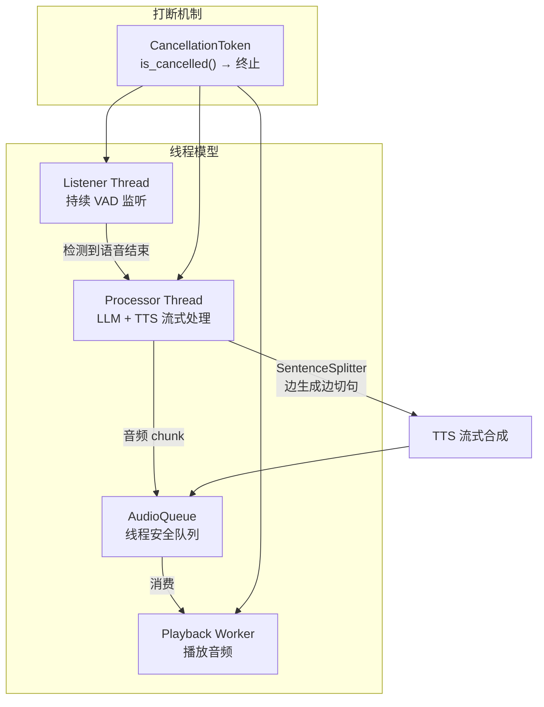
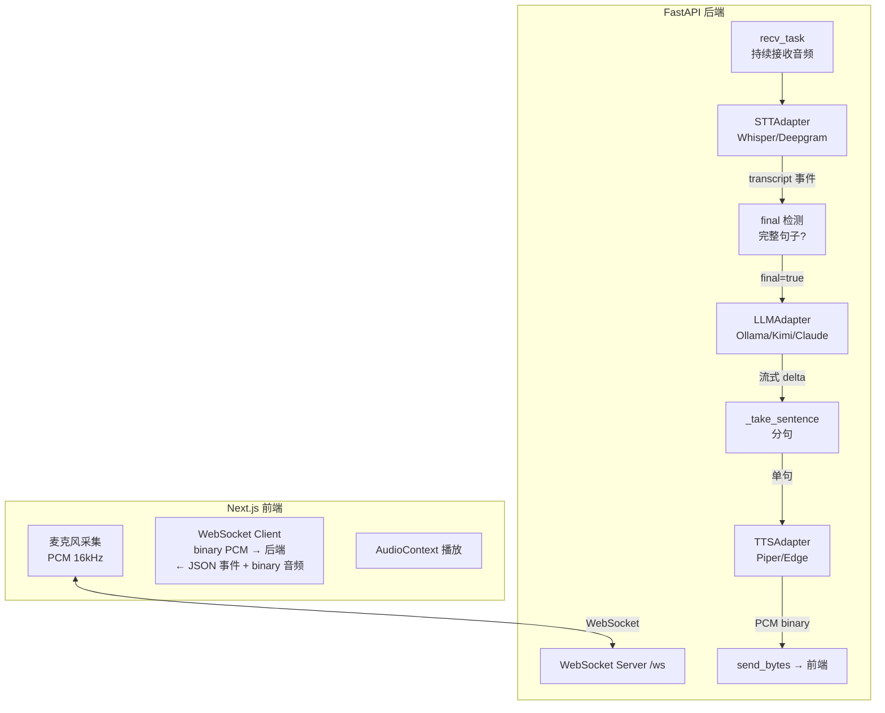
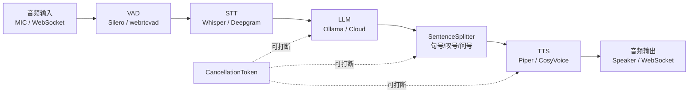
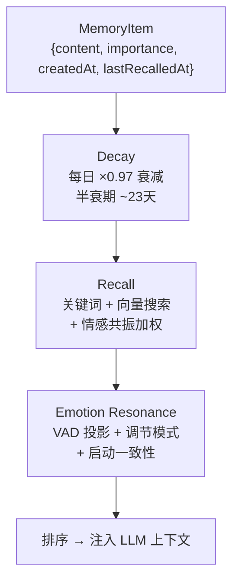

# GitHub 开源项目参考分析与流式实现总结

> 本文档基于对 8 个 GitHub 开源项目的研究，重点关注流式运作、实时对话、人格系统、记忆系统的实现方式。
> 两个项目已完成源码下载和深度分析：`realtime-voice-agent-demo`、`voice-core`。

---

## 1. 调研概览

| 项目 | Stars | 语言 | 核心价值 |
| --- | --- | --- | --- |
| [my-neuro](https://github.com/morettt/my-neuro) | 1276⭐ | Python | 桌面 AI 伴侣：Live2D、语音克隆、长期记忆、MCP 工具 |
| [Soul-of-Waifu](https://github.com/jofizcd/Soul-of-Waifu) | 737⭐ | Python | 桌面角色扮演：Live2D/VRM、实时语音、本地 LLM |
| [Nexus](https://github.com/FanyinLiu/Nexus) | 14⭐ | **TypeScript** | always-on 唤醒、**dreaming 长期记忆**、自主行为 |
| [Voxray](https://github.com/Voxray-AI/Voxray) | 3⭐ | Go | 实时语音基础设施：STT→LLM→TTS Pipeline、WebSocket/WebRTC、barge-in |
| [realtime-voice-agent-demo](https://github.com/0xkaz/realtime-voice-agent-demo) | 2⭐ | Python+Node | **与我们的技术栈最接近**：本地(Whisper+Ollama+Piper)+云端双模、Provider 抽象模式 |
| [voice-core](https://github.com/codeuh/voice-core) | 1⭐ | Python | 最小流式闭环：Ears→Brain→Voice→Orchestrator、连续监听+打断 |
| [eros_ai](https://github.com/NayanshiSingh/eros_ai) | 1⭐ | Python | 持久记忆 + **演化人格引擎** + 实时情感智能 |
| [LingYa](https://github.com/CalmDownTR/LingYa) | 0⭐ | Python | 演化人格 + 长期记忆 + 情境感知 |

---

## 2. 流式运作：两种核心架构模式

### 2.1 模式一：voice-core — 线程驱动 + 连续监听

**源码位置**：`D:\chat-A\reference\github-projects\voice-core\voice-core-main`

#### 架构图



#### 关键实现细节

**Ears 模块（耳朵/STT）**  
`D:\chat-A\reference\github-projects\voice-core\voice-core-main\ears\stt.py`

```python
class EarsModule:
    def __init__(self, model_size, device, compute_type, vad_threshold, enable_streaming):
        # Whisper 本地模型
        self.model = WhisperModel(model_size, device=device, compute_type=compute_type)
        # Silero VAD
        self.vad_model = load_silero_vad()
    
    def listen_continuously(self, audio_source, cancellation_token):
        """持续监听：边录音边VAD，检测到完整语音段后交给 Orchestrator"""
        audio_buffer = []
        is_speaking = False
        
        for audio_chunk in audio_source:
            if cancellation_token.is_cancelled():
                break
            
            speech_prob = self.vad_model(audio_chunk, SAMPLE_RATE)
            if speech_prob > self.vad_threshold:
                # 检测到语音
                is_speaking = True
                audio_buffer.append(audio_chunk)
                silence_frames = 0
            elif is_speaking:
                silence_frames += 1
                if silence_frames > SILENCE_THRESHOLD:
                    # 语音结束 → 转录
                    transcription = self.transcribe(audio_buffer)
                    yield transcription  # 交给 Orchestrator 处理
```

**Brain 模块（大脑/LLM）**  
`D:\chat-A\reference\github-projects\voice-core\voice-core-main\brain\llm.py`

```python
class BrainModule:
    def generate_response_stream_cancellable(self, user_input, cancellation_token):
        """流式生成 + 可取消"""
        # Ollama 流式
        stream = self.client.chat(
            model=self.model,
            messages=self.conversation_history + [{"role": "user", "content": user_input}],
            stream=True
        )
        
        full_response = ""
        for chunk in stream:
            if cancellation_token.is_cancelled():
                # 被打断 → 不更新对话历史
                return
            
            delta = chunk["message"]["content"]
            full_response += delta
            yield delta  # 边生成边产出
        
        # 只有完整完成才更新历史
        if not cancellation_token.is_cancelled():
            self.conversation_history.append({"role": "assistant", "content": full_response})
```

**Orchestrator 核心：打断处理**  
`D:\chat-A\reference\github-projects\voice-core\voice-core-main\orchestrator\orchestrator.py`

```python
class Orchestrator:
    def _listener_loop(self):
        """持续监听线程"""
        for transcription in self.ears.listen_continuously(...):
            # 取消当前正在处理的请求
            with self.state_lock:
                if self.current_cancellation_token:
                    self.current_cancellation_token.cancel()
                    self.audio_queue.clear()
            
            # 新 processor ID
            processor_id = self._allocate_processor_id()
            cancellation_token = CancellationToken()
            self.current_cancellation_token = cancellation_token
            
            # 启动新的 processor 线程
            processor_thread = threading.Thread(
                target=self._process_request,
                args=(transcription, processor_id, cancellation_token)
            )
            processor_thread.start()
    
    def _process_request(self, transcription, processor_id, cancellation_token):
        """单次请求处理"""
        # LLM 流式生成
        for delta in self.brain.generate_response_stream_cancellable(
            transcription, cancellation_token
        ):
            if cancellation_token.is_cancelled(): return
            # SentenceSplitter 切句 → 边生成边 TTS
            for sentence in self.sentence_splitter.feed(delta):
                if cancellation_token.is_cancelled(): return
                pcm = self.voice.synthesize(sentence)
                self.audio_queue.put(pcm)  # 播放线程消费
```

#### 值得借鉴

- **CancellationToken** 是本地打断的标准方案：线程安全、轻量、支持重置
- **音频队列 + 播放线程** 解耦了 TTS 合成和播放，播放不会被合成阻塞
- **SentenceSplitter** 让 LLM 的 token 流在 TTS 面前变成自然句，边生成边说话
- **processor_generation** 单调递增的 ID，防止旧请求覆盖新请求

---

### 2.2 模式二：realtime-voice-agent-demo — asyncio + WebSocket

**源码位置**：`D:\chat-A\reference\github-projects\realtime-voice-agent-demo\realtime-voice-agent-demo-main`

#### 架构图



#### 关键实现细节

**Provider 抽象层**  
`D:\chat-A\reference\github-projects\realtime-voice-agent-demo\realtime-voice-agent-demo-main\backend\app\adapters\llm\base.py`

```python
class LLMAdapter(ABC):
    name: str
    
    @abstractmethod
    def stream(self, messages: list[Message]) -> AsyncIterator[str]:
        """流式返回文本 delta"""
        ...

    async def aclose(self) -> None:
        """释放连接资源"""
        ...

# Provider 工厂
def create_llm_adapter(provider: str = None) -> LLMAdapter:
    provider = provider or os.getenv("LLM_PROVIDER", "ollama")
    if provider == "ollama":
        return OllamaAdapter(...)
    elif provider == "kimi":
        return KimiAdapter(...)
    elif provider == "claude":
        return ClaudeAdapter(...)
```

**三种 Provider 同接口，运行时切换**：这是我们要的"本地+云端自动切换"的最佳参考。

**barge-in 打断**  
`D:\chat-A\reference\github-projects\realtime-voice-agent-demo\realtime-voice-agent-demo-main\backend\app\main.py`

```python
async def ws_voice(websocket: WebSocket):
    response_task = None
    
    async def cancel_response(reason="new-turn"):
        """取消当前 LLM/TTS 响应"""
        nonlocal response_task
        if response_task and not response_task.done():
            response_task.cancel()
            await websocket.send_json({"type": "interrupted", "reason": reason})
    
    async for transcript in stt.transcribe(audio_stream):
        if transcript.is_final and transcript.text:
            # 新输入 → 打断当前回复
            await cancel_response("new-turn")
            # 启动新的回复任务
            response_task = asyncio.create_task(
                _respond(websocket, llm, tts, history, transcript.text)
            )
```

**TTS 音频帧到二进制 WebSocket**  
```python
async def _speak(websocket, tts, text):
    await websocket.send_json({"type": "audio", "phase": "start", "text": text})
    async for pcm in tts.synthesize(text):
        await websocket.send_bytes(pcm)  # 每个 PCM chunk 作为二进制帧
    await websocket.send_json({"type": "audio", "phase": "end"})
```

#### 值得借鉴

- **Provider 抽象 + 工厂模式**：是最干净的"本地 Ollama + 云端 Kimi/Claude"实现方式
- **WebSocket 混合帧**：JSON 帧做事件控制 + binary 帧做音频数据，前端分路处理
- **asyncio.create_task + cancel**：Python 原生的打断方案，简单高效
- **_take_sentence 分句**：在 LLM 流中检测句号/叹号/问号，边出边 TTS

---

## 3. 人格系统实现分析

### 3.1 my-neuro 的人格方案

my-neuro 把人格拆成三个可训练的维度：

| 维度 | 实现方式 | 工具 |
| --- | --- | --- |
| **声音** | 声音克隆 + TTS 训练 | GPT-SoVITS |
| **性格** | System Prompt + LLM 微调 | LLM-studio（本地微调指导） |
| **形象** | Live2D 模型 + 动作表情 | Live2D SDK |

**人格系统在我们的项目中可简化为**：

```
人格 = System Prompt（角色设定）
     + 长期记忆（用户画像、共同经历）
     + 情感引擎（从 LLM 输出提取情感标记 → TTS 音调调制）
```

### 3.2 Nexus 的 dreaming 长期记忆

Nexus 最独特的设计是 **dreaming 长期记忆**：

```
离线自主整理 → 总结近期交互 → 压缩成长期记忆条目
                → 发现模式/关联 → 更新用户画像
                → 忘却过期信息 → 保持记忆精简
```

**这对我们的启示**：v1 可以先做基础长期记忆（chatbot 的 LanceDB 方案），v2 加入 dreaming 自主整理。

---

## 4. 流式架构的最佳实践总结

基于所有项目的分析，流式对话系统的最佳实践如下：

### 4.1 管道阶段抽象



### 4.2 关键设计决策对比

| 决策点 | voice-core 做法 | realtime-voice-agent-demo 做法 | 我们的 v1 建议 |
| --- | --- | --- | --- |
| 运行时 | 多线程 + 队列 | asyncio + WebSocket | **asyncio/事件循环**（Node.js 天然匹配） |
| 打断机制 | CancellationToken | asyncio.cancel_task | **AbortController + 事件标记** |
| Provider 切换 | 无（固定 Ollama） | 工厂模式 + env var | **工厂模式 + 运行时切换** |
| TTS 流式 | Kokoro 一次性合成 | Piper/Edge 流式合成 | **先简单再流式** |
| 音频传输 | 本地声卡 | WebSocket binary frame | **WebSocket binary frame** |
| 前端 | 无（CLI only） | Next.js + AudioContext | **v1 CLI，v2 Web/桌面** |

### 4.3 可复用的代码模式

**1. 分句器（SentenceSplitter）**

所有项目都需要这个：LLM token 流 → TTS 可播句子。

```python
# voice-core 版
class SentenceSplitter:
    SENTENCE_ENDINGS = set(".!?。！？\n")
    
    def feed(self, token: str) -> list[str]:
        self.buffer += token
        sentences = []
        while True:
            split_at = self._find_split()
            if split_at < 0: break
            sentences.append(self.buffer[:split_at+1].strip())
            self.buffer = self.buffer[split_at+1:]
        return sentences

# realtime-voice-agent-demo 版（更简洁）
def _take_sentence(buffer: str) -> tuple[str, str]:
    for i, ch in enumerate(buffer):
        if ch in ".!?。！？\n":
            return buffer[:i+1].strip(), buffer[i+1:]
    return "", buffer
```

**2. CancellationToken（打断令牌）**

```python
# voice-core 的精简实现
class CancellationToken:
    def __init__(self):
        self._event = threading.Event()
    def cancel(self): self._event.set()
    def is_cancelled(self) -> bool: return self._event.is_set()
    def reset(self): self._event.clear()
```

**Node.js 等价实现**：
```typescript
class CancellationToken {
  private _cancelled = false;
  cancel() { this._cancelled = true; }
  get cancelled() { return this._cancelled; }
  reset() { this._cancelled = false; }
}
```

**3. Provider 工厂模式**

```python
# realtime-voice-agent-demo 的 LLM Provider 工厂
def create_llm_adapter(provider: str) -> LLMAdapter:
    adapters = {
        "ollama": lambda: OllamaAdapter(model=...),
        "kimi":   lambda: KimiAdapter(api_key=...),
        "claude": lambda: ClaudeAdapter(api_key=...),
    }
    return adapters[provider]()

# 本地/云端自动切换的封装
class FallbackLLMAdapter(LLMAdapter):
    async def stream(self, messages):
        try:
            async for delta in self.local.stream(messages):
                yield delta
        except (TimeoutError, ConnectionError):
            async for delta in self.cloud.stream(messages):
                yield delta
```

---

## 5. 辅助模块设计参考

### 5.1 audio_queue（voice-core）

独立的线程安全音频队列，适合我们的播放层：

```python
class AudioQueue:
    def __init__(self, max_depth=10):
        self._queue = queue.Queue(maxsize=max_depth)
    
    def put(self, audio, metadata=None, block=False, timeout=None):
        """放入音频 chunk；queue full 时可丢弃或阻塞"""
        self._queue.put({"audio": audio, "metadata": metadata or {}}, block, timeout)
    
    def clear(self):
        """打断时清空队列"""
        while not self._queue.empty():
            self._queue.get_nowait()
```

### 5.2 streaming_utils（voice-core）

```python
class SentenceSplitter:
    """流式分句 + 最小 token 数保证"""
    def __init__(self, min_tokens=5):
        self.min_tokens = min_tokens
        self.buffer = ""
        self.token_count = 0
    
    def feed(self, token: str) -> list[str]:
        self.buffer += token
        self.token_count += 1
        if self.token_count < self.min_tokens:
            return []
        # 分句逻辑...
```

---

## 6. 与我们设计的对比

| 维度 | 我们的 v1 设计 | 开源最佳实践 | 需调整？ |
| --- | --- | --- | --- |
| 运行环境 | Node.js + TS | 多数 Python | 否，TS 更适合网关和多平台 |
| 通信协议 | WebSocket JSON+binary | 一致 | 否 |
| Provider 模式 | 工厂+Fallback | 一致 | 否 |
| 打断机制 | AbortController | CancellationToken | **建议参考 voice-core 的 token 模式** |
| 分句 & TTS | SemanticChunker | SentenceSplitter | **建议参考 demo 的 _take_sentence** |
| 音频队列 | 待设计 | AudioQueue | **建议参考 voice-core** |
| 人格系统 | System Prompt + 记忆 | my-neuro 三件套+ Nexus dreaming | v1 简化即可 |
| 记忆系统 | LanceDB + MongoDB | 与 chatbot 一致 | 否 |
| 网关多平台 | 事件路由 | 全项目独有 | 我们的差异化优势 |

---

## 7. 关键源码位置索引

### voice-core
| 文件 | 职责 |
| --- | --- |
| `D:\chat-A\reference\github-projects\voice-core\voice-core-main\orchestrator\orchestrator.py` | 线程模型、打断编排 |
| `D:\chat-A\reference\github-projects\voice-core\voice-core-main\orchestrator\cancellation.py` | CancellationToken |
| `D:\chat-A\reference\github-projects\voice-core\voice-core-main\orchestrator\audio_queue.py` | 线程安全音频队列 |
| `D:\chat-A\reference\github-projects\voice-core\voice-core-main\brain\llm.py` | Ollama 流式+可取消生成 |
| `D:\chat-A\reference\github-projects\voice-core\voice-core-main\voice\tts.py` | Kokoro TTS 合成 |
| `D:\chat-A\reference\github-projects\voice-core\voice-core-main\ears\stt.py` | Whisper + VAD |

### realtime-voice-agent-demo
| 文件 | 职责 |
| --- | --- |
| `D:\chat-A\reference\github-projects\realtime-voice-agent-demo\realtime-voice-agent-demo-main\backend\app\main.py` | FastAPI + WS + barge-in |
| `D:\chat-A\reference\github-projects\realtime-voice-agent-demo\realtime-voice-agent-demo-main\backend\app\adapters\llm\base.py` | LLM Provider 抽象 |
| `D:\chat-A\reference\github-projects\realtime-voice-agent-demo\realtime-voice-agent-demo-main\backend\app\adapters\stt\base.py` | STT Provider 抽象 |
| `D:\chat-A\reference\github-projects\realtime-voice-agent-demo\realtime-voice-agent-demo-main\backend\app\adapters\tts\base.py` | TTS Provider 抽象 |
| `D:\chat-A\reference\github-projects\realtime-voice-agent-demo\realtime-voice-agent-demo-main\backend\app\adapters\llm\ollama.py` | Ollama 适配器实现 |
| `D:\chat-A\reference\github-projects\realtime-voice-agent-demo\realtime-voice-agent-demo-main\frontend\app\transcribe` | 前端 WebSocket 音频客户端 |

---

## 8. 一句话总结

两个已分析的项目验证了我们的设计方向完全可行：**voice-core** 展示了"线程+队列+Token"的打断编排，**realtime-voice-agent-demo** 展示了"Provider 抽象+WebSocket 混合帧"的多平台架构。我们的 v1 可以自信地沿 Node.js + TypeScript + WebSocket + Provider 工厂这个路线推进。

---

## 9. 未完整下载项目的关键文件分析

以下项目因网络限制未能完整克隆，但通过 GitHub API 拉取了关键源码文件。

### 9.1 Nexus（TypeScript + Electron）— 最接近我们技术栈

**仓库**：[FanyinLiu/Nexus](https://github.com/FanyinLiu/Nexus)  
**技术栈**：Electron + React + TypeScript + Vite  
**核心价值**：dreaming 长期记忆 + 情感共振检索 + Provider 目录

**源码结构**：
```
src/
├── core/
│   ├── agent/          # Agent 循环 + 工具（MemoryTool, TodoTool）
│   ├── budget/         # Token 预算 + 费用追踪
│   ├── routing/        # 认证路由
│   ├── sessions/       # 会话管理
│   └── skills/         # 技能系统
├── features/
│   ├── autonomy/       # 自主行为 + 情感模型（emotionModel）
│   ├── character/      # 角色档案（profiles.ts）
│   ├── memory/         # 记忆：衰减/召回/情感共振/向量搜索
│   ├── voice/          # 语音输入/输出
│   ├── vision/         # 视觉/摄像头
│   ├── proactive/      # 主动行为
│   ├── tools/          # 工具调用
│   └── failover/       # Provider 故障切换
└── lib/
    ├── providerCatalog.ts     # 统一 Provider 目录
    ├── coreRuntime.ts         # 核心运行时
    ├── modelCapabilities.ts   # 模型能力描述
    └── relationshipTypes.ts   # 关系类型定义
```

**人格系统 — Character Profile**：
```typescript
// profiles.ts — 角色档案结构
interface CharacterProfile {
  companionName: string
  userName: string
  companionRelationshipType: string   // 关系类型
  systemPrompt: string                // 系统提示词
  petModelId: string                  // Live2D 模型
  speechOutputProviderId: string      // TTS Provider
  speechOutputVoice: string           // 语音
  speechOutputInstructions: string    // TTS 指令
}
```

**记忆系统 — 三组件协同**：



```typescript
// decay.ts — 记忆衰减算法
const DECAY_FACTOR = 0.97           // 每日衰减系数
const RECALL_BOOST = 0.15           // 每次回忆加分
const IMPORTANCE_SEED = {
  pinned: 1.0,    high: 0.8,        // 重要性初始分
  reflection: 0.6, normal: 0.5, low: 0.25
}

function getDecayedScore(memory, now) {
  const base = memory.importanceScore ?? IMPORTANCE_SEED[memory.importance]
  const elapsedDays = (now - Date.parse(memory.lastRecalledAt)) / 86_400_000
  if (memory.importance === 'pinned') return base  // 钉住不过期
  return base * (DECAY_FACTOR ** elapsedDays)
}
```

```typescript
// emotionResonance.ts — 情感共振检索
// 将 4D 情感状态投影到 Russell 环状模型 (valence-arousal)
function projectToVA(state: EmotionState): VAPoint {
  return {
    valence: state.warmth - state.concern,
    arousal: (state.energy + state.curiosity) / 2,
  }
}

// 三种调节模式
// match: 匹配用户情绪（同情）
// empathize: 共情（理解但不一定匹配）
// repair: 修复（用积极情绪拉回）
function detectRegulatoryMode(userVA: VAPoint): RegulatoryMode { ... }
```

**值得借鉴**：
- **记忆衰减算法**：简单但有效，pinned 记忆不会过期
- **情感共振检索**：记忆不只是关键词匹配，还按当前情绪状态加权
- **Provider 目录**：统一注册所有 STT/TTS/LLM/搜索 provider
- **角色档案**：companionName + relationshipType + systemPrompt 三要素

---

### 9.2 eros_ai — 心理学人格引擎

**仓库**：[NayanshiSingh/eros_ai](https://github.com/NayanshiSingh/eros_ai)  
**技术栈**：FastAPI + Next.js + MongoDB + Redis + LiveKit WebRTC

**人格系统 — Carl Jung 心理画像**：
```
Hot Memory（热记忆）     Cold Memory（冷记忆）
核心事实 + 当前上下文    情景记忆 + 长期经历
    ↓                        ↓
    └────→ Personality Engine ←────┘
            ↓
    Trait Delta（人格增量）
    → 随时间演化的人格档案
```

**技术亮点**：
- **Hot/Cold Memory 架构**：热记忆保存核心事实，冷记忆保存情景经历
- **Trait Delta**：每次交互产生人格增量，随时间累积演化
- **LiveKit WebRTC**：专业实时音视频框架，自带 STT/TTS 管线
- **ARQ 后台任务**：记忆整理、人格更新、日记生成
- **情感感知**：实时推断用户情绪，调整语气和行为

---

### 9.3 LingYa — OCEAN 人格模型

**仓库**：[CalmDownTR/LingYa](https://github.com/CalmDownTR/LingYa)  
**技术栈**：Python，支持任何 OpenAI-compatible API

**人格系统 — OCEAN + PAD 双模型**：
```yaml
# agent_config.yaml — 人格配置
ocean:
  openness: 0.5          # 开放性
  conscientiousness: 0.5 # 尽责性
  extraversion: 0.5      # 外向性
  agreeableness: 0.5     # 宜人性
  neuroticism: 0.5       # 神经质

tone_matrix:
  warmth: 50             # 温暖度 (0-100)
  formality: 50          # 正式度 (0-100)
  humor: 0.1             # 幽默感 (0.0-1.0)
```

**设计理念**：
- OCEAN（大五人格）作为人格底层，PAD 情绪状态从 OCEAN 推导（Mehrabian 映射）
- 人格在数据库中持久化，每次对话后逐步漂移
- Agent 有自我身份和核心信念（identity + core_belief）
- 行为护栏（behavior_guardrails）约束回复边界

---

## 10. 各项目的人格/记忆方案汇总

| 项目 | 人格模型 | 记忆模型 | 情感引擎 |
| --- | --- | --- | --- |
| **my-neuro** | System Prompt + LLM 微调 + 声音训练 | 长期记忆（关键信息+个性+脾气） | 开发中 |
| **Nexus** | Character Profile (companionName+relationshipType+systemPrompt) | 衰减算法 + 情感共振检索 + 向量搜索 | EmotionState (warmth/concern/energy/curiosity) |
| **eros_ai** | Carl Jung 心理画像 + Trait Delta 演化 | Hot/Cold Memory 双层架构 | 实时情感感知 |
| **LingYa** | OCEAN 大五人格 + tone_matrix | 持久化人格 + 会话日记 | PAD 从 OCEAN 推导 |
| **voice-core** | System Prompt only | 会话历史（max_history=10） | 无 |
| **realtime-voice-agent-demo** | System Prompt only | 会话历史（对话列表） | 无 |

---

## 11. 对我们的设计影响

### 11.1 立即可采用的模式

| 来源 | 模式 | 适合我们的 v1 |
| --- | --- | --- |
| **Nexus** | Character Profile（companionName + relationshipType + systemPrompt） | ✅ 人格定义起点 |
| **Nexus** | 记忆衰减算法（DECAY_FACTOR + RECALL_BOOST） | ✅ 长期记忆基础 |
| **LingYa** | OCEAN 人格模型 | ✅ 可配置人格参数 |
| **voice-core** | CancellationToken | ✅ 打断机制 |
| **voice-core** | AudioQueue | ✅ 播放缓冲 |
| **realtime-voice-agent-demo** | Provider 工厂 + Fallback | ✅ LLM/TTS 切换 |

### 11.2 v2 应引入的模式

| 来源 | 模式 | 适用场景 |
| --- | --- | --- |
| **Nexus** | 情感共振检索（VAD 投影 + 调节模式） | 记忆召回质量提升 |
| **eros_ai** | Trait Delta 人格演化 | 长期人格发展 |
| **eros_ai** | Hot/Cold Memory 双层架构 | 记忆分层管理 |
| **LingYa** | OCEAN→PAD 情绪映射 | 情绪状态建模 |
| **Nexus** | dreaming 自主记忆整理 | 离线记忆优化 |

---

## 12. 源码收集状态（最终）

| 项目 | 方式 | 文件数 | 关键模块 |
| --- | --- | --- | --- |
| **realtime-voice-agent-demo** | 完整克隆 | 47 | Provider工厂、WebSocket barge-in、asyncio管线 |
| **voice-core** | 完整克隆 | 22 | CancellationToken、AudioQueue、SentenceSplitter、线程Orchestrator |
| **Nexus** | API逐文件拉取 | 25 | 记忆衰减/情感共振检索/Provider目录/角色档案/CostTracker |
| **eros_ai** | API逐文件拉取 | 21 | Hot/Cold记忆/personality_update管线/memory_curation/voice filler |
| **LingYa** | API逐文件拉取 | 22 | OCEAN人格引擎/affect/tone/dynamics/belief/reflection/gateway |

**源码路径**：
- 完整克隆：`D:\chat-A\reference\github-projects\realtime-voice-agent-demo\`
- 完整克隆：`D:\chat-A\reference\github-projects\voice-core\`
- 关键文件：`D:\chat-A\reference\github-projects\Nexus-src\`
- 关键文件：`D:\chat-A\reference\github-projects\eros_ai-src\`
- 关键文件：`D:\chat-A\reference\github-projects\LingYa-src\`

所有项目的核心流式、人格、记忆实现代码均已可阅读参考。
