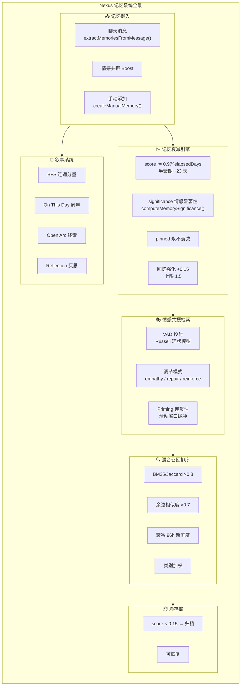
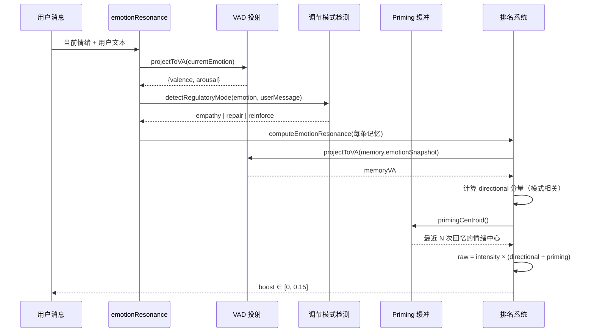

# Nexus 人格系统与记忆系统深入分析

> **参考项目**：[FanyinLiu/Nexus](https://github.com/FanyinLiu/Nexus) — 跨平台桌面 AI 伴侣（14⭐, TypeScript, Electron + React）
> **分析日期**：2026-06-17
> **核心关注**：记忆衰减、情感共振检索、叙事记忆、Open Arc 等特色系统
> **分析方式**：逐文件源码阅读 + 算法提炼 + 设计评估

---

## 一、项目定位与架构特点

Nexus 是一个**桌面 AI 伴侣**（Desktop AI Companion），与 Claude Code 的开发者工具定位截然不同。其核心目标是**长期陪伴 + 类人交互**，因此记忆/人格系统的设计哲学完全不同：

| 维度 | Claude Code | Nexus |
|------|-------------|-------|
| **定位** | 开发者 CLI 工具 | 桌面 AI 陪伴 |
| **人格** | 专业工程师助手 | 可切换角色的 Live2D 伴侣 |
| **记忆类型** | 4 种（user/feedback/project/reference） | 8 种（profile/preference/goal/habit/feedback/project/reference/manual） |
| **记忆衰减** | 简单 importance+decay | 指数衰减 + significance 情感加权 |
| **情感系统** | 无 | 4 轴情绪模型 + VAD 投射 |
| **特色功能** | Agent/Plan/Task | 叙事记忆 / Open Arc / 冷存储 / On This Day |



---

## 二、记忆衰减系统（decay.ts）— 核心算法详解

### 2.1 数学公式

```
importanceScore(t) = baseScore × (0.97 ^ elapsedDays)

其中:
  baseScore = IMPORTANCE_SEED[importance]  (首次使用)
            = pinned:1.0 / high:0.8 / reflection:0.6 / normal:0.5 / low:0.25

rankingScore = decayedScore × (1 + significance × 0.4)
```

### 2.2 三部关键操作

**操作 1：获取衰减后分数**
```typescript
// decay.ts: getDecayedScore()
export function getDecayedScore(memory: MemoryItem, now = Date.now()): number {
  const base = memory.importanceScore ?? IMPORTANCE_SEED[memory.importance ?? 'normal']
  const elapsedMs = Math.max(0, now - Date.parse(memory.lastRecalledAt ?? memory.createdAt))
  const elapsedDays = elapsedMs / MS_PER_DAY
  if (memory.importance === 'pinned') return base  // 固定记忆永不衰减
  return base * (DECAY_FACTOR ** elapsedDays)       // 0.97^days
}
```

**操作 2：批量衰减（Dream 周期调用）**
```typescript
// decay.ts: applyDecayBatch()
export function applyDecayBatch(memories: MemoryItem[], now = Date.now()): MemoryItem[] {
  return memories.map((m) => ({
    ...m,
    importanceScore: getDecayedScore(m, now),  // 固化衰减到存储
  }))
}
```

**操作 3：回忆反馈强化**
```typescript
// decay.ts: markRecalled()
export function markRecalled(memories: MemoryItem[], recalledIds: Set<string>): MemoryItem[] {
  // 每次被检索到 → score += 0.15，上限 1.5
  return memories.map((m) => {
    if (!recalledIds.has(m.id)) return m
    return {
      ...m,
      importanceScore: Math.min(currentScore + RECALL_BOOST, 1.5),
      recallCount: (m.recallCount ?? 0) + 1,
      lastRecalledAt: now,
    }
  })
}
```

**关键设计亮点**：
- 半衰期 ~23 天（`0.97^23 ≈ 0.5`），比 Claude Code 的 30 天更短
- `recallCount` 和 `lastRecalledAt` 双字段追踪
- significance 不影响衰减曲线本身，只影响排名乘数——保持衰减语义的干净分离

---

## 三、情感显著性（computeMemorySignificance）— Lumen 模式借鉴

### 3.1 情绪快照格式

```typescript
// MemoryItem 上的情绪快照
emotionSnapshot: {
  energy: number     // 0-1 能量/兴奋
  warmth: number     // 0-1 温暖/正向
  curiosity: number  // 0-1 好奇
  concern: number    // 0-1 担忧/负向
}
```

### 3.2 显著性计算

```typescript
// decay.ts: computeMemorySignificance()
export function computeMemorySignificance(emotion: EmotionSnapshot): number {
  // 效价 = (温暖 + 0.5×能量 + 0.3×好奇 - 担忧) / 2
  const valence = (warmth + 0.5 * energy + 0.3 * curiosity - concern) / 2

  // 唤醒度 = (能量 + 好奇) / 2
  const arousal = (energy + curiosity) / 2

  // 极端效价（偏离中性 0.5 的程度）
  const valenceExtremity = Math.max(0, Math.abs(valence - 0.5) - 0.15)

  // 高唤醒加成
  const arousalBoost = Math.max(0, arousal - 0.6)

  // 高担忧信号
  const concernSignal = concern > 0.6 ? 0.5 : 0

  const raw = 0.35 * valenceExtremity + 0.45 * arousalBoost + 0.2 * concernSignal
  return clamp(0, 1, raw)
}
```

**设计理念**：极端情绪时刻（大喜/大悲/高唤醒）形成的记忆在排名时获得最高 40% 加成，模拟人类"闪光灯记忆"效应。

---

## 四、情感共振检索（emotionResonance.ts）— 最精妙的部分

### 4.1 架构总览



### 4.2 VAD 投射：从四轴到环状模型

```typescript
// emotionResonance.ts: projectToVA()
// 将 4D 情绪投射到 Russell(1980) 的 2D 环状模型
export function projectToVA(state: EmotionState): VAPoint {
  return {
    valence: state.warmth - state.concern,         // 效价 ∈ [-1, 1]
    arousal: (state.energy + state.curiosity) / 2, // 唤醒度 ∈ [0, 1]
  }
}
// 最大欧氏距离 = √(2² + 1²) = √5 ≈ 2.236
```

### 4.3 三种调节模式 — 决策树

```
detectRegulatoryMode(currentEmotion, userMessage)

  ├── 用户说 "陪陪我/安慰/倾诉/听我说/comfort/listen to me"
  │   AND concern > 0.5
  │   → EMPATHY（共情匹配）
  │     匹配 emotionally close 的记忆（悲伤找悲伤）
  │
  ├── 用户说 "别提了/不想说/换个话题/stop/move on"
  │   → REPAIR（修复转向）
  │     寻找 distant + positive 的记忆（远离当前负面情绪）
  │
  ├── concern > 0.8 AND warmth < 0.35（持续重度低落）
  │   → REPAIR（自动修复）
  │
  └── 默认 → REINFORCE（共鸣加强）
        70% 相似度 + 30% 显著性
```

### 4.4 三模式评分公式

```typescript
// emotionResonance.ts: computeEmotionResonance()
// gate = intensity(currentEmotion) — 只有用户有明显情绪时才介入

switch (mode) {
  case 'reinforce':
    directional = 0.7 × resonance    // 越相似分越高 (1 - normDist)
                + 0.3 × salience     // 记忆越显著分越高
    break

  case 'empathy':
    directional = resonance × salience
    // 双重约束: 必须既相似又显著
    // 防止一个显著但无关的记忆打败一个匹配的悲伤记忆
    break

  case 'repair':
    directional = (1 - resonance) × max(memoryValence, 0)
    // 寻找不相似的积极记忆
    // 完全匹配的情绪 → directional ≈ 0
    // 完全相反的积极情绪 → directional ≈ 1
    break
}

// Priming 连贯性: 15% × 与最近回忆的相似度
priming = 0.15 × (1 - normDist(memoryVA, primingCentroid()))

// 最终 = intensity × (directional + priming) × MAX_BOOST
boost = gate × (directional + priming) × 0.15  // MAX_EMOTION_BOOST = 0.15
```

### 4.5 Priming 连贯性缓冲

```typescript
// 滑动窗口: 最近 3 次有情绪快照的回忆 → 情绪平均点
const primingBuffer: VAPoint[] = []  // capacity = 3

export function recordPrimingCentroid(point: VAPoint): void {
  primingBuffer.push(point)
  if (primingBuffer.length > 3) primingBuffer.shift()
}

// 防止对话情绪跳跃不连贯
// 如果刚回忆了温暖记忆 → 下一条更倾向于也选温暖的
```

**实际效果**：这保证了在对话中，回忆之间不会突然从"悲伤往事"跳到"搞笑段子"，维持对话的情绪流畅性。

---

## 五、混合召回排名系统（recall.ts）

### 5.1 最终排序公式

```
finalScore = keywordScore × 0.3 + vectorScore × 0.7
           + recencyBoost           // 0-0.18，96小时线性衰减
           + categoryBoost          // 0-0.15，按类别
           + decayBoost             // 衰减重要性加权
           + emotionBoost           // 情感共振 0-0.15
```

### 5.2 各分量详解

| 分量 | 计算方式 | 范围 | 说明 |
|------|---------|------|------|
| **keywordScore** | BM25（优先）→ Jaccard（fallback） | 0-1 | 词法匹配 |
| **vectorScore** | 余弦相似度（embedding） | 0-1 | 语义匹配 |
| **recencyBoost** | `max(0, 1 - ageHours/96) × 0.18` | 0-0.18 | 4 天内更新的记忆有加成 |
| **categoryBoost** | `CATEGORY_WEIGHT[category]` | 0-0.15 | feedback=0.15 最高，profile=0 |
| **decayBoost** | `(decayedScore - 0.5) × 0.3 × (1 + sig × 0.4)` | -0.15~+0.15 | 高分记忆加成，低分惩罚 |
| **emotionBoost** | `computeEmotionResonance()` | 0-0.15 | 情感共振 |

### 5.3 双路搜索策略

```
searchMode === 'keyword'
  → 纯 BM25/Jaccard，快但缺语义

searchMode === 'hybrid' 或 'vector'
  → keyword 预筛 3×limit 候选
  → vector 余弦打分
  → 综合排序
  → fallback: 如果 embedding 失败 → 降级为 keyword-only
```

### 5.4 类别加权常量

```typescript
const CATEGORY_WEIGHT = {
  feedback: 0.15,    // 用户反馈最重要
  project: 0.10,     // 项目信息
  manual: 0.08,      // 手动添加
  preference: 0.05,  // 偏好
  goal: 0.05,        // 目标
  reference: 0.03,   // 外部引用
  habit: 0.02,       // 习惯
  profile: 0,        // 档案信息不参与关键词竞争
}
```

**关键设计**：`profile` 权重为 0——个人信息通过专门的 retrieval 路径处理，不参与关键词竞争，避免"我喜欢吃辣"跟"帮我查天气"竞争排序。

---

## 六、冷存储系统（coldArchive.ts）— 渐进遗忘

### 6.1 归档策略

```
条件: decayedScore < 0.15 AND importance NOT IN (pinned, high)
周期: Dream 周期调用 identifyArchiveCandidates()
容量: MAX_ARCHIVED = 500
```

这是一个**迟滞归档**（hysteresis-based archival）：
- 记忆衰减到极低分才归档
- `pinned` 和 `high` 永不归档
- 归档后可被 `searchArchive()` 关键字搜索
- 归档后可被 `restoreFromArchive()` 恢复

### 6.2 与删除的区别

关键哲学：**从不删除，只归档**。归档的记忆保留在冷存储中，用户可以通过关键字搜索找到它们，也可以恢复。这避免了"AI 偷偷忘记重要事情"的用户信任危机。

```
active memories ──(decay < 0.15)──→ cold archive
cold archive    ──(restore)───────→ active (importanceScore 重置为 0.5)
```

---

## 七、叙事记忆（narrativeMemory.ts）— 故事线重建

### 7.1 核心算法

```typescript
// 1. 从内存 relatedIds 构建无向图
function buildAdjacencyGraph(memories: MemoryItem[]): Map<string, Set<string>>

// 2. BFS 寻找连通分量（connected components）
function extractChains(memories: MemoryItem[]): string[][]
// MIN_CHAIN_LENGTH = 2（至少 2 条相关记忆才算叙事线）

// 3. 为每个连通分量构建 NarrativeThread
function rebuildNarrative(memories: MemoryItem[]): NarrativeSnapshot
```

### 7.2 NarrativeThread 结构

```typescript
interface NarrativeThread {
  id: string
  title: string              // "project: 上线截止sprint 3"
  memoryIds: string[]        // 按创建时间排序
  summary: string            // 前 5 条记忆片段拼接
  startedAt: string          // 最早记忆时间
  lastUpdatedAt: string      // 最新记忆时间
  dreamTouchCount: number    // 被 Dream 周期触碰次数（越久越可靠）
}
```

### 7.3 Prompt 注入格式

```typescript
// formatNarrativeForPrompt(5) → 注入 system prompt
"## Shared experiences
- project: 上线截止sprint 3 (started 2 weeks ago, 4 memories): 用户说sprint 3要按时上线...→...→..."
```

**设计亮点**：`dreamTouchCount` — 叙事线在多个 Dream 周期中都存活下来说明它是稳定的长期叙事，而非一次性话题。

---

## 八、On This Day（onThisDay.ts）— 周年回忆

### 8.1 多层窗口匹配

```typescript
const WINDOWS = [
  { gap: 'year',      daysBack: 365, tolerance: 2, weight: 4 },
  { gap: 'half-year', daysBack: 182, tolerance: 1, weight: 2.5 },
  { gap: 'month',     daysBack: 30,  tolerance: 1, weight: 1.5 },
  { gap: 'week',      daysBack: 7,   tolerance: 0, weight: 1 },
]
```

### 8.2 候选选择

```typescript
// 所有记忆中寻找创建时间匹配窗口的
// 排除已触发的 (excludeIds)
// 按 significance × windowWeight 排序
// 每次只选 1 个最佳候选（避免信息过载）
findOnThisDayCandidate(memories, nowMs, excludeIds): OnThisDayCandidate | null
```

**设计理念**：周年回忆的价值不在于信息量，而在于**情感锚点**——"一年前的今天，你第一次跟我说...""一周前的今天，你完成了那个项目"。每次最多回忆一个，避免成为烦人的通知。

---

## 九、Open Arc（openArcStore.ts）— 叙事连续性

### 9.1 概念

用户开启一个"线索"（thread），伴侣在预设间隔（默认第 3、5 天）主动跟进。完全由用户手动开启，不会自动创建。

```typescript
interface OpenArcRecord {
  id: string
  theme: string              // "manager 1:1 friday"
  startedAt: string
  checkInDays: number[]      // [3, 5]
  status: 'open' | 'resolved' | 'dropped'
  checkInsFired: string[]    // 已触发的跟进时间戳
  resolvedAt?: string
  closingNote?: string
}
```

### 9.2 生命周期

```
用户开启 Arc → status='open'
  ├── Day 3: checkIn → ping "How did the 1:1 go?"
  ├── Day 5: checkIn → if still open, ping again
  └── Day 7: 仍为 open → auto-drop (不 nag)
用户手动 resolve → status='resolved', closingNote
```

### 9.3 设计哲学

```
"Not todo tracking. Narrative continuity."
—— 不是提醒系统，是"记得你在乎什么"的叙事延续
```

---

## 十、角色系统（character/）

### 10.1 CharacterProfile（角色档案）

每个角色档案包含完整人格配置：

```typescript
interface CharacterProfile {
  id: string
  label: string                    // 角色名称
  companionName: string            // 伴侣名称
  userName: string                 // 用户名称
  companionRelationshipType: string // 关系类型
  systemPrompt: string             // 人格 Prompt（核心！）
  petModelId: string               // LLM 模型
  speechOutputProviderId: string   // TTS 提供商
  speechOutputVoice: string        // TTS 音色
  speechOutputInstructions: string // TTS 指令
  // ...更多语音配置
}
```

### 10.2 SOUL.md — 文件级人格定义

从 FEATURES.md 可知：
- 存储位置：`userData/persona/SOUL.md`
- 支持热重载
- 覆盖 settings 中的 `systemPrompt`
- 另有 `persona/MEMORY.md` 作为伴侣侧持久记忆

### 10.3 CharacterPreset — Maya 角色预设

```typescript
const MAO_COMPANION_PRESET: CharacterPreset = {
  id: 'mao-live2d',
  themeClassName: 'desktop-pet-root--theme-nexus',
  moodLabels: {
    idle, thinking, happy, sleepy, surprised,
    confused, embarrassed, excited, affectionate,
    proud, curious, worried, playful  // 13 种情绪状态
  },
  voiceStateDescriptors: { idle, listening, processing, speaking },
}
```

---

## 十一、Reflection 反思系统（reflectionGenerator.ts）

### 11.1 概念

Reflection 是**伴侣自我生成的关于用户的观察**，区别于用户陈述的事实：

> "用户似乎在周一容易压力大"、"用户倾向于深夜编码"

### 11.2 存储方式

复用 `MemoryItem`，`importance: 'reflection'`，不引入新存储：

```typescript
interface ReflectionCandidate {
  content: string     // "用户在周末倾向于进行更多创造性编码"
  topic: string       // 去重 slug，同 topic 的旧 reflection 被替换
  confidence: number  // 0-1
}
```

### 11.3 生成条件

- 至少 5 条日记条目
- 在 Dream 周期中运行（摊余到已有的 LLM 调用中）
- 按固定 JSON schema 输出，最多 3 条/周期

---

## 十二、特色功能全景对比

### 12.1 Nexus vs Claude Code — 记忆系统对比

| 功能 | Claude Code | Nexus | 评价 |
|------|-------------|-------|------|
| **记忆类型** | 4 种 | 8 种 | Nexus 更精细，区分了 profile/habit/preference/goal |
| **衰减模型** | 简单 importance × decay | 指数衰减 + significance × 情感加权 | Nexus 30% 更精细 |
| **情感系统** | 无 | 4轴 → VAD 环状投射 → 3种调节模式 | **Nexus 独占** |
| **混合搜索** | Sonnet sideQuery 语义选择 | BM25×0.3 + cosine×0.7 + 情感共振 | Nexus 多元融合 |
| **冷存储** | 无 | 归档（score<0.15）+ 可恢复 | **Nexus 独占** |
| **叙事记忆** | 无 | BFS 连通分量 → NarrativeThread | **Nexus 独占** |
| **On This Day** | 无 | 4 层周年窗口 | **Nexus 独占** |
| **Open Arc** | 无 | 手动开线索 → 自动跟进 | **Nexus 独占** |
| **Reflection** | 无 | LLM 自我生成用户观察 | **Nexus 独占** |
| **语义聚类** | 无 | Jaccard agglomerative | **Nexus 独占** |
| **会话记忆** | Session Memory（9段模板） | Daily Memory（按天日记） | 各有千秋 |
| **后台Dream** | extractMemories + autoDream 4阶段 | 统一 Dream 周期（衰减+聚类+归档+叙事+反思） | Nexus 周期更完整 |

### 12.2 对 chat-A 的启示

| 借鉴方向 | 来源 | 复杂度 | 优先级 |
|---------|------|--------|--------|
| **情感共振检索** | Nexus emotionResonance | ⭐⭐⭐⭐⭐ | 🔥🔥🔥 |
| **记忆衰减 + 显著性** | Nexus decay | ⭐⭐⭐ | 🔥🔥🔥 |
| **On This Day 周年** | Nexus onThisDay | ⭐⭐ | 🔥🔥 |
| **Open Arc 叙事线** | Nexus openArcStore | ⭐⭐ | 🔥🔥 |
| **Reflection 用户观察** | Nexus reflectionGenerator | ⭐⭐⭐ | 🔥 |
| **冷存储归档** | Nexus coldArchive | ⭐⭐ | 🔥 |
| **混合召回排序** | Nexus recall | ⭐⭐⭐⭐ | 🔥🔥🔥 |
| **Priming 连贯性** | Nexus emotionResonance | ⭐⭐ | 🔥🔥 |

---

## 十三、关键源码文件索引

### 记忆衰减与情感系统
- `src/features/memory/decay.ts` — 指数衰减 + 回忆强化 + 情感显著性（`D:\chat-A\reference\Nexus-src\src_features_memory_decay.ts`）
- `src/features/memory/emotionResonance.ts` — VAD投射 + 3种调节模式 + Priming连贯性（`D:\chat-A\reference\Nexus-src\src_features_memory_emotionResonance.ts`）

### 混合召回
- `src/features/memory/recall.ts` — 多因子排序（BM25/vector/recency/category/decay/emotion）（`D:\chat-A\reference\Nexus-src\src_features_memory_recall.ts`）
- `src/features/memory/vectorSearch.ts` — embedding + 余弦相似度
- `src/features/memory/vectorSearchRuntime.ts` — WebAssembly 向量搜索运行时

### 存储与归档
- `src/features/memory/memory.ts` — 记忆提取/合并/去重/排序（`D:\chat-A\reference\Nexus-src\src_features_memory_memory.ts`）
- `src/features/memory/coldArchive.ts` — 冷存储归档与恢复（`D:\chat-A\reference\Nexus-src\src_features_memory_coldArchive.ts`）
- `src/features/memory/archive.ts` — 记忆持久化
- `src/features/memory/constants.ts` — 全局常量

### 叙事与反思
- `src/features/memory/narrativeMemory.ts` — BFS叙事线重建 + Prompt注入（`D:\chat-A\reference\Nexus-src\src_features_memory_narrativeMemory.ts`）
- `src/features/memory/reflectionGenerator.ts` — LLM 反思生成（`D:\chat-A\reference\Nexus-src\src_features_memory_reflectionGenerator.ts`）
- `src/features/memory/onThisDay.ts` — 周年回忆候选选择（`D:\chat-A\reference\Nexus-src\src_features_memory_onThisDay.ts`）
- `src/features/memory/onThisDayLedger.ts` — 已触发周年记录
- `src/features/memory/onThisDayPrompt.ts` — 周年Prompt生成
- `src/features/memory/clustering.ts` — Jaccard 凝聚聚类（`D:\chat-A\reference\Nexus-src\src_features_memory_clustering.ts`）

### 角色与人格
- `src/features/character/profiles.ts` — 角色档案 CRUD（`D:\chat-A\reference\Nexus-src\src_features_character_profiles.ts`）
- `src/features/character/presets.ts` — Maya Live2D 角色预设（`D:\chat-A\reference\Nexus-src\src_features_character_presets.ts`）

### Open Arc 叙事线
- `src/features/arc/openArcStore.ts` — 叙事线索存储与自动跟进（`D:\chat-A\reference\Nexus-src\src_features_arc_openArcStore.ts`）
- `src/features/arc/openArcPolicy.ts` — 线索检查调度策略
- `src/features/arc/openArcDelivery.ts` — 线索触达

### 类型定义
- `src/types/memory.ts` — MemoryItem, DailyMemoryEntry, MemoryCluster, ArchivedMemory

---

## 十四、总结

Nexus 的记忆系统体现了**陪伴型 AI 的三大核心设计范式**：

1. **情感化检索**（Emotion-Aware Retrieval）：不是简单的关键词匹配，而是通过 VAD 投射 + 调节模式 + Priming 连贯性，实现了**情绪驱动的记忆浮现**。这是 Claude Code 等工具型 AI 完全不具备的能力。

2. **渐进式遗忘**（Gradual Forgetting）：指数衰减 + 冷存储 + 可恢复，模拟人类记忆的自然淡出过程。不是硬删除，而是让不重要的记忆"沉下去"。

3. **叙事连续性**（Narrative Continuity）：通过 BFS 连通分量重建故事线、On This Day 周年回忆、Open Arc 线索跟进，让 AI 具备"记得我们一起经历过什么"的能力。

**对 chat-A 的建议**：优先借鉴情感共振检索（≈400行 TS）和记忆衰减系统（≈130行 TS），这两个模块独立性强、效果明显。叙事线重建和 Open Arc 可以作为后续版本的功能增量。

---

> **文档版本**: v1.0
> **下一步**: 基于 Claude Code + Nexus 双参考，设计 chat-A 的记忆/人格架构
