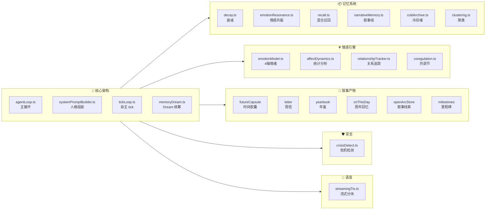

# Nexus 参考代码索引 —— 情感陪伴引擎完整地图

> 项目：[FanyinLiu/Nexus](https://github.com/FanyinLiu/Nexus)  
> 版本：v0.3.1（分析时）  
> 技术栈：Electron + React + TypeScript  
> 用途：为 chat-A 项目提供可参考、可借鉴的代码蓝图  
> 更新时间：2026-06-17

---

## 0. 阅读指南

本文档是 Nexus 项目的**全模块代码索引**，按功能域分类。每个条目包含：

| 字段 | 含义 |
|------|------|
| **本地路径** | 下载到本地的源码文件（`D:\chat-A\reference\Nexus-src\`） |
| **GitHub 路径** | 原始仓库中的位置 |
| **核心导出** | 该文件对外暴露的关键函数/类型/变量 |
| **借鉴价值** | ⭐1-5，对 chat-A 项目的参考意义 |
| **要点** | 一句话说明为什么值得看 |



---

## 1. 自主行为引擎（autonomy/）

### 1.1 情绪模型

| # | 文件 | 借鉴价值 | 要点 |
|---|------|---------|------|
| 1 | `src_features_autonomy_emotionModel.ts`<br/>→ `src/features/autonomy/emotionModel.ts` | ⭐⭐⭐⭐⭐ | **4轴情绪状态**（energy/warmth/curiosity/concern）→ 20+ 种信号增量（SIGNAL_DELTAS）→ 自然衰减回归基线。这是整个情感系统的数据源头。 |
| 2 | `src_features_autonomy_affectDynamics.ts`<br/>→ `src/features/autonomy/affectDynamics.ts` | ⭐⭐⭐⭐ | **Russell 环状统计分析**：效价均值、唤醒度均值、variability（标准差）、inertia（lag-1 自相关）。Kuppens(2015) 学术落地——高 inertia 表示情绪卡顿，高 variability 表示波动。 |
| 3 | `src_features_autonomy_affectGuidance.ts` | ⭐⭐⭐ | 情感指导：基于 affect snapshot 生成 Prompt 建议文案 |
| 4 | `src_features_autonomy_moodMapBinning.ts` | ⭐⭐ | 情绪按日期分桶，供年鉴和月报渲染 |

**emotionModel 信号增量表示例**：
```
user_greeting    → energy+0.1, warmth+0.15
user_praise      → warmth+0.2, energy+0.1
user_frustration → concern+0.25, energy-0.05
long_idle        → energy-0.15, curiosity-0.1
reunion          → warmth+0.25, energy+0.2  ← "你回来了！"的温暖飙升
voice_emotion_sad → concern+0.12, energy-0.04
late_night       → energy-0.2, concern+0.1
```

### 1.2 Tick 循环（自主行为调度）

| # | 文件 | 借鉴价值 | 要点 |
|---|------|---------|------|
| 4 | `src_features_autonomy_tickLoop.ts`<br/>→ `src/features/autonomy/tickLoop.ts` | ⭐⭐⭐⭐⭐ | **自主状态机**：awake → drowsy → sleeping → dreaming，按闲置时间自动切换。关键函数：`computeNextPhase()`, `shouldTick()`, `advanceTick()` |
| 5 | `src_features_autonomy_focusAwareness.ts`<br/>→ `src/features/autonomy/focusAwareness.ts` | ⭐⭐⭐⭐ | **用户专注度检测**：active(0-5min) → idle(5-30min) → away(30min+) → locked。含安静时段（quiet hours）判断。 |

**Tick 状态机转换规则**：
```
idle > sleepAfterIdleMinutes/2 → drowsy
idle > sleepAfterIdleMinutes   → sleeping
用户交互                       → awake（任意状态）
locked 或 安静时段             → sleeping
```

### 1.3 关系追踪

| # | 文件 | 借鉴价值 | 要点 |
|---|------|---------|------|
| 6 | `src_features_autonomy_relationshipTracker.ts`<br/>→ `src/features/autonomy/relationshipTracker.ts` | ⭐⭐⭐⭐⭐ | **关系评分**（0-100）：连续互动天 = +1（streak 加成最高 +3），连续缺席 >=3 天 = -2/天。含 lastSessionEmotion 和 lastSessionTopic 用于 reunion 上下文。 |
| 7 | `src_features_autonomy_relationshipDimensions.ts`<br/>→ `src/features/autonomy/relationshipDimensions.ts` | ⭐⭐⭐⭐ | **关系子维度**：trust（信任）、vulnerability（脆弱度）、playfulness（趣味度）、intellectual（智力深度）。 |
| 8 | `src_features_autonomy_milestones.ts`<br/>→ `src/features/autonomy/milestones.ts` | ⭐⭐⭐⭐⭐ | **周年里程碑**：30天/100天/365天触发，5语言文案，每次只触发一个，永不重复。核心理念："具体引用，不搞仪式感"。 |
| 9 | `src_features_autonomy_ruptureDetection.ts` | ⭐⭐⭐ | 关系破裂检测 |
| 10 | `src_features_autonomy_coregulation.ts`<br/>→ `src/features/autonomy/coregulation.ts` | ⭐⭐⭐⭐ | **共调节分析**：对比伴侣和用户的情绪变化相关性。 |

**关系评分公式**：
```
dailyInteraction()  → score += 1（连续 bonus 最高 +3）
absentDays >= 3     → score -= 2 × absentDays
totalDaysInteracted → 用于里程碑检测
score ∈ [0, 100]
```

### 1.4 Dream 周期（记忆整合统筹）

| # | 文件 | 借鉴价值 | 要点 |
|---|------|---------|------|
| 11 | `src_features_autonomy_memoryDream.ts`<br/>→ `src/features/autonomy/memoryDream.ts` | ⭐⭐⭐⭐⭐ | **Dream 触发门控 + Prompt 构建 + 响应解析**：门控检查 session 数和时间间隔，Prompt 包含 existing+ daily → 输出 new/update/prune 三操作 JSON。 |
| 12 | `src_features_memory_reflectionGenerator.ts`<br/>→ `src/features/memory/reflectionGenerator.ts` | ⭐⭐⭐⭐ | **Reflection 反思生成**：基于日记条目 + 情绪趋势 → LLM 自我生成用户观察，按 topic slug 去重，最多 20 条。 |

**Dream 门控条件**：
```
autonomyEnabled && autonomyDreamEnabled
sessionsSinceDream >= autonomyDreamMinSessions  // 最少会话数
hoursSinceLastDream >= autonomyDreamIntervalHours  // 最小间隔
```

### 1.5 学习与节奏

| # | 文件 | 借鉴价值 | 要点 |
|---|------|---------|------|
| 13 | `src_features_autonomy_rhythmLearner.ts`<br/>→ `src/features/autonomy/rhythmLearner.ts` | ⭐⭐⭐ | 节奏学习器：学习用户的活跃时间模式 |
| 14 | `src_features_autonomy_activityTone.ts`<br/>→ `src/features/autonomy/activityTone.ts` | ⭐⭐⭐ | 活动基调：根据当前活动类型（游戏/工作/空闲）调整对话语气 |
| 15 | `src_features_autonomy_skillDistillation.ts` | ⭐⭐ | 技能蒸馏：从复杂工具使用中提取可复用技能 |

### 1.6 v2 升级（Persona 架构）

| # | 文件 | 借鉴价值 | 要点 |
|---|------|---------|------|
| 16 | `src_features_autonomy_v2_personaTypes.ts`<br/>→ `src/features/autonomy/v2/personaTypes.ts` | ⭐⭐⭐⭐⭐ | **SOUL.md 类型定义**：LoadedPersona{soul, memory, examples, style{signaturePhrases, forbiddenPhrases, toneTags}, voice, tools}。默认角色 ID：`xinghui`。 |
| 17 | `src_features_autonomy_v2_orchestrator.ts`<br/>→ `src/features/autonomy/v2/orchestrator.ts` | ⭐⭐⭐⭐ | v2 编排器 |
| 18 | `src_features_autonomy_v2_decisionEngine.ts` | ⭐⭐⭐ | 自主决策引擎 |
| 19 | `src_features_autonomy_v2_personaGuardrail.ts` | ⭐⭐⭐⭐ | **人格护栏**：确保输出不偏离角色设定 |
| 20 | `src_features_autonomy_v2_personaLoader.ts` | ⭐⭐⭐ | 从磁盘加载 SOUL.md + MEMORY.md + examples.md |

---

## 2. 记忆系统（features/memory/）

### 2.1 核心存储

| # | 文件 | 借鉴价值 | 要点 |
|---|------|---------|------|
| 21 | `src_features_memory_memory.ts`<br/>→ `src/features/memory/memory.ts` | ⭐⭐⭐⭐⭐ | **记忆全生命周期**：extractMemoriesFromMessage（自动提取）→ mergeMemories（去重合并 0.72 阈值）→ rankMemories（基础排序）。500 条上限。 |
| 22 | `src_features_memory_constants.ts`<br/>→ `src/features/memory/constants.ts` | ⭐⭐ | 全局常量 |
| 23 | `src_features_memory_memoryPersistence.ts` | ⭐⭐ | 持久化层 |

### 2.2 衰减与显著性

| # | 文件 | 借鉴价值 | 要点 |
|---|------|---------|------|
| 24 | `src_features_memory_decay.ts`<br/>→ `src/features/memory/decay.ts` | ⭐⭐⭐⭐⭐ | **指数衰减** `0.97^days`（半衰期 23 天）+ **回忆强化 +0.15** + **情感显著性 computeMemorySignificance()** + 排名分数加权 |
| 25 | `src_features_memory_emotionResonance.ts`<br/>→ `src/features/memory/emotionResonance.ts` | ⭐⭐⭐⭐⭐ | **情感共振检索**：VAD 投射 + 三种调节模式（reinforce/empathy/repair）+ Priming 连贯性缓冲（滑动窗口 3）|

### 2.3 回忆与检索

| # | 文件 | 借鉴价值 | 要点 |
|---|------|---------|------|
| 26 | `src_features_memory_recall.ts`<br/>→ `src/features/memory/recall.ts` | ⭐⭐⭐⭐⭐ | **五维混合召回**：BM25×0.3 + Cosine×0.7 + recency + category + emotionBoost。`buildMemoryRecallContext()` 统一入口。 |
| 27 | `src_features_memory_vectorSearch.ts`<br/>→ `src/features/memory/vectorSearch.ts` | ⭐⭐⭐ | 向量搜索：embedding + 余弦相似度 |
| 28 | `src_features_memory_vectorSearchRuntime.ts`<br/>→ `src/features/memory/vectorSearchRuntime.ts` | ⭐⭐ | WASM 向量运行时 |

### 2.4 叙事与反思

| # | 文件 | 借鉴价值 | 要点 |
|---|------|---------|------|
| 29 | `src_features_memory_narrativeMemory.ts`<br/>→ `src/features/memory/narrativeMemory.ts` | ⭐⭐⭐⭐⭐ | **叙事线重建**：BFS 连通分量 → NarrativeThread{title, summary, dreamTouchCount} → Prompt 注入 |
| 30 | `src_features_memory_reflectionGenerator.ts`<br/>→ `src/features/memory/reflectionGenerator.ts` | ⭐⭐⭐⭐ | LLM 反思生成，按 topic slug 去重 |
| 31 | `src_features_memory_onThisDay.ts`<br/>→ `src/features/memory/onThisDay.ts` | ⭐⭐⭐⭐ | **周年候选选择**：4 层窗口（年/半年/月/周），按 significance×weight 排序，每次只选 1 条 |
| 32 | `src_features_memory_onThisDayLedger.ts`<br/>→ `src/features/memory/onThisDayLedger.ts` | ⭐⭐ | 已触发周年记录 |
| 33 | `src_features_memory_onThisDayPrompt.ts`<br/>→ `src/features/memory/onThisDayPrompt.ts` | ⭐⭐ | 周年 Prompt 生成 |

### 2.5 归档与聚类

| # | 文件 | 借鉴价值 | 要点 |
|---|------|---------|------|
| 34 | `src_features_memory_coldArchive.ts`<br/>→ `src/features/memory/coldArchive.ts` | ⭐⭐⭐⭐ | **冷存储**：decay < 0.15 归档（pinned/high 永不），可搜索，可恢复。最多 500 条。 |
| 35 | `src_features_memory_archive.ts`<br/>→ `src/features/memory/archive.ts` | ⭐⭐ | 归档管理 |
| 36 | `src_features_memory_clustering.ts`<br/>→ `src/features/memory/clustering.ts` | ⭐⭐⭐⭐ | **凝聚聚类**：Jaccard 相似度 + 平均链接 agglomerative，阈值 0.25，最多 30 簇 |

---

## 3. 对话系统（features/chat/）

### 3.1 系统核心

| # | 文件 | 借鉴价值 | 要点 |
|---|------|---------|------|
| 37 | `src_features_chat_systemPromptBuilder.ts`<br/>→ `src/features/chat/systemPromptBuilder.ts` | ⭐⭐⭐⭐⭐ | **Prompt 总装工厂**：SOUL.md + 叙事线 + 记忆注入 + 上下文（桌面/游戏/意图/工具/技能）+ 情绪状态 + 关系状态 + 里程碑 + OnThisDay + 周年 + 缺席通知。**
| 38 | `src_features_chat_memoryInjection.ts`<br/>→ `src/features/chat/memoryInjection.ts` | ⭐⭐⭐⭐⭐ | **记忆 Prompt 注入格式**：hot-tier（长期+日记，按字符预算截断）+ semantic（语义关联，带 confidence 分数）。语气极度自然："Things you know about this person..." |
| 39 | `src_features_chat_contextCompaction.ts`<br/>→ `src/features/chat/contextCompaction.ts` | ⭐⭐⭐⭐ | **上下文压缩**：Token 估算（CJK×2 + 英文×1.3 + 安全系数 1.2）→ 老消息语义总结（300 词上限） |

### 3.2 对话指导

| # | 文件 | 借鉴价值 | 要点 |
|---|------|---------|------|
| 40 | `src_features_chat_coherenceGuidance.ts` | ⭐⭐⭐⭐ | **连贯性指导**：防止对话跳脱 |
| 41 | `src_features_chat_emotionalTransitionGuidance.ts` | ⭐⭐⭐⭐ | **情绪转换指导**：控制情绪变化节奏 |
| 42 | `src_features_chat_lowSignalGuidance.ts` | ⭐⭐⭐ | 低信号对话处理（嗯、哦、好的 等短回复） |
| 43 | `src_features_chat_questionPacingGuidance.ts` | ⭐⭐⭐ | 提问节奏控制（不要连续拷问） |
| 44 | `src_features_chat_topicExhaustionGuidance.ts` | ⭐⭐⭐ | 话题耗尽检测（"这个话题差不多了"） |
| 45 | `src_features_chat_selfDisclosureGuidance.ts` | ⭐⭐⭐⭐ | **自我表露节奏**：控制 AI 何时暴露"自己的事" |
| 46 | `src_features_chat_reunionGuidance.ts`<br/>→ `src/features/chat/reunionGuidance.ts` | ⭐⭐⭐⭐⭐ | **重逢指导**：用户长时间离开后回来的对话策略——读取 lastSessionEmotion/Topic，自然衔接 |
| 47 | `src_features_chat_lorebookInjection.ts`<br/>→ `src/features/chat/lorebookInjection.ts` | ⭐⭐⭐ | Lorebook 注入（角色世界观资料） |

### 3.3 工具与循环

| # | 文件 | 借鉴价值 | 要点 |
|---|------|---------|------|
| 48 | `src_features_chat_toolCallLoop.ts` | ⭐⭐⭐ | 工具调用循环 |
| 49 | `src_features_chat_failoverChain.ts` | ⭐⭐⭐ | 对话层的故障转移链 |
| 50 | `src_features_chat_runtime.ts` | ⭐⭐ | 对话运行时 |

---

## 4. 特色叙事产物（features/）

### 4.1 时间胶囊

| # | 文件 | 借鉴价值 | 要点 |
|---|------|---------|------|
| 51 | `src_features_futureCapsule_futureCapsuleStore.ts`<br/>→ `src/features/futureCapsule/futureCapsuleStore.ts` | ⭐⭐⭐⭐⭐ | **我给未来的我留言**：用户写一段话 + 指定日期 → 伴侣在那天原样呈现，伴以自己的声音框架。最多 200 条，delivered 旧条目优先淘汰。 |
| 52 | `src_features_futureCapsule_futureCapsuleDelivery.ts` | ⭐⭐⭐⭐ | 胶囊投递调度 + 交付 Prompt |

### 4.2 周信（Sunday Letter）

| # | 文件 | 借鉴价值 | 要点 |
|---|------|---------|------|
| 53 | `src_features_letter_letterStore.ts`<br/>→ `src/features/letter/letterStore.ts` | ⭐⭐⭐⭐⭐ | **周日信**：6 段结构（greeting/summary/suggestion/intention/experiment/closing），最多保留 26 封（半年）。 |
| 54 | `src_features_letter_letterScheduler.ts`<br/>→ `src/features/letter/letterScheduler.ts` | ⭐⭐⭐⭐ | 信调度器：周日触发判断 + 生成条件检查 |
| 55 | `src_features_letter_letterPromptBuilder.ts`<br/>→ `src/features/letter/letterPromptBuilder.ts` | ⭐⭐⭐⭐ | 信 Prompt 构建 |
| 56 | `src_features_letter_aggregator.ts`<br/>→ `src/features/letter/aggregator.ts` | ⭐⭐⭐ | 一周数据聚合 |

### 4.3 年鉴

| # | 文件 | 借鉴价值 | 要点 |
|---|------|---------|------|
| 57 | `src_features_yearbook_yearbookAggregator.ts`<br/>→ `src/features/yearbook/yearbookAggregator.ts` | ⭐⭐⭐⭐⭐ | **年度记忆汇总**：12 个月情绪分桶 + 影响快照 + 共调节趋势 + 信摘录 + 记忆高光 + 关系里程碑。纯函数，无 IO。 |
| 58 | `src_features_yearbook_yearbookRender.ts` | ⭐⭐⭐ | 年鉴 HTML 渲染 |

### 4.4 Open Arc

| # | 文件 | 借鉴价值 | 要点 |
|---|------|---------|------|
| 59 | `src_features_arc_openArcStore.ts`<br/>→ `src/features/arc/openArcStore.ts` | ⭐⭐⭐⭐⭐ | **叙事线索**：用户手动开启 → d3/d5 自动跟进 → d7 自动放下。核心理念："不是提醒，是记得你在乎什么"。 |
| 60 | `src_features_arc_openArcPolicy.ts`<br/>→ `src/features/arc/openArcPolicy.ts` | ⭐⭐⭐ | 线索检查调度 |
| 61 | `src_features_arc_openArcDelivery.ts`<br/>→ `src/features/arc/openArcDelivery.ts` | ⭐⭐⭐ | 线索触达 |

---

## 5. 安全系统（features/safety/）

| # | 文件 | 借鉴价值 | 要点 |
|---|------|---------|------|
| 62 | `src_features_safety_crisisDetect.ts`<br/>→ `src/features/safety/crisisDetect.ts` | ⭐⭐⭐⭐⭐ | **危机检测**：两阶段——正则初筛（中英日韩 5 语，low/medium/high 三级）+ false-positive 抑制（"笑死了"、"killing it"）。偏向 recall > precision，宁可误报不漏报。 |
| 63 | `src_features_safety_crisisSecondPass.ts` | ⭐⭐⭐ | LLM 二次判定 |
| 64 | `src_features_safety_crisisGuidance.ts` | ⭐⭐⭐⭐ | 危机应对指导 |
| 65 | `src_features_safety_hotlines.ts` | ⭐⭐ | 各语言热线号码 |
| 66 | `src_features_safety_CrisisHotlinePanel.tsx` | ⭐⭐ | 热线面板 UI |

---

## 6. 语音系统（features/voice/ + features/hearing/）

| # | 文件 | 借鉴价值 | 要点 |
|---|------|---------|------|
| 67 | `src_features_voice_streamingTts.ts`<br/>→ `src/features/voice/streamingTts.ts` | ⭐⭐⭐⭐ | **流式 TTS 分块器**：基于句子边界智能切分（句号/问号/叹号 → 逗号/顿号 → 空格），首块更短优先，可配置 18-72 字符窗口。 |
| 68 | `src_features_voice_bus.ts` | ⭐⭐⭐ | 语音事件总线 |
| 69 | `src_features_voice_streamAudioPlayer.ts` | ⭐⭐⭐ | 流式音频播放器 |
| 70 | `src_features_hearing_wakewordListener.ts` | ⭐⭐⭐ | 唤醒词监听 |
| 71 | `src_features_hearing_browserVad.ts` | ⭐⭐⭐ | 浏览器端 VAD |

---

## 7. 其他基础设施

| # | 文件 | 借鉴价值 | 要点 |
|---|------|---------|------|
| 72 | `src_features_failover_orchestrator.ts`<br/>→ `src/features/failover/orchestrator.ts` | ⭐⭐⭐⭐ | **故障转移编排**：自动切换到备份 LLM/TTS/STT 提供商 |
| 73 | `src_features_metering_contextMeter.ts`<br/>→ `src/features/metering/contextMeter.ts` | ⭐⭐⭐ | 上下文计量 + 成本追踪 |
| 74 | `src_features_intent_preprocess.ts`<br/>→ `src/features/intent/preprocess.ts` | ⭐⭐⭐ | 意图预处理 |
| 75 | `src_features_chat_promptModeMcp.ts` | ⭐⭐ | MCP Prompt 模式 |
| 76 | `src_features_agent_agentLoop.ts` | ⭐⭐⭐⭐ | Agent 主循环（工具调用+结果处理） |
| 77 | `src_features_agent_errandRunner.ts` | ⭐⭐⭐ | 后台任务执行器 |
| 78 | `src_features_proactive_bracketScheduler.ts`<br/>→ `src/features/proactive/bracketScheduler.ts` | ⭐⭐⭐ | 主动输出时段调度 |

---

## 8. 类型定义（关键 TypeScript 类型）

| 类型 | 所在文件 | 说明 |
|------|---------|------|
| `MemoryItem` | `src/types/memory.ts` | 长期记忆核心类型（含 emotionSnapshot, significance, relatedIds） |
| `EmotionState` | `autonomy/emotionModel.ts` | 4 轴情绪 {energy, warmth, curiosity, concern} |
| `EmotionSignal` | `autonomy/emotionModel.ts` | 20+ 种情绪信号枚举 |
| `RelationshipState` | `autonomy/relationshipTracker.ts` | 关系评分 + lastSessionEmotion/Topic |
| `RegulatoryMode` | `memory/emotionResonance.ts` | 三模式：reinforce / empathy / repair |
| `NarrativeThread` | `memory/narrativeMemory.ts` | 叙事线 {title, summary, dreamTouchCount} |
| `LoadedPersona` | `autonomy/v2/personaTypes.ts` | SOUL.md 加载后的完整人格 |
| `OpenArcRecord` | `arc/openArcStore.ts` | 叙事线索 {theme, checkInDays, status} |
| `FutureCapsuleRecord` | `futureCapsule/futureCapsuleStore.ts` | 时间胶囊 {message, scheduledFor, status} |
| `SavedLetter` | `letter/letterStore.ts` | 周信 {letterDate, content, themes} |
| `VAPoint` | `memory/emotionResonance.ts` | 效价-唤醒度二维点 |
| `AffectSnapshot` | `autonomy/affectDynamics.ts` | 情绪统计快照 {baselineValence, variability, inertia} |

---

## 9. chat-A 借鉴优先级总表

按实现难度和效果收益排序：

| 优先级 | 模块 | 代码量 | 依赖 | 效果 |
|--------|------|--------|------|------|
| 🔥🔥🔥🔥🔥 | **emotionResonance.ts** | ~200行 | EmotionState | 情感驱动的记忆浮现 |
| 🔥🔥🔥🔥🔥 | **decay.ts** | ~130行 | MemoryItem | 记忆自然淡出 + 回忆强化 |
| 🔥🔥🔥🔥🔥 | **recall.ts** | ~200行 | decay + emotionResonance | 五维混合排序 |
| 🔥🔥🔥🔥 | **emotionModel.ts** | ~150行 | 无 | 4轴情绪 + 信号增量 |
| 🔥🔥🔥🔥 | **systemPromptBuilder.ts** | ~300行 | 多个注入模块 | 总装工厂参考 |
| 🔥🔥🔥🔥 | **memoryInjection.ts** | ~100行 | MemoryRecallContext | 记忆注入格式（文案极佳） |
| 🔥🔥🔥 | **relationshipTracker.ts** | ~250行 | 无 | 关系评分 + 缺席感知 |
| 🔥🔥🔥 | **onThisDay.ts** | ~130行 | MemoryItem | 周年回忆（低成本高情感价值） |
| 🔥🔥🔥 | **milestones.ts** | ~150行 | RelationshipState | 30/100/365天里程碑 |
| 🔥🔥 | **narrativeMemory.ts** | ~300行 | MemoryItem.relatedIds | 叙事线（需 relatedIds 基础） |
| 🔥🔥 | **coldArchive.ts** | ~200行 | decay | 冷存储 |
| 🔥🔥 | **clustering.ts** | ~180行 | 无 | 语义聚类 |
| 🔥🔥 | **openArcStore.ts** | ~250行 | 调度器 | 叙事线索跟进 |
| 🔥🔥 | **futureCapsuleStore.ts** | ~200行 | 调度器 | 时间胶囊 |
| 🔥🔥 | **letterStore.ts** | ~200行 | 多个数据源 | 周日信（需较多依赖） |
| 🔥 | **crisisDetect.ts** | ~300行 | 无 | 危机检测（5语言正则） |
| 🔥 | **streamingTts.ts** | ~150行 | 无 | 流式 TTS 分块器 |

---

## 10. 所有已下载源码清单

以下文件已从 GitHub 下载到 `D:\chat-A\reference\Nexus-src\`：

```
src_features_autonomy_activityTone.ts
src_features_autonomy_affectDynamics.ts
src_features_autonomy_coregulation.ts
src_features_autonomy_emotionModel.ts
src_features_autonomy_focusAwareness.ts
src_features_autonomy_memoryDream.ts
src_features_autonomy_milestones.ts
src_features_autonomy_relationshipDimensions.ts
src_features_autonomy_relationshipTracker.ts
src_features_autonomy_rhythmLearner.ts
src_features_autonomy_ruptureDetection.ts
src_features_autonomy_tickLoop.ts
src_features_autonomy_v2_orchestrator.ts
src_features_autonomy_v2_personaTypes.ts
src_features_arc_openArcDelivery.ts
src_features_arc_openArcPolicy.ts
src_features_arc_openArcStore.ts
src_features_character_index.ts
src_features_character_presets.ts
src_features_character_profiles.ts
src_features_chat_coherenceGuidance.ts
src_features_chat_contextCompaction.ts
src_features_chat_lorebookInjection.ts
src_features_chat_memoryInjection.ts
src_features_chat_reunionGuidance.ts
src_features_chat_systemPromptBuilder.ts
src_features_failover_orchestrator.ts
src_features_futureCapsule_futureCapsuleDelivery.ts
src_features_futureCapsule_futureCapsuleStore.ts
src_features_intent_preprocess.ts
src_features_letter_aggregator.ts
src_features_letter_letterPromptBuilder.ts
src_features_letter_letterScheduler.ts
src_features_letter_letterStore.ts
src_features_memory_archive.ts
src_features_memory_clustering.ts
src_features_memory_coldArchive.ts
src_features_memory_constants.ts
src_features_memory_decay.ts
src_features_memory_emotionResonance.ts
src_features_memory_index.ts
src_features_memory_memory.ts
src_features_memory_narrativeMemory.ts
src_features_memory_onThisDay.ts
src_features_memory_onThisDayLedger.ts
src_features_memory_onThisDayPrompt.ts
src_features_memory_recall.ts
src_features_memory_reflectionGenerator.ts
src_features_memory_vectorSearch.ts
src_features_memory_vectorSearchRuntime.ts
src_features_metering_contextMeter.ts
src_features_proactive_bracketScheduler.ts
src_features_safety_crisisDetect.ts
src_features_voice_streamingTts.ts
src_features_yearbook_yearbookAggregator.ts
```

---

> **文档版本**: v2.0 — 全模块索引版
> **使用建议**: 实现 chat-A 时，按第 9 节的优先级顺序逐个参考。前三项（emotionResonance + decay + recall）总计约 530 行 TS 可独立移植。
