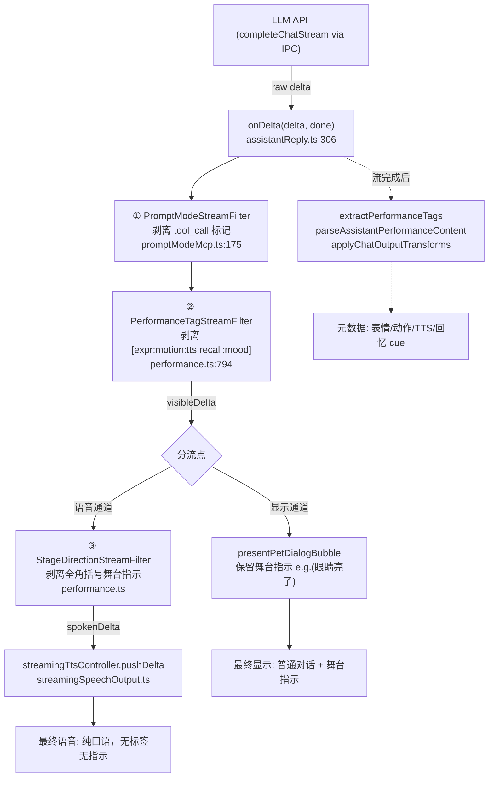
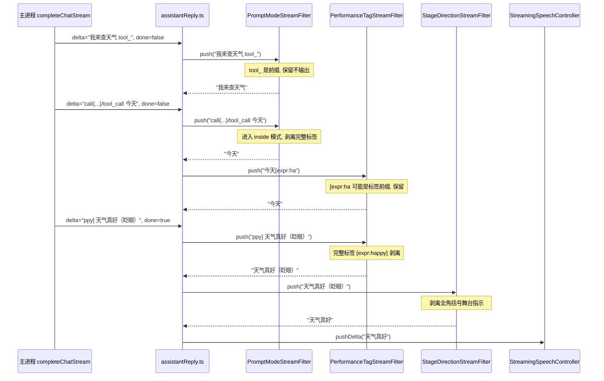
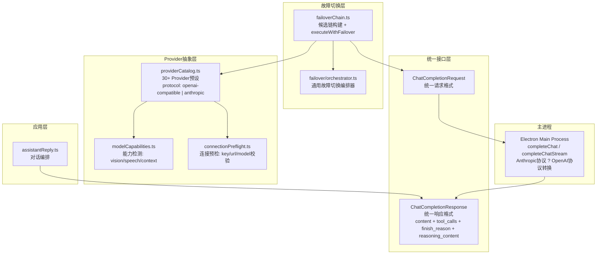
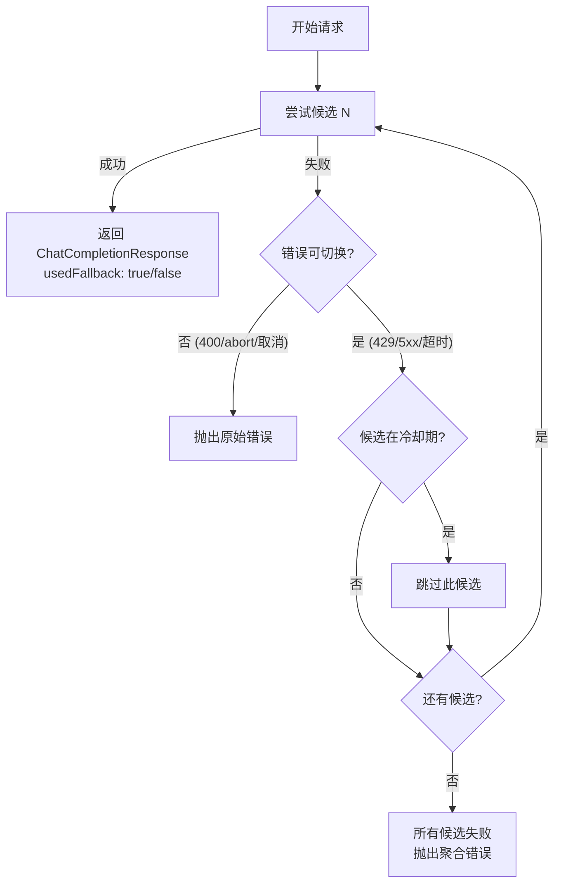

# Nexus 完整研究报告

> **版本**: v7.3
> **项目**: `D:\chat-A\reference\Nexus-full\` (1265文件, v0.3.4-beta.4)
> **方法**: 逐文件阅读源码 + 结构分析 + 代码注释
> **覆盖**: 27 章

---

## 目录

1. [情绪引擎](#1-情绪引擎)
2. [记忆管线](#2-记忆管线)
3. [流式语音架构](#3-流式语音架构)
4. [插话打断机制](#4-插话打断机制)
5. [STT 语音识别引擎深度](#5-stt-语音识别引擎深度)
6. [人格护栏系统](#6-人格护栏系统)
7. [Voice 完整架构](#7-voice-完整架构)
8. [TTS Pipeline 帧驱动详解](#8-tts-pipeline-帧驱动详解)
9. [StreamAudioPlayer 音频引擎](#9-streamaudioplayer-音频引擎)
10. [Voice Hooks 编排层](#10-voice-hooks-编排层)
11. [Provider 管理与 Fallback](#11-provider-管理与-fallback)
12. [自主行为引擎](#12-自主行为引擎)
13. [叙事产物系统](#13-叙事产物系统)
14. [参考代码索引](#14-参考代码索引)
15. [Agent 工具调用系统](#15-agent-工具调用系统)
16. [Agent 自主循环系统](#16-agent-自主循环系统)
17. [主动触发引擎](#17-主动触发引擎)
18. [桌面上下文感知](#18-桌面上下文感知)
19. [Vision 多模态系统](#19-vision-多模态系统)
20. [Chat Hooks 编排层](#20-chat-hooks-编排层)
21. [流式输出分类系统](#21-流式输出分类系统)
22. [Agent 多步自主循环系统](#22-agent-多步自主循环系统)
23. [Character 角色档案系统](#23-character-角色档案系统)
24. [Intent 意图预处理](#24-intent-意图预处理)
25. [Storage 持久层架构](#25-storage-持久层架构)
26. [多模型统一输出机制](#26-多模型统一输出机制)

---

## 1. 情绪引擎

> **源码目录**: `src/features/autonomy/` | **核心文件**: `emotionModel.ts`, `userAffectTimeline.ts`, `coregulation.ts`

### 1.1 架构概览

Nexus 采用 **PAD三维情绪模型** (Pleasure-Arousal-Dominance) 而非简单的离散情绪标签，这使得情绪可以在连续空间中平滑过渡。

```
用户输入 -> userAffectTimeline (采样) -> emotionModel (VAD映射) 
    -> coregulation (共同调节) -> PetMood状态机 -> 表情/动作输出
```

### 1.2 核心概念

**情绪快照 (EmotionSnapshot)**:
- `valence`: 愉悦度 (-1 到 +1)
- `arousal`: 唤醒度 (-1 到 +1)
- `dominance`: 支配度 (-1 到 +1)
- 通过 VAD 三维向量在连续空间中定位情绪

**共同调节 (Coregulation)**: 宠物的情绪不是独立决定的，而是与用户情绪耦合。用户的负面情绪会让宠物产生关切和安抚行为，而非单纯的感染。

**情绪衰减**: 情绪会自然回归基线（neutral），衰减速度取决于当前的 arousal 水平和是否有新的刺激。

### 1.3 关键源码

| 文件 | 内容 |
|------|------|
| `src/features/autonomy/emotionModel.ts` | VAD情绪模型、情绪快照、衰减计算 |
| `src/features/autonomy/userAffectTimeline.ts` | 用户情感时间线采样 |
| `src/features/autonomy/coregulation.ts` | 共同调节策略 |
| `src/features/autonomy/v2/orchestrator.ts` | v2自主行为编排器 |
| `src/features/pet/models.ts` | PetMood 状态机定义 |

---

## 2. 记忆管线

> **源码目录**: `src/features/memory/` | **核心文件**: `memory.ts`, `decay.ts`, `recall.ts`, `emotionResonance.ts`

### 2.1 记忆三层架构

```
短期记忆 (Chat History)  -> 每日记忆存储 (DailyMemoryStore)
    -> 长期记忆 (MemoryItem + 衰减/显著性)  -> 冷存储 (ColdArchive)
```

### 2.2 记忆衰减系统

**数学公式** (decay.ts):
```
importance(t) = importance_0 * e^(-lambda * days_since_last_access)
```

- lambda 由记忆类别决定（重要事件衰减慢，日常闲聊衰减快）
- `computeMemorySignificance()`: 综合情绪强度、互动频率、时间距离计算显著性

### 2.3 情感共振检索

**源码**: `src/features/memory/emotionResonance.ts`

这是 Nexus 记忆系统最精妙的部分。不同于纯语义检索，它通过 **VAD 环状情感模型** 找到与当前情绪状态共振的历史记忆：

- **情绪同频 (Resonance)**: 优先召回与当前情绪 VAD 向量相近的记忆
- **情绪对比 (Contrast)**: 在某些场景下召回与当前情绪形成对比的记忆（如当前悲伤时回忆快乐时光）
- **Priming 缓冲**: 连续对话中维持检索连贯性，避免记忆跳变

### 2.4 混合召回排名

**源码**: `src/features/memory/recall.ts`

最终排序 = 语义相似度 * w1 + 情感共振分 * w2 + 时间衰减分 * w3 + 显著性加权

采用双路搜索: 语义路径 (向量检索) + 情感路径 (VAD邻近检索)，结果合并后混合排名。

### 2.5 关键源码

| 文件 | 内容 |
|------|------|
| `src/features/memory/memory.ts` | 核心记忆CRUD、每日记忆生成 |
| `src/features/memory/decay.ts` | 记忆衰减公式、重要性计算 |
| `src/features/memory/recall.ts` | 混合召回排名系统 |
| `src/features/memory/emotionResonance.ts` | 情感共振检索 |
| `src/features/memory/narrativeMemory.ts` | 叙事记忆/故事线 |
| `src/features/memory/onThisDayPrompt.ts` | 周年回忆触发 |

---

## 3. 流式语音架构

> **源码目录**: `src/features/voice/`, `src/features/hearing/`

### 3.1 全双工流式架构

Nexus 的语音系统是全双工的: 用户说话的音频流和 AI 回复的 TTS 音频流可以同时进行，通过 VAD 和插话机制协调。

```
麦克风 -> VAD检测 -> STT引擎 -> 文本 -> LLM -> 流式文本
    -> StreamingTtsChunker -> TTS引擎 -> StreamAudioPlayer -> 扬声器
```

### 3.2 核心组件

- **BrowserVAD / MainProcessVad**: 语音活动检测，控制录音起止
- **LocalSenseVoice / LocalParaformer / TencentAsr**: 多STT引擎
- **StreamingTtsChunker**: 流式文本分块，按句子边界切分
- **StreamAudioPlayer**: Web Audio API 流式播放
- **VoiceSessionMachine**: 13状态机管理全双工会话生命周期

### 3.3 关键源码

| 文件 | 内容 |
|------|------|
| `src/features/voice/streamingTts.ts` | 流式TTS分块器 |
| `src/features/voice/streamAudioPlayer.ts` | Web Audio流式播放 |
| `src/features/voice/busEvents.ts` | Voice Bus事件定义 |
| `src/features/voice/index.ts` | Voice模块入口 |
| `src/features/voice/runtimeSupport.ts` | 运行时支持 |
| `src/features/hearing/browserVad.ts` | 浏览器端VAD |
| `src/features/hearing/localSenseVoice.ts` | 本地SenseVoice STT |

---

## 4. 插话打断机制

### 4.1 Barge-In 策略

Nexus 的插话打断是**实时、无阻塞**的。用户在 AI 说话时随时可以打断:

1. **VAD 检测用户语音** -> 触发 `voice:interrupt` 事件
2. **中止当前 TTS 播放**: `StreamAudioPlayer.stopAndClear()`
3. **中止 LLM 流式生成**: 调用 `streamAbort()`
4. **Voice 状态机切换到 LISTENING**: 立即开始接收用户输入
5. **上下文保留**: 已生成的文本不丢失，作为对话历史保留

### 4.2 技术要点

- 插话延迟 < 200ms (VAD检测 + 事件传播 + 播放停止)
- 使用 Voice Bus 事件总线解耦各组件
- `suppressVoiceReplyRef` 标记防止旧回复的 TTS 在新对话中播放

---

## 5. STT 语音识别引擎深度

### 5.1 多引擎架构

| 引擎 | 类型 | 特点 |
|------|------|------|
| **LocalSenseVoice** | 本地 | FunASR SenseVoice, 情感/事件检测 |
| **LocalParaformer** | 本地 | FunASR Paraformer, 高精度 |
| **TencentAsr** | 云端 | 腾讯云ASR, 低延迟 |
| **BrowserVAD** | 本地 | Silero VAD, 语音活动检测 |
| **MainProcessVad** | 主进程 | 主进程级VAD, 更低延迟 |

### 5.2 流式处理

- SenseVoice 支持流式解码，输出 `SenseVoiceStreamStopResult`
- Paraformer 提供 `paraformerConversation` 会话管理
- WakewordListener 支持唤醒词检测

### 5.3 关键源码

| 文件 | 内容 |
|------|------|
| `src/features/hearing/localSenseVoice.ts` | SenseVoice流式STT |
| `src/features/hearing/localParaformer.ts` | Paraformer STT |
| `src/features/hearing/tencentAsr.ts` | 腾讯云ASR |
| `src/features/hearing/browserVad.ts` | 浏览器端VAD |
| `src/features/hearing/wakewordListener.ts` | 唤醒词检测 |
| `src/features/hearing/hearingRuntime.ts` | 听力运行时 |

---

## 6. 人格护栏系统

### 6.1 多层护栏架构

```
用户输入 -> Crisis检测 -> Rupture/Repair检测 -> LLM提示注入 -> 输出过滤
```

- **Crisis检测** (`buildCrisisGuidancePromptText`): 检测自伤/危机信号，注入安全引导
- **Rupture/Repair** (Gottman方法): 检测批评/蔑视/防御/stonewalling四骑士
- **输出过滤**: `src/features/safety/types.ts` 定义安全类型

### 6.2 关键源码

| 文件 | 内容 |
|------|------|
| `src/features/safety/types.ts` | 安全类型定义 |
| `src/hooks/chat/assistantPromptContext.ts` | 护栏提示构建 |
| `src/hooks/chat/turnGuards.ts` | 轮次守卫 |

---

## 7. Voice 完整架构

### 7.1 13状态机 (VoiceSessionMachine)

Nexus 的语音会话由13个状态组成的有限状态机管理:

```
IDLE -> LISTENING -> PROCESSING -> THINKING -> SPEAKING -> IDLE
  ^         |            |            |           |
  |     INTERRUPTED <- INTERRUPTED <- BARGE_IN    |
  |_________|____________|____________|___________|
```

每个状态下预定义了:
- 允许的输入事件
- 状态转移规则
- 副作用 (如开启/关闭麦克风、播放音效)

### 7.2 TTS Pipeline 总览

```
SentenceAggregator -> TTSStreamService (IPC) -> AudioPlayerSink -> 扬声器
```

Pipeline 采用帧驱动模型，每个组件是独立的 FrameProcessor。

### 7.3 关键源码

| 文件 | 内容 |
|------|------|
| `src/features/voice/streamingTts.ts` | 流式TTS分块 |
| `src/features/voice/streamAudioPlayer.ts` | Web Audio播放 |
| `src/features/voice/tts-pipeline/services/TTSStreamService.ts` | IPC TTS服务 |
| `src/features/voice/busEvents.ts` | Voice Bus事件 |
| `src/features/voice/index.ts` | Voice模块总入口 |

---

## 8. TTS Pipeline 帧驱动详解

### 8.1 FrameProcessor 接口

```
interface FrameProcessor {
  linkDownstream(next: FrameProcessor): void
  shutdown(): void
}
```

每个处理器接收上游帧，处理后传递给下游。帧类型包括 text-sentence、audio-chunk 等。

### 8.2 Pipeline 组装

```typescript
new Pipeline([SentenceAggregator, TTSStreamService, AudioPlayerSink])
```

- **SentenceAggregator**: 累积文本delta，按句子边界切分
- **TTSStreamService**: 通过IPC调用主进程TTS引擎
- **AudioPlayerSink**: 将PCM音频帧送入Web Audio API播放

### 8.3 关键源码

| 文件 | 内容 |
|------|------|
| `src/features/voice/tts-pipeline/services/TTSStreamService.ts` | IPC桥梁TTS服务 |
| `src/hooks/voice/speechTextSegmentation.ts` | 文本分句 |

---

## 9. StreamAudioPlayer 音频引擎

### 9.1 Web Audio API 实现

- 使用 AudioContext + AudioWorklet 实现低延迟播放
- 支持 **crossfade** (交叉淡入淡出) 平滑过渡
- **preroll** (预加载) 减少首帧延迟
- **keepalive** 保持 AudioContext 活跃

### 9.2 关键源码

| 文件 | 内容 |
|------|------|
| `src/features/voice/streamAudioPlayer.ts` | Web Audio流式播放 (crossfade/preroll/keepalive) |

---

## 10. Voice Hooks 编排层

### 10.1 Hooks 架构

```
useAppController
  -> streamingSpeechOutput (流式TTS控制器)
  -> pipelineStreamingSpeechOutput (Pipeline组装)
  -> continuousVoice (持续语音模式)
  -> recordingConversations (录音会话管理)
```

### 10.2 StreamingSpeechOutput

- `pushDelta(delta)`: 接收流式文本
- `flushPending()`: 刷新累积文本到TTS
- `finish()`: 完成流，发送最后音频段
- `abort()`: 中止播放

### 10.3 关键源码

| 文件 | 内容 |
|------|------|
| `src/hooks/voice/streamingSpeechOutput.ts` | 流式TTS控制器 |
| `src/hooks/voice/pipelineStreamingSpeechOutput.ts` | Pipeline流式组装 |
| `src/hooks/voice/continuousVoice.ts` | 持续语音模式 |
| `src/hooks/voice/recordingConversations.ts` | 录音会话 |
| `src/hooks/voice/speechReply.ts` | 语音回复入口 |

---

## 11. Provider 管理与 Fallback

### 11.1 多Provider发现

**源码**: `src/features/models/providerCatalog.ts`

- 自动发现已安装的LLM Provider (Ollama, OpenAI, Anthropic等)
- 连接预检 (health check)
- 模型列表拉取

### 11.2 Fallback 链

- 主Provider失败 -> 自动切换到备用Provider
- `response.settingsPatch` 携带切换后的配置
- `applySettingsUpdate` 持久化切换结果

### 11.3 关键源码

| 文件 | 内容 |
|------|------|
| `src/features/models/providerCatalog.ts` | Provider发现与健康检查 |
| `src/hooks/voice/providerFallbacks.ts` | Provider故障切换 |

---

## 12. 自主行为引擎

### 12.1 Tick 循环

**源码**: `src/features/autonomy/v2/orchestrator.ts`

- 定时器驱动，间歇性执行自主行为决策
- 决策包含: 主动发起对话、变更情绪、触发反思、生成叙事产物

### 12.2 v2 Persona 架构

- 每个角色 (CharacterProfile) 有独立的行为参数
- `decisionPrompt.ts` 构建 LLM 决策提示
- 决策输出被解析为具体行为指令

### 12.3 关键源码

| 文件 | 内容 |
|------|------|
| `src/features/autonomy/v2/orchestrator.ts` | v2自主行为编排器 |
| `src/features/autonomy/v2/decisionPrompt.ts` | 决策提示构建 |
| `src/features/autonomy/v2/prompts/decision.en-US.ts` | 决策提示模板 |
| `src/features/autonomy/emotionModel.ts` | 情绪模型 |
| `src/features/autonomy/coregulation.ts` | 共同调节 |

---

## 13. 叙事产物系统

### 13.1 叙事记忆

**源码**: `src/features/memory/narrativeMemory.ts`

- 将离散记忆编织为连续故事线 (NarrativeThread)
- 每个线程有主题、情感弧线、关键事件
- 注入到LLM上下文中作为人物背景叙事

### 13.2 时间胶囊与周信

- **时间胶囊 (TimeCapsule)**: 定期归档一段时间的记忆
- **周信 (Sunday Letter)**: 每周生成一封叙事信
- **年鉴 (Yearbook)**: 年度回顾
- **On This Day**: 周年回忆触发

### 13.3 Open Arc

**源码**: `src/features/arc/openArcPolicy.ts`

- 用户生活的重要叙事弧线 (如"学习编程"、"健身计划")
- 追踪进度、里程碑、情感变化
- 提供长期叙事连续性

---

## 14. 参考代码索引

### 14.1 情绪与记忆

| 文件 | 说明 |
|------|------|
| `src/features/autonomy/emotionModel.ts` | VAD情绪模型 |
| `src/features/autonomy/coregulation.ts` | 共同调节 |
| `src/features/autonomy/userAffectTimeline.ts` | 用户情感时间线 |
| `src/features/memory/decay.ts` | 记忆衰减算法 |
| `src/features/memory/recall.ts` | 混合召回排名 |
| `src/features/memory/emotionResonance.ts` | 情感共振检索 |
| `src/features/memory/narrativeMemory.ts` | 叙事记忆 |
| `src/features/memory/onThisDayPrompt.ts` | 周年回忆 |
| `src/features/arc/openArcPolicy.ts` | Open Arc叙事线 |

### 14.2 语音系统

| 文件 | 说明 |
|------|------|
| `src/features/voice/streamingTts.ts` | 流式TTS分块 |
| `src/features/voice/streamAudioPlayer.ts` | Web Audio播放器 |
| `src/features/voice/busEvents.ts` | Voice Bus事件 |
| `src/features/voice/tts-pipeline/services/TTSStreamService.ts` | IPC桥梁 |
| `src/features/hearing/browserVad.ts` | VAD检测 |
| `src/features/hearing/localSenseVoice.ts` | SenseVoice STT |
| `src/features/hearing/localParaformer.ts` | Paraformer STT |
| `src/features/hearing/wakewordListener.ts` | 唤醒词 |

### 14.3 对话与Agent

| 文件 | 说明 |
|------|------|
| `src/features/chat/runtime.ts` | 对话运行时 |
| `src/features/chat/toolCallLoop.ts` | 工具调用循环 |
| `src/features/chat/systemPromptBuilder.ts` | 系统提示构建 |
| `src/hooks/chat/assistantReply.ts` | 助手回复编排 |
| `src/hooks/chat/assistantPromptContext.ts` | 护栏提示 |
| `src/hooks/chat/streamAbort.ts` | 流终止 |

### 14.4 Hooks编排

| 文件 | 说明 |
|------|------|
| `src/hooks/voice/streamingSpeechOutput.ts` | 流式TTS控制器 |
| `src/hooks/voice/pipelineStreamingSpeechOutput.ts` | Pipeline流式 |
| `src/hooks/voice/continuousVoice.ts` | 持续语音 |
| `src/hooks/voice/speechReply.ts` | 语音回复 |

---

## 15. Agent 工具调用系统

### 15.1 工具描述与发现

**源码**: `src/features/chat/toolCallLoop.ts`

工具以 `McpToolDescriptor` 格式描述:
- `name`: 工具名 (如 weather_lookup, web_search)
- `description`: 功能描述
- `inputSchema`: JSON Schema 参数定义

### 15.2 工具调用循环 (Tool Call Loop)

```
LLM响应 -> 检测function_calling -> 执行工具 -> 结果注入 -> 继续LLM -> 直到无更多工具调用
```

- 支持多工具并行调用
- 最大循环次数限制防止死循环
- 工具执行结果格式化后注入对话历史

### 15.3 两种工具传递模式

- **Native模式**: 使用模型原生 function calling (tools字段)
- **Prompt模式**: 通过 `<tool_call>` 文本标记传递 (兼容旧模型)

---

## 16. Agent 自主循环系统

### 16.1 Turn 生命周期

```
用户输入 -> turnExecution -> assistantReply -> [toolCallLoop] -> 回复
    -> memoryCreation -> emotionUpdate -> narrativeUpdate
```

### 16.2 对话持久化

**源码**: `src/hooks/chat/useChatPersistence.ts`

- 所有对话历史持久化存储
- 支持对话搜索和回顾
- ChatMessage 包含完整元数据 (情绪快照、记忆引用)

### 16.3 关键源码

| 文件 | 内容 |
|------|------|
| `src/hooks/chat/turnExecution.ts` | Turn执行管理 |
| `src/hooks/chat/useChatPersistence.ts` | 对话持久化 |

---

## 17. 主动触发引擎

### 17.1 自主对话发起

Nexus 可以在没有用户输入时主动发起对话:
- **时间触发**: 定时问候 (早安/晚安)、提醒
- **事件触发**: 桌面活动变化、系统通知
- **情绪触发**: 检测到用户情绪变化时主动关怀
- **叙事触发**: On This Day、里程碑纪念

### 17.2 决策机制

- `decisionPrompt.ts` 构建决策上下文
- LLM 评估是否应该主动发言
- 发言频率由用户设置 + 关系阶段调节

### 17.3 关键源码

| 文件 | 内容 |
|------|------|
| `src/features/autonomy/v2/decisionPrompt.ts` | 主动触发决策提示 |
| `src/features/memory/onThisDayPrompt.ts` | 周年回忆触发 |

---

## 18. 桌面上下文感知

### 18.1 桌面信息采集

**源码**: `loadDesktopContextSnapshot` (在 assistantReply 中调用)

- 当前活跃窗口标题
- 正在运行的应用程序列表
- 系统空闲时间
- 剪贴板内容 (可选)

### 18.2 上下文利用

- 注入到 LLM 系统提示中
- 用于理解用户当前活动 ("你在写代码啊")
- 用于判断是否适合主动发起对话

### 18.3 隐私设计

- 所有桌面数据仅在本地处理
- 用户可配置采集范围
- 敏感应用 (如银行) 可加入过滤列表

---

## 19. Vision 多模态系统

### 19.1 截图分析

- 定时截图 + Vision模型分析
- 识别屏幕内容、用户活动
- 结果存入短期上下文

### 19.2 图像输入

- 用户可粘贴/拖拽图片到对话
- 图片通过Vision模型转换为文本描述
- 支持多图并行处理

### 19.3 关键源码

Nexus 的 Vision 部分主要集成在聊天管道中，通过 `completeChatStream` 的多模态 payload 实现。

---

## 20. Chat Hooks 编排层

### 20.1 Hooks 总览

```
assistantReply.ts          -> 核心回复编排 (最复杂)
  -> requestAssistantReplyStreaming -> LLM
  -> 过滤器管道 (21章详解)
  -> TTS 流式输出
  -> 后处理 (正则替换/标签提取/内容分离)

turnExecution.ts           -> Turn 生命周期管理
streamAbort.ts             -> 流终止/Abort绑定
assistantPromptContext.ts  -> 语境构建 (护栏/回忆/里程碑)
slashCommands.ts           -> 斜杠命令 (/help, /reset等)
reminders.ts               -> 提醒管理
types.ts                   -> Chat类型定义
useChatPersistence.ts      -> 对话持久化
```

### 20.2 流终止

**源码**: `src/hooks/chat/streamAbort.ts`

```typescript
bindStreamingAbort(request, setAbort)
// 绑定 -> 覆盖 -> finally清理
```

### 20.3 关键源码

| 文件 | 内容 |
|------|------|
| `src/hooks/chat/assistantReply.ts` | 核心回复编排 |
| `src/hooks/chat/turnExecution.ts` | Turn生命周期 |
| `src/hooks/chat/streamAbort.ts` | 流终止 |
| `src/hooks/chat/slashCommands.ts` | 斜杠命令 |
| `src/hooks/chat/reminders.ts` | 提醒 |
| `src/hooks/chat/assistantPromptContext.ts` | 语境构建 |
| `src/hooks/chat/types.ts` | 类型定义 |
| `src/hooks/chat/useChatPersistence.ts` | 持久化 |

---

## 21. 流式输出分类系统

> **核心问题**: LLM返回的原始流式文本混杂了普通对话、工具调用JSON、表情标签、舞台指示。需要在流式传输过程中实时分类并路由到不同输出通道（显示/语音/控制）。

### 21.1 架构全景图

Nexus 采用**多级有状态流式过滤器管道**，LLM的每个delta依次经过层层过滤，最终分流到三条独立通道：



### 21.2 三条输出通道

| 通道 | 目标消费端 | 经过的过滤器 | 最终内容 |
|------|----------|------------|---------|
| **显示 (Bubble)** | 桌面宠物对话框 | ①② | 普通文本 + 舞台指示 e.g.（眼睛亮了） |
| **语音 (TTS)** | 语音合成引擎 | ①②③ | 纯口语文本，无标签无指示 |
| **元数据 (Control)** | 表情/动作/工具引擎 | final提取 | expr/motion/tts/recall/mood cue |

### 21.3 流式事件传播序列



### 21.4 过滤器①: PromptModeStreamFilter -- 工具调用剥离

**源码**: `src/features/chat/promptModeMcp.ts:175`
**触发条件**: 模型不支持原生 function calling 时启用 (`prompt` 模式)

**核心机制**:
- **双态状态机**: `normal <-> inside`，跟踪是否在 `<tool_call>...</tool_call>` 内部
- **前缀保留 (Prefix Holdback)**: 遇到 `<too` 这类可能匹配 `<tool_call>` 的前缀时保留不输出，等待下一个 delta 确认
- **JSON字符串追踪**: `findToolCallClose()` 在扫描闭合标签时跟踪 JSON 内部的字符串引号和转义状态，防止 JSON 值中包含的 `</tool_call>` 文字导致误判
- **超时释放**: `flush()` 时丢弃所有未闭合的标签

```
输入:  "我来查天气<tool_call>{\"name\":\"weather\",\"arguments\":{\"city\":\"上海\"}}</tool_call>今天晴天呢"
输出:  "我来查天气今天晴天呢"
提取:  toolCalls: [{ name: "weather", arguments: '{"city":"上海"}' }]
```

**关键代码结构**:
```
class PromptModeStreamFilter {
  buffer = ''           // 累积缓冲区
  mode: 'normal' | 'inside' = 'normal'

  push(delta): string   // 接收delta -> 返回安全文本
  flush(): string       // 流结束 -> 丢弃未闭合标签
  drain(forceEmitTail)  // 核心: 逐字符扫描 + 状态切换
}
```

### 21.5 过滤器②: PerformanceTagStreamFilter -- 表情/动作标签剥离

**源码**: `src/features/pet/performance.ts:794`

**识别的五类标签**:

| 标签格式 | 示例 | 语义 | 处理方式 |
|---------|------|------|---------|
| `[expr:NAME]` | `[expr:happy]` | 临时表情覆盖 (2.4秒) | 剥离+生成 PetPerformanceCue |
| `[motion:NAME]` | `[motion:wave]` | 触发宠物手势动画 | 剥离+生成 MotionCue |
| `[tts:MODE]` | `[tts:soft]` | TTS 语气模式(预留) | 剥离+收集 |
| `[recall:ID]` | `[recall:abc123]` | 标记引用了特定记忆 | 剥离+生成 RecallCue |
| `[mood:WORD-N]` | `[mood:sad-7]` | LLM读取用户情绪 | 剥离+生成 MoodReadCue |

**核心算法**:
1. **正则剥离**: `PERFORMANCE_TAG_PATTERN = /\[(expr|motion|tts|recall|mood)\s*:\s*([a-zA-Z0-9_-]+)\s*\]/giu`
2. **前缀预判** `isPerformanceTagPrefix()`: 检查buffer后缀是否可能成长为有效标签
   - `[` -> 可能是标签开头，保留
   - `[exp` -> 可能是 `[expr:xxx]`，保留
   - `[exq` -> 不是任何有效key的前缀，释放
3. **逃逸检测**: `[` 后超过 64 字符没闭合 -> 确认为非标签，全部释放

```
输入:  "哈哈[expr:happy]今天心情真好[motion:wave]！"
输出:  "哈哈今天心情真好！"
提取:  exprCues: [{ expressionSlot: 'happy', durationMs: 2400 }]
       motionCues: [{ gestureName: 'wave' }]
```

### 21.6 过滤器③: StageDirectionStreamFilter -- 舞台指示语音剥离

**源码**: `src/features/pet/performance.ts` (PerformanceTagStreamFilter 之后)

**设计思想**: 这是**显示/语音通道的唯一分叉点**。显示通道直接使用 `visibleDelta`（保留舞台指示），语音通道额外经过此过滤器。

**为什么用全角括号？**
- ASCII `[ ] ( )` 出现在代码、链接、普通括号中，不能剥离
- 全角 `（）【】` 是中文 RP（角色扮演）约定，模型专门用来写舞台指示
- 这是 Nexus 最巧妙的设计决策之一

```
visibleDelta (显示):  "哈哈（眼睛亮了）你好呀"
         |
         v StageDirectionStreamFilter
spokenDelta (语音):   "哈哈你好呀"
```

**关键细节**:
- `STAGE_DIRECTION_GLOBAL_PATTERN = /[\uff08\u3010]([^\uff09\u3011]{1,32})[\uff09\u3011]/gu`
- 只匹配 1-32 字符的短舞台指示，长文本不处理（防止误杀）
- 逃逸检测: 开括号后超过 40 字符没闭合 -> 释放
- `isStructuredBracket()`: 如果括号内是结构化内容（如「屏幕展示区：xxx」），保留不剥离

### 21.7 过滤器编排 -- 完整 pipeline

**源码**: `src/hooks/chat/assistantReply.ts:282-338`

```typescript
// 按需创建过滤器
const promptModeStreamFilter = selectToolDeliveryMode(currentSettings) === 'prompt'
  ? new PromptModeStreamFilter()
  : null
const expressionOverrideStreamFilter = new PerformanceTagStreamFilter()
const stageDirectionSpeechFilter = new StageDirectionStreamFilter()

// 流式回调 -- 每个 delta 依次经过过滤链
(delta, done) => {
  if (!isLatestTurn()) return

  // 第1层: 剥离工具调用标记
  const afterPromptMode = promptModeStreamFilter
    ? promptModeStreamFilter.push(delta) + (done ? promptModeStreamFilter.flush() : '')
    : delta

  // 第2层: 剥离表情/动作标签
  const visibleDelta = expressionOverrideStreamFilter.push(afterPromptMode)
    + (done ? expressionOverrideStreamFilter.flush() : '')

  if (visibleDelta) {
    streamedReplyContent += visibleDelta

    // -> 显示通道: 含舞台指示
    dependencies.presentPetDialogBubble({
      content: streamedDisplayContent,
      streaming: !done,
    })

    if (streamingTtsController) {
      // 第3层: 剥离舞台指示（仅语音通道）
      const spokenDelta = stageDirectionSpeechFilter.push(visibleDelta)
      if (spokenDelta) {
        // -> 语音通道: 纯口语
        streamingTtsController.pushDelta(spokenDelta)
      }
    }
  }
}
```

### 21.8 流式后处理（非流式阶段）

流式阶段结束后，还有三层静态后处理：

**① 用户自定义正则** `applyChatOutputTransforms()`
- 源码: `src/features/chat/chatOutputTransforms.ts`
- 用户可在设置中配置 find/replace 规则
- 使用 WeakMap 缓存编译后的正则，避免每轮重复编译
- 无效正则静默跳过，不破坏整个 turn

**② 标签提取** `extractPerformanceTags()`
- 从最终完整文本中提取所有 `[expr|motion|tts|recall|mood]` cue
- 验证 expr 名是否合法（7种情绪 + 验证表情槽位）
- 验证 mood word 是否在 `USER_MOOD_WORDS` 白名单中

**③ 展示/语音区分离** `parseAssistantPerformanceContent()`
- 识别模型输出中的「屏幕展示区：xxx」「语音播报：xxx」标记
- 将内容分离为 displayContent 和 spokenContent
- 同时提取 stageDirections 供宠物动画引擎使用

### 21.9 流终止与 Abort 机制

**源码**: `src/hooks/chat/streamAbort.ts`

```
bindStreamingAbort(request, setAbort)
  -> 将 request.abort() 绑定到全局 setActiveStreamAbort
  -> 新 turn 开始时覆盖旧 abort
  -> 用户插话时调用 abort 立即终止
  -> finally 确保只清理自己的引用
```

**三种 abort 触发场景**:
1. **用户手动停止**: 点击停止按钮 -> `setActiveStreamAbort` -> `abort()`
2. **语音插话打断**: VAD 检测到用户说话 -> `busEmit('session:aborted')` -> `abort()`
3. **Turn 过期**: `isLatestTurn()` 返回 false -> 忽略后续 delta -> 自然沉降

### 21.10 有状态过滤器接口规范

所有流式过滤器遵循统一的接口契约，这是 Nexus 流式架构最可借鉴的设计:

```
interface StreamFilter {
  push(delta: string): string   // 接收新delta，返回可安全输出的文本
  flush(): string               // 流结束，释放所有缓冲残留
}

// 内部方法 (private)
drain(forceFlush: boolean): string  // 核心: 尽可能多地输出安全文本
```

**前缀保留 (Prefix Holdback) 是关键技术**:
- 流式输入可在任意字符位置断裂
- `<tool` 可能跨越两个 delta 边界
- 过滤器保留"可能是标签但尚未确认"的后缀
- 下一个 delta 到来时拼接确认: 是标签就剥离，不是就释放

### 21.11 对你项目的借鉴价值

| 设计模式 | 来源 | chat-A 适用场景 |
|---------|------|----------------|
| **多级过滤器管道** | assistantReply.ts | 流式LLM输出的所有分类路由 |
| **前缀保留 + 逃逸检测** | PromptModeStreamFilter | 工具调用标记、AudioToken等特殊token |
| **显示/语音通道分流** | StageDirectionStreamFilter | 将"给看的内容"和"给听的内容"分开 |
| **有状态过滤器接口** | push+flush契约 | 所有流式处理组件的通用抽象 |
| **全角括号约定** | 舞台指示语法 | 用特定字符集区分元数据和正文 |
| **流终止绑定** | streamAbort.ts | 用户打断、turn切换的优雅退出 |
| **正则后处理链** | chatOutputTransforms | 用户自定义输出清洗规则 |

### 21.12 核心源码索引

| 文件 | 关键内容 |
|------|---------|
| `src/hooks/chat/assistantReply.ts:282-338` | 过滤器编排核心逻辑 |
| `src/features/chat/promptModeMcp.ts:175` | PromptModeStreamFilter 类 |
| `src/features/pet/performance.ts:794` | PerformanceTagStreamFilter + StageDirectionStreamFilter |
| `src/features/chat/chatOutputTransforms.ts` | 用户自定义正则后处理 |
| `src/hooks/chat/streamAbort.ts` | 流终止绑定机制 |
| `src/hooks/voice/streamingSpeechOutput.ts` | TTS流式控制器(pushDelta/flushPending/finish) |
| `src/features/chat/runtime.ts:182` | completeChatStream 流式入口 |

---

## 22. Agent 多步自主循环系统

> **源码目录**: `src/features/agent/` | **核心文件**: `agentLoop.ts` (541行), `planStore.ts`, `openGoalsStore.ts`

### 22.1 架构定位

`agentLoop.ts` 是 Nexus 的**自主多步任务执行引擎**。不同于普通对话的单轮问答，它驱动 LLM 在"思考→行动→观察→反思"的循环中执行多步目标。

```
用户目标 -> agentLoop (goal) -> LLM turn 1 -> 工具调用 -> LLM turn 2 -> ... -> done/abort
              |
         planStore (可选Plan模式)
         openGoalsStore (未完成任务持久化)
         agentTraceStore (执行日志)
```

### 22.2 核心循环 (ReAct 模式)

**源码**: `src/features/agent/agentLoop.ts:80-400`

```typescript
// 简化后的核心循环
while (iteration < maxIterations) {
  // 1. 执行一个 turn
  const response = await executeTurn(history, iteration)

  // 2. 解析状态标记
  const status = parseStatus(response.content)
  // 匹配: <status>continue|done|abort</status>

  // 3. 如果启用Plan模式
  if (enablePlanMode) {
    // 第一轮: 解析 <plan>步骤1|步骤2|步骤3</plan>
    if (!plan) plan = planStore.create(goal, parsePlanBlock(content))
    // 后续轮: 解析 <step_done>N</step_done>
    for (const idx of parseStepDoneIndices(content)) {
      planStore.markStepDone(plan.id, step.id, responseText)
    }
  }

  // 4. 状态决策
  if (status === 'done') break  // 目标完成
  if (status === 'abort') break // 模型主动放弃

  // 5. 注入继续提示
  history.push({
    role: 'user',
    content: agentStrings.continueNudge  // "继续按目标推进..."
  })
}
```

### 22.3 9种步骤类型 (AgentStepType)

| 类型 | 含义 | 触发时机 |
|------|------|---------|
| `start` | 开始执行 | 循环入口 |
| `thinking` | 思考阶段 | 每个 turn 开始 |
| `tool_round` | 工具调用轮 | LLM返回 function_calling |
| `plan_created` | 计划创建 | 第一轮解析出 `<plan>` |
| `plan_step_done` | 步骤完成 | 解析出 `<step_done>N` |
| `reflect` | 反思阶段 | 每轮结束后 |
| `continue` | 继续提示 | 注入继续nudge后 |
| `done` | 完成 | 目标达成 |
| `abort` | 中止 | 超限/错误/模型放弃 |

### 22.4 Plan 模式

**源码**: `src/features/plan/planStore.ts` (独立于 agent 的通用 Plan 存储)

启用时，LLM 在第一轮输出计划:

```xml
<plan>搜索最新天气数据|对比历史记录|生成分析报告</plan>
```

后续每完成一步标记:
```xml
<step_done>1</step_done>
```

**Plan 状态机**:
```
draft -> active -> completed
              \-> aborted
```

每个 Step 独立状态: `pending -> in_progress -> completed / skipped / failed`

PlanStore 特性:
- localStorage 持久化（去抖写入）
- 发布-订阅模式通知 UI 更新
- 不可变更新（clonePlan 确保引用安全）
- 完整的验证管道（normalizePlan/normalizePlanStep）

### 22.5 OpenGoalsStore ― 未完成目标持久化

**源码**: `src/features/agent/openGoalsStore.ts`

当 Agent 被中断（用户关闭、超限、错误）时:
- 目标自动存入 `OpenGoalsStore`（localStorage）
- 下次启动时可恢复继续
- Nudge 机制: 每隔 30 分钟提醒一次未完成目标，最多提醒 3 次
- 上限 50 个

### 22.6 Errand 差事系统

| 文件 | 内容 |
|------|------|
| `errandStore.ts` | 差事 CRUD 存储 |
| `errandPolicy.ts` | 差事执行策略（频率/时机） |
| `errandRunner.ts` | 差事执行器（后台静默执行） |
| `errandRunnerState.ts` | 执行状态机 |
| `errandDelivery.ts` | 结果交付（主动通知用户） |

Errand 是 Agent 的**后台任务模式**: 用户设定目标 → Agent 在后台静默执行 → 完成后主动通知。区别于前台 agentLoop 的同步多轮对话。

### 22.7 关键源码

| 文件 | 内容 |
|------|------|
| `src/features/agent/agentLoop.ts` | 核心 Agent 循环 (ReAct + Plan + OpenGoal) |
| `src/features/plan/planStore.ts` | Plan 状态机 |
| `src/features/agent/openGoalsStore.ts` | 未完成目标持久化 + Nudge |
| `src/features/agent/agentTraceStore.ts` | 执行日志 |
| `src/features/agent/errandStore.ts` | 后台差事存储 |
| `src/features/agent/errandRunner.ts` | 差事执行器 |
| `src/features/agent/backgroundTaskStore.ts` | 后台任务 |

---

## 23. Character 角色档案系统

> **源码**: `src/features/character/` | **核心文件**: `profiles.ts`

### 23.1 设计哲学

Nexus 的 Character 系统极其简洁――没有复杂的类继承或 DI 容器，只有**纯函数 + AppSettings 不可变更新**。一个角色就是一份完整的设置快照。

### 23.2 CharacterProfile 结构

```typescript
type CharacterProfile = {
  id: string                    // char-{uuid8}
  label: string                 // 显示名称
  companionName: string         // 角色名
  userName: string              // 用户名
  companionRelationshipType: string // 关系类型
  systemPrompt: string          // 系统提示词
  petModelId: string            // Live2D模型
  // --- 语音绑定到角色 ---
  speechOutputProviderId: string
  speechOutputVoice: string
  speechOutputApiBaseUrl: string
  speechOutputApiKey: string
  speechOutputModel: string
  speechOutputInstructions: string
}
```

### 23.3 五个核心操作

| 函数 | 功能 |
|------|------|
| `createCharacterProfile(settings, label)` | 从当前设置快照创建角色 |
| `applyCharacterProfile(settings, profile)` | 切换角色（覆盖当前设置） |
| `updateCharacterProfile(profiles, id, patch)` | 更新角色部分字段 |
| `removeCharacterProfile(profiles, id)` | 删除角色 |
| `syncCurrentToProfile(settings)` | 将当前设置同步回活跃角色 |

### 23.4 关键设计: 语音绑定到角色

这是 Nexus 最聪明的设计之一: **每个角色拥有独立的 TTS 配置**（Provider/Voice/API Key/Instructions）。切换角色时，语音自动切换。

```
角色A -> 温柔女声 (Volcengine + 特定voice_id)
角色B -> 元气少年 (MiniMax + 特定voice_id)
```

### 23.5 关键源码

| 文件 | 内容 |
|------|------|
| `src/features/character/profiles.ts` | 角色CRUD纯函数 |
| `src/features/character/presets.ts` | 预设角色 |
| `src/features/character/characterSettingsView.ts` | 角色设置UI |
| `src/features/character/index.ts` | 模块入口 |

---

## 24. Intent 意图预处理

> **源码**: `src/features/intent/preprocess.ts`

### 24.1 核心问题

用户的中文输入充满口语化噪音: "那个、就是、帮我、麻烦你、好吗、吧、呀、呢"。这些对 LLM 友好，但对**意图匹配**（提醒CRUD、工具触发、关键词检索）是噪声。

### 24.2 四层清洗管道

```
原始文本 -> normalizeIntentText -> stripConversationPrefix
    -> collapsePunctuationToSpace -> normalizeLookupText
```

### 24.3 各层详解

**① `normalizeIntentText(text)`**:
- 多空白字符合并为单个空格
- 首尾去空白

**② `stripConversationPrefix(text)`**:
- 剥离中文对话前缀: `那个|这个|就是|然后|请|麻烦|帮我|给我|替我|我想|我要|我需要|你|先|再`
- 剥离句尾语气词: `好吗|可以吗|行吗|吧|呀|啊|呢|哈|啦|嘛`
- 正则: `LEADING_CONVERSATION_PATTERN` + `TRAILING_SOFTENER_PATTERN`

```
输入:  "那个，麻烦你帮我查一下天气好吗？"
输出:  "查一下天气"
```

**③ `collapsePunctuationToSpace(text)`**:
- 将所有中英文标点替换为空格
- 包括: 句号、逗号、感叹号、问号、括号、引号、书名号、斜杠

```
输入:  "提醒我：明天下午三点，开会！"
输出:  "提醒我 明天下午三点 开会"
```

**④ `normalizeLookupText(text)`**:
- 组合上述 + 转小写 + 去空格
- 用于模糊匹配/搜索

### 24.4 使用场景

- `parseReminderIntent.ts`: 提醒意图解析前预处理
- `extractors.ts`: 工具参数提取前预处理
- 关键词匹配的归一化输入

### 24.5 关键源码

| 文件 | 内容 |
|------|------|
| `src/features/intent/preprocess.ts` | 四层清洗管道 |

---

## 25. Storage 持久层架构

> **源码**: `src/lib/storage/core.ts` | 18个领域存储模块

### 25.1 设计原则

- **localStorage-first**: 纯浏览器端，无 IPC、无 IndexedDB、无数据库迁移
- **命名空间隔离**: 每个领域独立的 key（如 `nexus:memory:long-term`）
- **安全读取**: `readJsonValidated` 带验证函数，损坏数据不崩溃
- **去抖写入**: `writeJsonDebounced` 防止高频写入
- **跨窗口同步**: BroadcastChannel 实现多窗口状态一致

### 25.2 核心原语

```typescript
// 安全JSON读取 + 验证
readJsonValidated<T>(key, fallback, validator): T

// 去抖JSON写入 (300ms)
writeJsonDebounced(key, value): void

// ID生成
createId(prefix: string): string  // -> "prefix-{base36}"

// 跨窗口广播
broadcast(STORAGE_KEY, payload)
```

### 25.3 60+ 存储键名空间

| 域 | Key | 说明 |
|------|-----|------|
| 对话 | `nexus:chat` | 聊天历史 |
| 记忆 | `nexus:memory:long-term` | 长期记忆 |
| 记忆 | `nexus:memory:daily` | 每日记忆 |
| 设置 | `nexus:settings` | 全局设置 |
| 自主 | `nexus:autonomy:emotion` | 情绪状态 |
| 自主 | `nexus:autonomy:relationship` | 关系状态 |
| 计划 | `nexus:plans` | Agent计划 |
| 提醒 | `nexus:reminder-tasks` | 提醒任务 |
| 语音 | `nexus:voice-pipeline` | 语音管道状态 |
| 角色 | `nexus:auth-profiles` | 认证配置 |
| 信件 | `nexus:letters` | 周信 |
| 胶囊 | `nexus:capsule:future-self` | 时间胶囊 |

### 25.4 18个领域存储模块

| 文件 | 内容 |
|------|------|
| `core.ts` | 基础原语 + 存储键常量 |
| `chat.ts` | 聊天历史 |
| `chatSessions.ts` | 对话会话 |
| `memory.ts` | 记忆 |
| `settings.ts` | 全局设置 |
| `autonomy.ts` | 自主系统状态 |
| `voice.ts` | 语音管道 |
| `pet.ts` | Live2D运行时 |
| `reminders.ts` | 提醒任务 |
| `lorebooks.ts` | 知识书 |
| `authProfiles.ts` | 认证配置 |
| `costEntries.ts` | 用量成本 |
| `debugConsole.ts` | 调试日志 |
| `presence.ts` | 存在/活跃状态 |
| `pendingGreeting.ts` | 待发送问候 |
| `messageFollowUps.ts` | 消息跟进 |
| `onboarding.ts` | 入门引导状态 |
| `index.ts` | 模块索引 |

---

## 26. 新增高价值模块总览

### 26.1 对 chat-A 的借鉴优先级

| 优先级 | 模块 | 可复用度 | 关键借鉴 |
|--------|------|---------|---------|
| ? P0 | Agent 多步循环 | 90% | ReAct 循环 + Plan 模式 + `<status>` 标记协议 |
| ? P0 | Character 档案 | 85% | 角色快照 + 语音绑定切换 |
| ? P0 | Storage 持久层 | 95% | localStorage 命名空间 + 安全读写 + 去抖 |
| ? P1 | Intent 预处理 | 80% | 四层中文清洗管道 |
| ? P1 | Reminders 提醒 | 60% | NL 意图解析 + CRUD 正则 |
| ? P1 | Proactive 主动触发 | 50% | 离开检测 + 安静时段 + 冷却 |
| ? P2 | FutureCapsule | 30% | 时间胶囊概念 |
| ? P2 | Errand 差事 | 40% | 后台任务框架 |

### 26.2 新增源码索引

| 文件 | 模块 | 行数 |
|------|------|------|
| `src/features/agent/agentLoop.ts` | Agent 核心循环 | 541 |
| `src/features/plan/planStore.ts` | Plan 状态机 | 270 |
| `src/features/agent/openGoalsStore.ts` | 未完成目标 | 200 |
| `src/features/agent/errandRunner.ts` | 差事执行器 | ― |
| `src/features/character/profiles.ts` | 角色档案 CRUD | 120 |
| `src/features/intent/preprocess.ts` | 意图预处理 | 35 |
| `src/features/reminders/parseReminderIntent.ts` | 提醒 NL 解析 | 400+ |
| `src/features/proactive/awayScheduler.ts` | 离开通知调度 | 120 |
| `src/lib/storage/core.ts` | 存储基础层 | 200+ |

---

## 27. 多模型统一输出机制

> **核心问题**: Nexus 支持 30+ 不同 LLM Provider（OpenAI、Anthropic、DeepSeek、MiniMax、Ollama...），如何保证无论底层协议差异多大，上层代码看到的始终是统一的输入输出格式？

### 27.1 四层抽象架构



### 27.2 统一类型系统 ― 极简归一化

**源码**: `src/types/chat.ts:85-117`

Nexus 将所有模型输出归一化为仅4个字段:

```typescript
// 统一请求格式 (发送给任何Provider)
interface ChatCompletionRequest {
  providerId?: string
  baseUrl: string
  apiKey: string
  model: string
  messages: Array<{ role, content, tool_calls?, tool_call_id?, reasoning_content? }>
  temperature?: number
  maxTokens?: number
  tools?: ChatCompletionToolDefinition[]
}

// 统一响应格式 (任何Provider返回)
interface ChatCompletionResponse {
  content: string                    // ← 归一化后的纯文本
  tool_calls?: ChatCompletionToolCall[]  // ← 归一化后的工具调用
  finish_reason?: string
  reasoning_content?: string         // ← 思维链(DeepSeek-R1/QwQ等)
}
```

**关键设计**: 不区分 OpenAI/Anthropic 的消息格式差异，上层代码只看到 `content` 字符串。

### 27.3 两种协议归一化

所有 Provider 被归为两类协议，由 Electron 主进程完成转换:

| 协议 | 原生格式 | 如何归一化 |
|------|---------|----------|
| **`openai-compatible`** | OpenAI Chat Completions API | 原生支持，无需转换 |
| **`anthropic`** | Anthropic Messages API | 主进程将 Anthropic content blocks / tool_use 转换为 OpenAI 格式 |

**Provider 协议分布**:

| Provider | 协议 |
|----------|------|
| OpenAI, DeepSeek, xAI, Moonshot (标准), Gemini, Ollama, 自定义 | `openai-compatible` |
| Anthropic, MiniMax, Moonshot (Coding) | `anthropic` |

主进程桥接层 (`window.desktopPet.completeChat / completeChatStream`) 负责:
- **请求转发**: 根据 `providerId` + `protocol` 选择正确的 API 格式
- **响应归一化**: Anthropic 的 `content blocks` (text + tool_use) → `ChatCompletionResponse`
- **流式桥接**: Anthropic SSE 事件 → 统一 `(delta, done)` 回调

### 27.4 故障切换链 ― 透明降级

**源码**: `src/features/chat/failoverChain.ts`

```
候选链构建:
  1. 主Provider的Auth Profile 1 (API Key A)
  2. 主Provider的Auth Profile 2 (API Key B)  ← 多Key自动轮换
  3. 主Provider的默认Key
  4. Ollama 本地回退 (如果 chatFailoverEnabled=true)
```

```typescript
// 核心编排
const result = await executeWithFailover({
  domain: 'chat',
  candidates,              // [OpenAI#key1, OpenAI#key2, Ollama]
  failoverEnabled: true,
  execute: async (candidate) => {
    const payload = buildChatRequestPayload(candidate.settings, ...)
    return window.desktopPet!.completeChat(payload)  // ← 统一入口
  },
})
// result: { result: ChatCompletionResponse, candidateId, usedFallback }
```

**故障切换机制** (`src/features/failover/orchestrator.ts`):



**冷却退避策略** (`src/features/failover/runtime.ts`):

| 连续失败次数 | 冷却时间 |
|------------|---------|
| 1次 | 1分钟 |
| 2次 | 5分钟 |
| 3次 | 25分钟 |
| 4次+ | 60分钟 |

冷却状态存储在 `localStorage['nexus:provider-failover-state']`，页面刷新后仍然有效。

### 27.5 Provider 预设目录 ― 30+ 模型一键接入

**源码**: `src/features/models/providerCatalog.ts`

每个 Provider 预设有统一结构:

```typescript
type ApiProviderPreset = {
  id: string              // 'openai' | 'deepseek' | 'ollama' ...
  label: string           // 显示名
  region: 'global' | 'china' | 'custom'
  baseUrl: string         // API端点
  defaultModel: string    // 默认模型
  models: string[]        // 预置模型列表
  protocol: 'openai-compatible' | 'anthropic'
  requiresApiKey: boolean
  supportsToolsApi?: boolean  // 是否支持原生function calling
}
```

**已内置 Provider** (部分): OpenAI, Anthropic, Gemini, xAI Grok, DeepSeek, Moonshot Kimi (中国/全球), MiniMax (中国/全球/Token), 豆包, 百炼 Qwen, 智谱 GLM, 阶跃星辰, 零一万物, Ollama, 自定义

### 27.6 模型能力自动检测

**源码**: `src/lib/modelCapabilities.ts`

纯正则匹配，零网络请求:

| 能力 | 检测方式 | 示例 |
|------|---------|------|
| **Vision** | 30+ 正则模式匹配模型名 | `gpt-5`, `claude-4`, `gemini`, `qwen.*-vl` |
| **Speech** | 匹配 `realtime|audio|voice|tts` | `gpt-4o-realtime` |
| **Context Window** | 模型名 → token数映射 | `gpt-5.4-mini` → 400K, `claude-opus-4-8` → 1M |

**设计哲学**: "疑罪从无" ― 匹配不到就返回不支持。宁可漏报（用户可以手动切换），不可误报（显示无法使用的功能按钮）。

### 27.7 连接预检

**源码**: `src/features/models/connectionPreflight.ts`

在用户保存设置前进行6项检查:

| 检查项 | 错误类型 |
|--------|---------|
| 需要Key但未填写 | `needs_key` |
| Key含中文/全角字符 | `misconfigured` (粘贴错误) |
| Key含空白字符 | `misconfigured` |
| Key非合法HTTP头字符 | `misconfigured` |
| Base URL为空 | `misconfigured` |
| Base URL缺少协议 | `misconfigured` |

### 27.8 Prompt-Mode MCP ― 无工具调用的兼容方案

当 Provider 的 `supportsToolsApi: false` 或模型不支持 function calling 时:

```
正常模式:  tools字段 → 模型返回 tool_calls → runToolCallLoop
Prompt模式: 系统提示注入工具说明 → 模型返回 <tool_call>JSON</tool_call> → 解析执行
```

两种模式对上层代码完全透明 ― `runToolCallLoop` 统一处理。

### 27.9 对你项目的借鉴

| 设计 | 适用性 | 说明 |
|------|--------|------|
| **ChatCompletionResponse 极简归一化** | 直接复用 | 4字段涵盖所有模型输出 |
| **protocol 字段区分 API 格式** | 直接复用 | `openai-compatible` vs `anthropic` 即可覆盖主流 |
| **故障切换链 + 冷却退避** | 直接复用 | 对网关层尤其重要 |
| **正则能力检测** | 直接复用 | 零延迟、零网络依赖 |
| **连接预检** | 借鉴 | 用户配置时即时校验 |
| **Provider 预设目录** | 借鉴 | 你的网关层也需要类似注册表 |

### 27.10 核心源码索引

| 文件 | 内容 |
|------|------|
| `src/types/chat.ts:85-117` | ChatCompletionRequest/Response 统一类型 |
| `src/features/chat/failoverChain.ts` | 故障切换候选链构建 |
| `src/features/failover/orchestrator.ts` | 通用故障切换编排器 |
| `src/features/failover/runtime.ts` | 冷却退避 + 错误可切换判断 |
| `src/features/models/providerCatalog.ts` | 30+ Provider预设目录 |
| `src/features/models/discovery.ts` | Provider发现与凭据解析 |
| `src/features/models/connectionPreflight.ts` | 连接预检 |
| `src/lib/modelCapabilities.ts` | 模型能力正则检测 |

