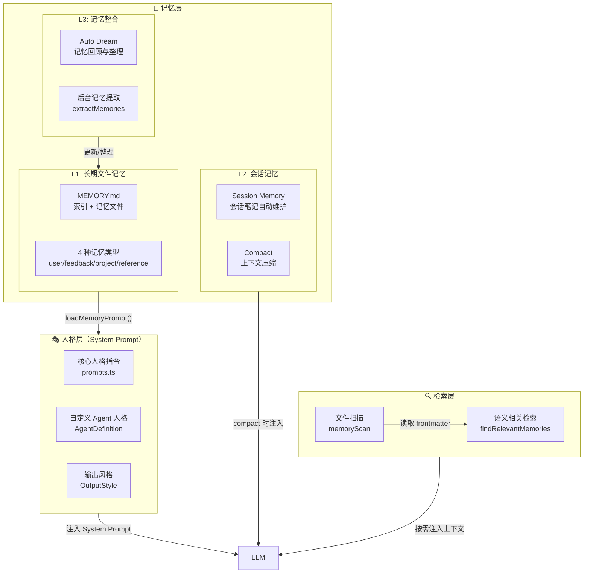
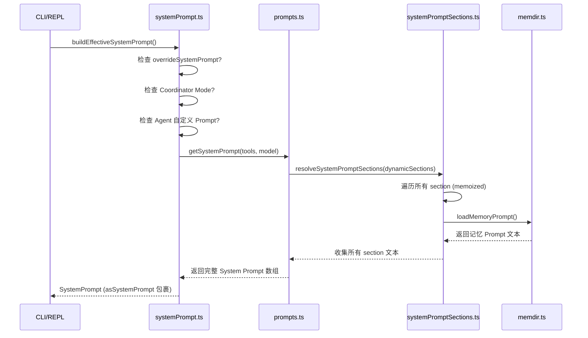
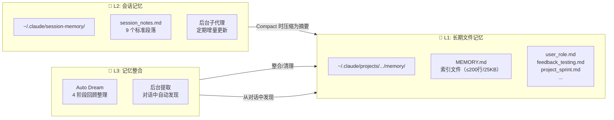
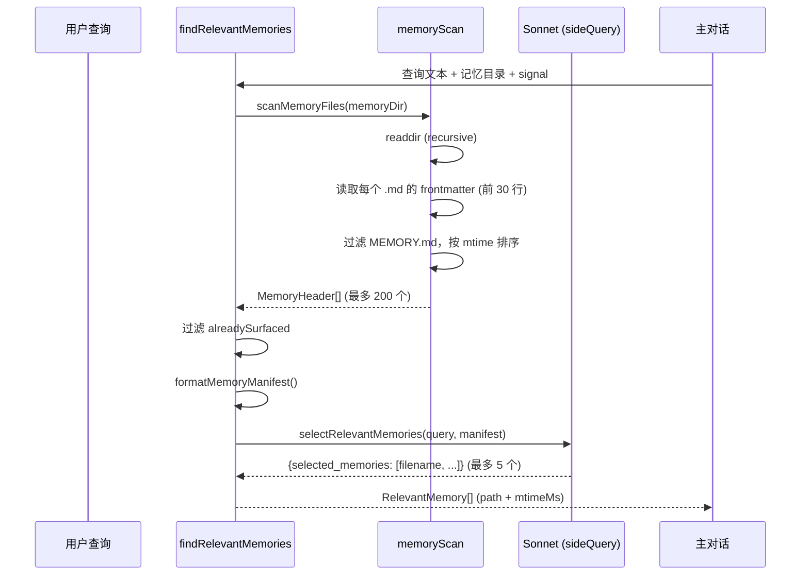

# Claude Code 人格系统与记忆系统实现分析

> **参考项目**：`claude-code-haha-main`（Anthropic 官方 Claude Code CLI）
> **分析日期**：2026-06-17
> **目的**：为搭建实时对话陪伴 Agent 提供人格系统和记忆系统的设计参考

---

## 一、总体架构概览

Claude Code 的人格与记忆系统是一个**三层记忆 + 动态人格注入**的架构，核心设计理念是：

- **人格（Personality）**通过 System Prompt 动态组装注入，支持自定义 Agent 覆盖
- **记忆（Memory）**分为三层：长期文件记忆（MEMORY.md）、会话记忆（Session Memory）、记忆整合（Dream/Consolidation）
- 所有记忆操作均通过 LLM 自主完成（读/写/检索/整理），无需人工干预



---

## 二、人格系统（Personality System）

### 2.1 System Prompt 组装流程

人格是通过一套**动态分段 + 缓存机制**的 System Prompt 组装管道实现的。



### 2.2 核心文件

| 文件 | 作用 |
|---|---|
| `src/constants/prompts.ts` | **核心人格定义** - 包含所有 System Prompt 段落的构建函数 |
| `src/constants/systemPromptSections.ts` | **分段缓存框架** - `systemPromptSection()` / `DANGEROUS_uncachedSystemPromptSection()` |
| `src/utils/systemPrompt.ts` | **组装入口** - `buildEffectiveSystemPrompt()` 按优先级合并各来源 Prompt |
| `src/constants/system.ts` | **身份前缀定义** - `DEFAULT_PREFIX` 等身份声明 |
| `src/constants/outputStyles.ts` | **输出风格配置** - 控制 Agent 回复风格 |
| `src/buddy/prompt.ts` | **Companion 宠物** - 输入框旁的小动物 UI 功能（非核心人格） |

### 2.3 人格 Prompt 的结构（prompts.ts 中的核心段落）

System Prompt 由以下段落动态组成：

```
# Identity（身份）
"You are Claude Code, Anthropic's official CLI for Claude."
  ├── SimpleIntroSection: 对用户的自我介绍
  └── 包含 CYBER_RISK_INSTRUCTION（安全指令）

# System（系统规则）
  ├── 输出规则：所有文本直接展示给用户，使用 GitHub-flavored Markdown
  ├── 权限模式说明：工具调用可能触发用户审批
  ├── <system-reminder> 标签说明
  └── 自动压缩提示：上下文窗口不限

# Doing Tasks（任务执行）
  ├── 精确执行：修复 bug 不连带重构，简单功能不加过度配置
  ├── 最小复杂度：不做防御性编程、不处理不可能状态
  ├── 不求抽象：三次重复才算模式，不预测未来需求
  └── 验证优先：完成任务前验证是否真的有效

# Tone and Style（语气风格）
  ├── 正式专业：不使用感叹号、表情符号
  ├── 反谄媚：不无条件赞同用户
  ├── 反懒惰：不跳过代码、不简写
  └── 可逆性优先：优先做可逆操作

# Using Your Tools（工具使用）
  ├── 优先专用工具 > Bash
  ├── 并行调用：无依赖的工具调用并行执行
  └── Agent Tool：后台 fork 子代理

# Memory Section（来自 memdir.ts）
  ├── 四种记忆类型定义
  ├── 何时保存/如何使用
  └── 记忆目录路径
```

### 2.4 人格覆盖机制

```typescript
// systemPrompt.ts - buildEffectiveSystemPrompt()
// 优先级从高到低：
// 0. overrideSystemPrompt（完全替换）
// 1. Coordinator Mode Prompt（协调器模式）
// 2. Agent 自定义 Prompt（mainThreadAgentDefinition）
//    - Proactive 模式：追加到默认 Prompt
//    - 普通模式：替换默认 Prompt
// 3. Custom System Prompt（--system-prompt 参数）
// 4. Default System Prompt（标准 Claude Code Prompt）
// + appendSystemPrompt（始终追加）
```

### 2.5 关键人格特征（借鉴价值）

1. **不补功能、不过度设计**：`"Don't add features, refactor code, or make improvements beyond what was asked"`
2. **默认不写注释**：`"Default to writing no comments. Only add one when the WHY is non-obvious"`
3. **验证再声称完成**：`"Before reporting a task complete, verify it actually works"`
4. **Safety first**：危险操作需显式确认，评估影响范围
5. **输出风格可配置**：通过 `outputStyles.ts` 支持不同对话风格

---

## 三、记忆系统（Memory System）

### 3.1 三层记忆架构总览



### 3.2 L1: 长期文件记忆（memdir/）

这是核心的**持久化记忆系统**，以文件系统为存储，LLM 自主管理。

#### 3.2.1 数据结构

**记忆类型（4 种）**：
```
user       - 用户角色、偏好、知识背景（始终 private）
feedback   - 用户给出的行为指导（纠正 + 确认）
project    - 项目目标、决策、时间线
reference  - 外部系统指针（Linear、Slack、Grafana 等）
```

**记忆文件格式**（YAML frontmatter + Markdown body）：
```markdown
---
name: user_role
description: User is a data scientist investigating logging
type: user
---

# Content

User is a data scientist focused on observability and logging infrastructure...
```

**索引文件 MEMORY.md**：
```markdown
- [User Role](user_role.md) - Data scientist, logging focus
- [No Mocks](feedback_testing.md) - Always use real DB in tests
- [Sprint 12](project_sprint.md) - Auth middleware rewrite for compliance
```

#### 3.2.2 核心代码路径

```
src/memdir/
├── memdir.ts          - 记忆 Prompt 构建 + MEMORY.md 加载
├── memoryTypes.ts     - 4 种记忆类型定义 + 保存/使用指引 XML
├── memoryScan.ts      - 扫描记忆目录，读取 frontmatter
├── findRelevantMemories.ts  - 语义相关检索（Sonnet 辅助选择）
├── memoryAge.ts       - 记忆年龄/新鲜度计算
├── paths.ts           - 记忆目录路径计算
├── teamMemPaths.ts    - 团队记忆目录路径
└── teamMemPrompts.ts  - 团队记忆 Prompt
```

#### 3.2.3 buildMemoryPrompt() 构建流程

```
buildMemoryPrompt()
  ├── 读取 MEMORY.md（截断到 200 行 / 25KB）
  ├── 注入 4 种记忆类型的完整 XML 指引（TYPES_SECTION_INDIVIDUAL）
  ├── 注入"不应保存的内容"指引（WHAT_NOT_TO_SAVE_SECTION）
  ├── 注入"如何保存记忆"两步流程（索引 + 文件）
  ├── 注入"何时访问记忆"指引（WHEN_TO_ACCESS_SECTION）
  ├── 注入"信任记忆"指引（TRUSTING_RECALL_SECTION）
  ├── 注入与其他持久化机制（Plan/Task）的区别说明
  └── 注入搜索历史上下文的方法（buildSearchingPastContextSection）
```

**关键设计决策**：
- 记忆内容通过 System Prompt 注入（非 user message），保证缓存效率
- `MEMORY.md` 有行数和字节数双上限（200 行 / 25KB），超限时截断并警告
- `.md` 文件使用 frontmatter 标注类型，便于扫描和语义检索
- 记忆目录在首次访问时自动创建（`ensureMemoryDirExists`）

#### 3.2.4 语义检索（findRelevantMemories）



**关键设计**：
- 使用 `sideQuery`（轻量 API 调用）而非主模型，避免浪费主对话的上下文
- 最多返回 5 个最相关记忆
- 自动排除最近已用过的工具文档（避免噪声）
- `alreadySurfaced` 机制防止同一轮反复选择相同记忆

---

### 3.3 L2: 会话记忆（Session Memory）

会话记忆是在**单次对话过程中自动维护**的结构化笔记，用于在上下文窗口压缩时保留关键信息。

#### 3.3.1 核心文件

```
src/services/SessionMemory/
├── sessionMemory.ts    - 后台子代理调度 + 提取逻辑
├── sessionMemoryUtils.ts - 状态管理、阈值判断
└── prompts.ts          - 模板定义 + 更新 Prompt
```

#### 3.3.2 模板结构（9 个标准段落）

```markdown
# Session Title
_5-10 词的描述性标题_

# Current State
_当前正在做什么？未完成的待办？下一步？_

# Task specification
_用户要求构建什么？设计决策？_

# Files and Functions
_重要文件及其作用_

# Workflow
_常用命令及执行顺序_

# Errors & Corrections
_遇到的错误及修复方式_

# Codebase and System Documentation
_重要系统组件及其关系_

# Learnings
_什么有效？什么无效？要避免什么？_

# Key results
_用户要求的输出结果_

# Worklog
_逐步记录：尝试了什么？做了什么？_
```

#### 3.3.3 工作流程

```
会话开始
  │
  ├── 检查是否已初始化 → 否 → 读取模板 → 写入初始文件
  │
  └── 每次工具调用后：
        │
        ├── 检查是否满足更新阈值（工具调用次数 / Token 使用量）
        │
        ├── 满足 → fork 子代理执行 update：
        │    ├── 读取当前 session_notes.md
        │    ├── 分析最近的对话消息
        │    ├── 并行调用 FileEditTool 更新各段落
        │    └── 记录提取完成
        │
        └── 不满足 → 跳过
```

**关键设计**：
- 后台子代理（forked agent）不打断主对话
- 只使用 `FileReadTool` + `FileEditTool`，不调用其他工具
- 严格保持模板结构：不能修改/删除段落标题和斜体描述
- `MAX_SECTION_LENGTH = 2000` 字符，`MAX_TOTAL_TOKENS = 12000`

#### 3.3.4 会话压缩（sessionMemoryCompact）

当主对话的上下文窗口接近限制时：

```
触发条件：Token 数超过阈值
  │
  ├── 读取当前 Session Memory 内容
  ├── 由 Session Memory 内容生成压缩摘要
  ├── 注入 "conversation_summary" user message
  ├── 保留最后 N 条消息（minTextBlockMessages: 5）
  └── 将旧消息替换为摘要
```

---

### 3.4 L3: 记忆整合（Auto Dream + 后台提取）

#### 3.4.1 Auto Dream（记忆回顾整理）

```
autoDream/consolidationPrompt.ts

Phase 1 - Orient（定位）
  ├── ls 记忆目录
  ├── 读取 MEMORY.md
  └── 浏览现有话题文件

Phase 2 - Gather（收集）
  ├── 日常日志（logs/YYYY/MM/YYYY-MM-DD.md）
  ├── 已过时的记忆（与代码现状矛盾的事实）
  └── Transcript 搜索（grep 会话记录）

Phase 3 - Consolidate（整合）
  ├── 合并新信息到现有话题文件
  ├── 将相对日期转为绝对日期
  └── 删除已被否定的旧事实

Phase 4 - Prune & Index（修剪索引）
  ├── 更新 MEMORY.md 保持在 200 行/25KB 内
  ├── 删除过时指针
  └── 缩短过长条目
```

#### 3.4.2 后台记忆提取（extractMemories）

```
触发：主对话轮次后（当主 Agent 未写入记忆时）
  │
  ├── 完美 fork 主对话（相同 system prompt + 消息前缀）
  ├── 分析最近 ~N 条消息
  ├── 两轮策略：
  │   Turn 1: 并行 Read 所有可能需要更新的记忆文件
  │   Turn 2: 并行 Write/Edit 所有更新
  └── 工具限制：只允许 FileRead/Write/Edit + 只读 Bash（ls/find/cat）
```

---

## 四、关键设计模式总结

### 4.1 对实时对话陪伴 Agent 的借鉴价值

| 设计模式 | 描述 | 借鉴建议 |
|---|---|---|
| **分层记忆** | L1 长期 + L2 会话 + L3 整合 | 对话陪伴 Agent 至少需要 L1+L2 |
| **LLM 自主管理** | 所有记忆读写由 LLM 自主决策 | 可用轻量模型做记忆管理，主力模型做对话 |
| **语义检索** | sideQuery 选择最相关记忆 | 对陪伴场景非常重要（回忆过往对话） |
| **System Prompt 分段缓存** | 每段独立 memoize，变化时才重算 | 减少每次对话的 Token 开销 |
| **Personality 可配置** | Agent Definition 覆盖默认人格 | 支持多个人格配置切换 |
| **后台子代理** | forked agent 异步处理记忆更新 | 不打断对话流，用户无感知 |
| **文件式记忆** | Markdown + frontmatter，人类可读 | 便于调试和手动编辑 |
| **类型系统约束** | 4 种记忆类型有明确边界 | 防止记忆膨胀和内容混乱 |

### 4.2 陪伴型 Agent 可增强的方向

1. **情感维度记忆**：Claude Code 的 4 种类型缺少对用户情绪/心情的记录，陪伴场景需要 `emotion` 类型
2. **时间线记忆**：需要更精细的时间轴，Claude Code 只用 `mtimeMs` 排序
3. **关系图谱**：用户关系、群体对话上下文（Claude Code 的 team memory 仅用于共享工作）
4. **长期对话摘要**：Session Memory 在压缩后被丢弃，陪伴场景可能需要更持久的历史摘要
5. **主动回忆触发**：在合适时机主动提及过往对话（"上次你提到..."），Claude Code 只在查询时检索

---

## 五、关键源码文件索引

### 人格系统
- `D:\chat-A\reference\claude-code-haha-main\src\constants\prompts.ts` - **核心人格定义**（913 行，包含所有 System Prompt 段落）
- `D:\chat-A\reference\claude-code-haha-main\src\constants\systemPromptSections.ts` - 分段缓存框架
- `D:\chat-A\reference\claude-code-haha-main\src\utils\systemPrompt.ts` - 人格组装入口
- `D:\chat-A\reference\claude-code-haha-main\src\constants\system.ts` - 身份前缀定义

### 记忆系统（L1: 长期文件记忆）
- `D:\chat-A\reference\claude-code-haha-main\src\memdir\memdir.ts` - 记忆 Prompt 构建核心
- `D:\chat-A\reference\claude-code-haha-main\src\memdir\memoryTypes.ts` - 4 种记忆类型 + XML 指引（22K+）
- `D:\chat-A\reference\claude-code-haha-main\src\memdir\memoryScan.ts` - 记忆文件扫描 + frontmatter 解析
- `D:\chat-A\reference\claude-code-haha-main\src\memdir\findRelevantMemories.ts` - 语义相关检索
- `D:\chat-A\reference\claude-code-haha-main\src\memdir\paths.ts` - 记忆目录路径计算

### 记忆系统（L2: 会话记忆）
- `D:\chat-A\reference\claude-code-haha-main\src\services\SessionMemory\sessionMemory.ts` - 会话记忆主逻辑
- `D:\chat-A\reference\claude-code-haha-main\src\services\SessionMemory\prompts.ts` - 模板 + 更新 Prompt
- `D:\chat-A\reference\claude-code-haha-main\src\services\SessionMemory\sessionMemoryUtils.ts` - 状态管理
- `D:\chat-A\reference\claude-code-haha-main\src\services\compact\sessionMemoryCompact.ts` - 会话压缩

### 记忆系统（L3: 记忆整合）
- `D:\chat-A\reference\claude-code-haha-main\src\services\autoDream\consolidationPrompt.ts` - 记忆回顾 4 阶段 Prompt
- `D:\chat-A\reference\claude-code-haha-main\src\services\extractMemories\prompts.ts` - 后台提取 Prompt
- `D:\chat-A\reference\claude-code-haha-main\src\memdir\memoryAge.ts` - 记忆新鲜度计算

### UI 相关
- `D:\chat-A\reference\claude-code-haha-main\src\commands\memory\memory.tsx` - `/memory` 命令 UI
- `D:\chat-A\reference\claude-code-haha-main\src\components\memory\MemoryFileSelector.tsx` - 记忆文件选择器
- `D:\chat-A\reference\claude-code-haha-main\src\components\MemoryUsageIndicator.tsx` - 记忆用量指示器

---

> **文档版本**: v1.0
> **下一步**: 基于此分析设计 `chat-A` 项目的记忆与人格系统架构
