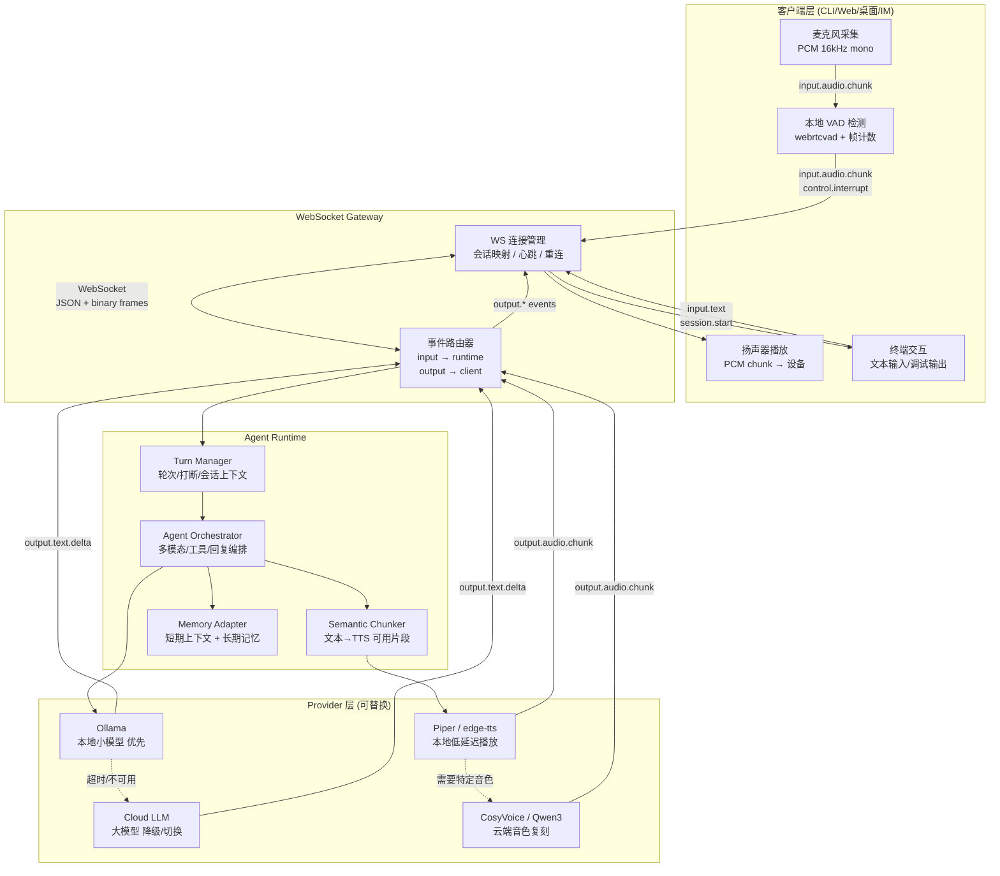
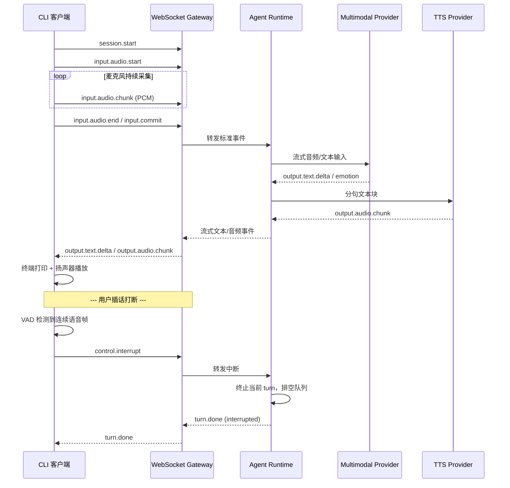
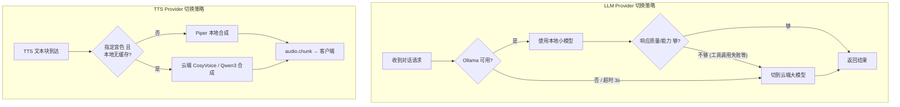

# 实时陪聊 Agent 系统 · v1 设计总纲

> 本文档为 D:\chat-A 全新项目的完整设计总结，涵盖从需求讨论到架构决策的全过程。文档来源：2026-06-16 至 2026-06-17 期间与开发者的多轮讨论。

---

## 1. 项目目标

构建一个**专用于实时对话陪伴的 Agent 系统**，核心诉求：

- **全程流式输入输出**：文本、语音、情感标记均通过统一流式事件总线传递。
- **快速响应与高效对话**：本地模型优先，延迟敏感；云端模型作为降级。
- **多模态 + TTS 语音合成**：支持音频、文本、视频等输入输出；TTS 专注音色复刻与语音合成。
- **边缘部署**：网关 + Runtime 部署在独立边缘机器上，仅 LLM/TTS 云端调用需要联网。
- **多平台兼容**：通过网关层统一事件协议，未来可接入 Web、桌面、IM、直播间、移动端。

---

## 2. 技术基线

| 维度 | 决策 | 理由 |
| --- | --- | --- |
| 项目位置 | `D:\chat-A` 全新项目 | 不绑定原有项目技术栈 |
| 主运行时 | `Node.js` (LTS) | 生态最稳、长期维护清晰、WebSocket/native addon 成熟 |
| 语言 | `TypeScript` | 全链路类型安全 |
| 包管理 | `npm` / `pnpm` workspace | 单仓库分层结构 |
| v1 入口 | CLI 测试客户端 | 最快验证流式链路和网关架构 |
| 通信方式 | `WebSocket` | 全双工、适合语音双工、事件流天然匹配 |
| 网关策略 | 轻量代理网关 | 保持模块化，后续升级成协议适配层 |
| 部署形态 | 独立边缘机器 | 核心可离线，仅 LLM/TTS 云端需要联网 |

---

## 3. 架构概览

### 3.1 端到端数据流



### 3.2 对话时序



### 3.3 Provider 双模切换



---

## 4. 项目结构

### 4.1 单仓库分层 workspace

```
chat-A/
├── packages/
│   ├── protocol/          ← 共享事件类型、PCM 类型、错误码、工具定义
│   ├── gateway/           ← WebSocket 连接管理、事件路由、session、connector 基类
│   ├── runtime/           ← turn 管理、interrupt、chunker、orchestrator
│   ├── providers/
│   │   ├── llm/           ← Ollama provider + Cloud provider + fallback 逻辑
│   │   ├── tts/           ← Piper/edge-tts + CosyVoice/Qwen3 + fallback 逻辑
│   │   └── memory/        ← 短期上下文 + 长期记忆适配器
│   └── client/
│       └── cli/           ← 麦克风采集 / 扬声器播放 / VAD / 终端交互 / WS 客户端
├── docs/                  ← 设计文档、研究笔记、决策记录
├── reference/             ← 参考项目源码（claude-code-haha-main）
├── package.json           ← npm workspace root
└── tsconfig.json          ← 全局 TypeScript 配置
```

### 4.2 各包职责说明

**`packages/protocol`**
- 定义所有 WebSocket 事件类型（TypeScript 接口/枚举）
- PCM 音频帧的数据结构
- 错误码、工具调用类型、情感标记类型
- 零依赖，全 workspace 共享

**`packages/gateway`**
- WebSocket Server 启动与管理
- 连接生命周期：connect → authenticate → session → disconnect
- 事件路由：`input.*` → runtime，`output.*` → client
- session 存储与 actor 映射
- connector 基类：为未来 Web/桌面/IM connector 提供接口

**`packages/runtime`**
- Turn Manager：轮次状态机（idle → listening → processing → responding → idle）
- Interrupt Handler：收到 `control.interrupt` 后的清理逻辑
- Semantic Chunker：流式文本 → 语义片段 → TTS 消费
- Agent Orchestrator：调用 LLM/TTS/Memory，分发事件

**`packages/providers/llm`**
- `LocalProvider`：对接 Ollama HTTP API，流式 token 输出
- `CloudProvider`：对接 OpenAI-compatible API
- `FallbackProvider`：封装超时检测、可用性检测、自动切换

**`packages/providers/tts`**
- `LocalProvider`：Piper / edge-tts，本地低延迟合成
- `CloudProvider`：CosyVoice / Qwen3 TTS，音色复刻
- `VoiceRegistry`：音色注册表，本地缓存已下载的音色模型

**`packages/providers/memory`**
- `ShortTermAdapter`：当前会话上下文窗口管理
- `LongTermAdapter`：长期记忆存储与检索（参考 chatbot 的 LanceDB + MongoDB 方案）
- 记忆摘要、衰减、检索接口

**`packages/client/cli`**
- 麦克风采集：`node-portaudio` 或 `node-record-lpcm16`
- 扬声器播放：`node-speaker` 或 `sound-play`
- VAD 检测：`webrtcvad` 绑定或 WASM 实现
- barge-in 逻辑：连续语音帧计数 → 触发 `control.interrupt`
- WebSocket 客户端：连接、重连、事件收发
- 终端 UI：交互式输入、流式文本打印、调试输出

---

## 5. WebSocket 事件协议 v1

### 5.1 事件分类

| 方向 | 事件类型 | 载荷 | 说明 |
| --- | --- | --- | --- |
| Client→GW | `session.start` | `{ actor_id, session_id? }` | 发起/恢复会话 |
| Client→GW | `input.audio.chunk` | `PCM binary frame` | 麦克风音频帧 (16kHz, mono, int16) |
| Client→GW | `input.audio.start` | `{}` | 语音输入开始 |
| Client→GW | `input.audio.end` | `{}` | 语音输入结束 |
| Client→GW | `input.text` | `{ text }` | 文本输入 |
| Client→GW | `control.interrupt` | `{ reason? }` | 用户打断当前播放 |
| GW→Client | `output.text.delta` | `{ text, turn_id }` | 流式文本增量 |
| GW→Client | `output.text.done` | `{ turn_id }` | 文本回复完成 |
| GW→Client | `output.audio.chunk` | `PCM binary frame` | TTS 音频帧 |
| GW→Client | `output.audio.done` | `{ turn_id }` | 当前音频片段播完 |
| GW→Client | `output.emotion` | `{ emotion, valence, arousal }` | 情感标记 |
| GW→Client | `turn.done` | `{ turn_id, reason }` | 一轮对话结束 |
| GW→Client | `error` | `{ code, message, recoverable }` | 错误信息 |
| GW→Client | `status` | `{ stage, detail }` | 当前处理阶段通知 |

### 5.2 错误码

| 错误码 | 含义 | 可恢复 |
| --- | --- | --- |
| `LLM_LOCAL_UNAVAILABLE` | Ollama 不可用 | 是，自动切云端 |
| `LLM_CLOUD_UNAVAILABLE` | 云端模型不可用 | 否 |
| `TTS_LOCAL_UNAVAILABLE` | 本地 TTS 不可用 | 是，自动切云端 |
| `TTS_CLOUD_UNAVAILABLE` | 云端 TTS 不可用 | 否 |
| `SESSION_NOT_FOUND` | 会话不存在 | 否 |
| `RATE_LIMITED` | 请求过于频繁 | 是，重试 |
| `INTERNAL_ERROR` | 内部错误 | 否 |

---

## 6. 模块设计要点

### 6.1 Gateway 层

- 最小化设计：不包含业务逻辑，只做连接管理 + 事件路由
- 支持多 connector 同时连接（CLI、Web、桌面等）
- session 隔离，基于 `actor_id` 路由
- 心跳检测与自动重连
- 事件日志与监控埋点

### 6.2 Runtime 层

- Turn 状态机：`idle → listening → processing → responding → idle`
- 中断处理：收到 `control.interrupt` → 取消当前 LLM 请求 → 排空 TTS 队列 → 重置 turn
- 文本切块：参考 `voice_text` 的 SemanticChunker，流式 token → 语义片段
- 情感解析：从 LLM 输出中提取情感标记 → 同步传给 TTS 做音调调制

### 6.3 Provider 层

- 统一抽象：每个 Provider 类型定义接口（`ILLMProvider`、`ITTSProvider`、`IMemoryProvider`）
- Fallback 模式：Provider 内部或外层 wrapper 处理超时/不可用
- 配置驱动：通过配置文件切换 Provider 实现

### 6.4 CLI 客户端

- 关键品质：低延迟采集 + 播放
- 麦克风：PCM 16kHz mono，帧长 30ms（480 samples）
- VAD 参数可调：灵敏度、连续语音帧数阈值、静音判定帧数
- 打断策略：连续语音帧 ≥ 25 帧（约 600ms）→ 发送 interrupt
- 双工播放：TTS 音频流到达即播放，不等待全句合成

---

## 7. 参考项目映射

| 能力 | 参考来源 | 关键文件 |
| --- | --- | --- |
| `AsyncGenerator` 流式事件总线 | `claude-code-haha-main` | `src/query.ts:219` |
| 多类型事件统一 yield | `claude-code-haha-main` | `src/query.ts` |
| 工具调用流式执行 | `claude-code-haha-main` | `src/services/tools/StreamingToolExecutor.ts` |
| UI 双状态渲染（临时/正式） | `claude-code-haha-main` | `src/utils/messages.ts:2929` |
| WebSocket + PCM 音频流 | `voice_text` | `core/pipeline.py`、`modules/multimodal/qwen_omni_realtime.py` |
| VAD + barge-in | `voice_text` | `core/pipeline.py:_barge_in_monitor` |
| SemanticChunker | `voice_text` | `core/chunker.py` |
| 广播麦克风流（多消费者） | `voice_text` | `core/tee_stream.py` |
| 多模态/TTS Provider 抽象 | `voice_text` | `modules/multimodal/base.py`、`modules/tts/base.py` |
| Memory/角色/长期陪伴 | `chatbot` | `packages/ema/src/memory/` |
| Agent loop + tool event | `chatbot` | `packages/ema/src/agent/agent.ts` |
| LLM 抽象层 | `chatbot` | `packages/ema/src/llm/base.ts` |

---

## 8. 决策记录（设计过程）

| 决策点 | 选项 | 最终选择 | 选择理由 |
| --- | --- | --- | --- |
| v1 优先做到什么体验？ | A 文字 / B 语音 / C 多模态 / D 设计优先 | **D 先设计后落地** | 系统复杂，需要完整规划再最小闭环 |
| 网关层职责 | A 协议适配 / B 编排中枢 / C 轻量代理 | **C 轻量代理** | 开发阶段保持灵活，后续升级 |
| v1 首个接入平台 | A WebUI / B CLI / C QQ / D 桌面 | **B CLI** | 最快验证链路，不被平台细节干扰 |
| v1 语音能力 | A 仅文本 / B 文本+TTS / C 语音输入 / D 语音双工 | **D 语音双工** | 直接对齐最终目标 |
| 主技术栈 | A Bun / B Go / C Rust / D Python | **A Node.js + TS** | 生态最稳，长期生产可靠 |
| 通信方式 | A WebSocket / B stdio / C SSE / D WebRTC | **A WebSocket** | 全双工、事件流天然匹配 |
| 音频采集位置 | A CLI / B 网关 / C 文件 / D 先文本 | **A CLI 客户端** | 网关保持无状态 |
| 打断检测位置 | A CLI VAD / B Runtime / C 双层 / D 手动 | **A CLI 本地 VAD** | 延迟最低、不依赖网络 |
| 仓库结构 | A 分层 workspace / B 扁平 / C 双进程分离 | **A 单仓库分层 workspace** | 模块边界清晰、扩展性好 |
| LLM 策略 | A Ollama / B llama.cpp / C 先云端 / D 双模 | **D 本地+云端自动切换** | 离线优先 + 云端保底 |
| TTS 策略 | A 本地+云端 / B 纯云端 / C 先一种 / D 全离线 | **A 本地优先 + 云端音色** | 低延迟 + 高质量兼得 |

---

## 9. 下一步

本设计文档已完整记录所有决策。

**后续流程：**

1. ~~Brainstorming 完成~~ ← 当前阶段
2. **Writing Spec**（下一步）：将设计文档精炼为正式 spec，提交到 `docs/superpowers/specs/`
3. **Writing Plans**：根据 spec 生成分步实施计划
4. **Implementation**：按计划执行开发
5. **Verification**：验证闭环
