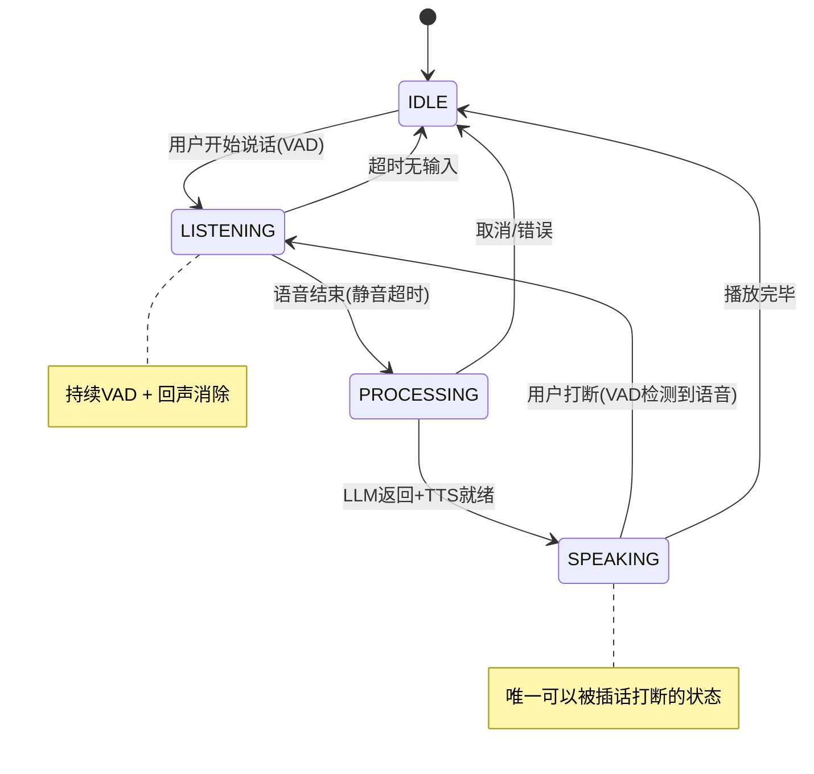

# 生产级语音管线设计：稳定流式输入输出 + 无痛插话打断

> 融合 Nexus 状态机 + voice-core CancellationToken + 实际工程经验

---

## 一、核心设计原则

```
用户体验铁律：
1. 用户说话时 → 立刻安静（<50ms 感知延迟）
2. AI说话被打断 → 不能有残留音频（不能"幻听"）
3. 快速连续说话 → 每一句都正确响应（不能丢句子或串句子）
4. 任何异常（网络超时/TTS失败）→ 自然恢复，不卡死
```

---

## 二、五状态语音机（从 Nexus 13状态简化）

Nexus 的 13 状态机对独立部署过于复杂。**5 个状态足够**：



### 状态定义

| 状态 | 麦克风 | 扬声器 | 允许的转入事件 |
|------|--------|--------|-------------|
| **IDLE** | 关 | 关 | 用户点击/唤醒词 → LISTENING |
| **LISTENING** | 开(VAD) | 关 | 静音超时 → PROCESSING, 超时 → IDLE |
| **PROCESSING** | 关 | 关 | LLM就绪 → SPEAKING, 错误 → IDLE |
| **SPEAKING** | 开(VAD) | 开(播放) | VAD检测 → LISTENING, 播放完 → IDLE |

---

## 三、ProcessorManager：打断的核心保障

这是整个系统最关键的部分，来自 voice-core 的 `processor_generation` 模式：

```javascript
class VoiceProcessorManager {
  #generation = 0
  #currentAbort = null
  #audioQueue = new AudioQueue(10)  // 最多缓冲10个音频块
  #state = 'IDLE'

  /** 分配新的processor ID，自动取消旧的 */
  allocate() {
    this.#generation++
    // 取消旧processor的所有异步操作
    this.#currentAbort?.abort()
    this.#currentAbort = new AbortController()
    // 清空旧processor的音频缓冲
    this.#audioQueue.clear()
    
    return {
      id: this.#generation,
      signal: this.#currentAbort.signal,
    }
  }

  /** 检查当前processor是否还是最新的 */
  isCurrent(id) {
    return id === this.#generation
  }

  transition(newState) {
    const allowed = {
      'IDLE':      ['LISTENING'],
      'LISTENING': ['PROCESSING', 'IDLE'],
      'PROCESSING':['SPEAKING', 'IDLE'],
      'SPEAKING':  ['LISTENING', 'IDLE'],
    }
    if (!allowed[this.#state]?.includes(newState)) {
      throw new Error(`Illegal transition: ${this.#state} -> ${newState}`)
    }
    this.#state = newState
  }
}
```

**为什么必须用 generation 计数器而不只用 AbortController？**

```
场景：用户连说3句话，每句间隔200ms

只用AbortController的问题：
  句子1 → controller1.abort() → 句子2开始
  句子2的LLM请求还在飞 → controller2.abort() → 句子3开始
  
  但句子2的某个TTS回调可能在controller2.abort()之后才执行
  → 句子2的音频片段污染了句子3！

加了generation：
  句子2的回调执行前检查 isCurrent(2)
  → 此时 generation=3，返回 false
  → 音频被丢弃，不会播放
```

---

## 四、AudioQueue：反压 + 防止内存爆炸

```javascript
class AudioQueue {
  #queue = []
  #maxDepth
  #resolveWait = null  // 等待者

  constructor(maxDepth = 10) {
    this.#maxDepth = maxDepth
  }

  /** 放入音频块。队列满时阻塞等待（反压） */
  async put(chunk, timeoutMs = 5000) {
    while (this.#queue.length >= this.#maxDepth) {
      // 反压：等待消费者取走
      await new Promise((resolve, reject) => {
        const timer = setTimeout(() => reject(new Error('AudioQueue put timeout')), timeoutMs)
        this.#resolveWait = () => { clearTimeout(timer); resolve() }
      })
    }
    this.#queue.push(chunk)
    
    // 通知等待的消费者
    if (this.#resolveWait) {
      const resolve = this.#resolveWait
      this.#resolveWait = null
      resolve()
    }
  }

  /** 取出音频块。空时阻塞等待 */
  async get(timeoutMs = 2000) {
    if (this.#queue.length === 0) {
      await new Promise((resolve, reject) => {
        const timer = setTimeout(() => resolve(), timeoutMs)
        this.#resolveWait = () => { clearTimeout(timer); resolve() }
      })
    }
    return this.#queue.shift() ?? null
  }

  /** 打断时清空 */
  clear() {
    this.#queue.length = 0
    if (this.#resolveWait) {
      this.#resolveWait()
      this.#resolveWait = null
    }
  }

  get depth() { return this.#queue.length }
}
```

**反压为什么重要？**

```
没有反压：
  LLM生成太快 → TTS合成跟不上 → 音频块堆积 → 内存爆炸
  等用户打断时，10秒的音频已经缓存好了但永远播不出来 → 浪费

有反压(maxDepth=10)：
  LLM生成快 → 队列满 → put()阻塞 → LLM流自然减速
  队列深度约等于 2-3 秒的预生成缓冲
  打断时 clear() → 全部丢弃，没有浪费
```

---

## 五、完整语音循环实现

```javascript
class VoicePipeline {
  manager = new VoiceProcessorManager()
  stt    // STT引擎
  llm    // LLM引擎
  tts    // TTS引擎
  player // 音频播放器

  /** 主循环：持续监听 */
  async start() {
    this.manager.transition('IDLE')
    
    // 持续VAD监听
    for await (const audioChunk of mic.stream()) {
      const speechDetected = await vad.detect(audioChunk)
      
      if (speechDetected && this.manager.state === 'SPEAKING') {
        // ===== 打断！ =====
        this.manager.allocate()  // 取消当前processor
        this.player.stop()       // 立即停止播放
        this.manager.transition('LISTENING')
        continue
      }
      
      if (speechDetected && this.manager.state === 'IDLE') {
        this.manager.transition('LISTENING')
      }
      
      if (this.manager.state === 'LISTENING') {
        const isSilent = await vad.isSilent(audioChunk)
        if (isSilent) {
          const text = await this.stt.transcribe(collectedAudio)
          if (text.trim()) {
            await this.processUtterance(text)
          }
        }
      }
    }
  }

  /** 处理一次完整的用户话语 */
  async processUtterance(text) {
    const { id, signal } = this.manager.allocate()
    this.manager.transition('PROCESSING')

    try {
      // Phase 1: LLM流式生成 + 实时分句
      const splitter = new SentenceSplitter()
      let fullText = ''
      
      for await (const delta of this.llm.stream(text, { signal })) {
        if (!this.manager.isCurrent(id)) return  // 被打断
        fullText += delta
        
        for (const sentence of splitter.feed(delta)) {
          // Phase 2: TTS合成 → 进入队列
          this.synthesizeAndQueue(sentence, id, signal)
        }
      }
      
      // 处理尾部
      const tail = splitter.flush()
      if (tail) this.synthesizeAndQueue(tail, id, signal)
      
      // Phase 3: 等待队列消费完毕
      this.manager.transition('SPEAKING')
      await this.drainQueue(id, signal)
      this.manager.transition('IDLE')
      
    } catch (err) {
      if (err.name === 'AbortError') return  // 正常打断
      console.error('Voice pipeline error:', err)
      this.manager.transition('IDLE')
    }
  }

  /** TTS合成 + 入队 */
  async synthesizeAndQueue(text, id, signal) {
    // 用Promise.race防止TTS hang住
    const audio = await Promise.race([
      this.tts.synthesize(text, { signal }),
      timeout(10000, 'TTS timeout')
    ])
    
    if (!this.manager.isCurrent(id)) return
    if (signal.aborted) return
    
    await this.manager.audioQueue.put(audio, 5000)
  }

  /** 消费音频队列 */
  async drainQueue(id, signal) {
    while (this.manager.isCurrent(id) && !signal.aborted) {
      const chunk = await this.manager.audioQueue.get(2000)
      if (!chunk) break  // 超时，队列空
      
      const played = await this.player.play(chunk, { signal })
      if (!played) break  // 播放被打断
    }
  }
}
```

---

## 六、关键稳定性保障

### 1. 每个异步操作都有超时

```javascript
const TIMEOUTS = {
  vad_silence:    1500,   // 1.5秒静音=语音结束
  stt_transcribe: 5000,   // STT最多等5秒
  llm_first_token: 8000,  // LLM首token最多等8秒
  tts_synthesize: 10000,  // TTS合成最多等10秒
  audio_playback: 30000,  // 单句播放最多30秒
  idle_timeout:   60000,  // 1分钟无输入→回到IDLE
}
```

### 2. 回声消除

```javascript
// voice-core的is_speaking_flag在Node.js中的等价实现
class EchoGuard {
  #isPlaying = false

  // 播放音频前调用
  markSpeaking() {
    this.#isPlaying = true
    // 200ms后自动清除（防止意外残留）
    setTimeout(() => { this.#isPlaying = false }, 200)
  }

  // VAD检测到语音时调用
  isEcho(audioChunk) {
    return this.#isPlaying  // 自己在说话→忽略
  }
}
```

### 3. 播放器必须支持即时停止

```javascript
class AudioPlayer {
  #currentSource = null
  
  async play(pcmData, { signal }) {
    return new Promise((resolve) => {
      // 如果已有在播的，先停
      this.#currentSource?.stop()
      
      const source = audioContext.createBufferSource()
      source.buffer = pcmToBuffer(pcmData)
      source.connect(audioContext.destination)
      this.#currentSource = source
      
      // 监听打断信号
      const onAbort = () => {
        source.stop()
        this.#currentSource = null
        resolve(false)
      }
      signal?.addEventListener('abort', onAbort, { once: true })
      
      source.onended = () => {
        signal?.removeEventListener('abort', onAbort)
        this.#currentSource = null
        resolve(true)
      }
      
      source.start()
    })
  }

  stop() {
    this.#currentSource?.stop()
    this.#currentSource = null
  }
}
```

---

## 七、UX打磨细节

| 场景 | 处理 | 感知效果 |
|------|------|---------|
| **说话中** | VAD检测→立刻停止TTS→清空队列→响一声提示音→进入LISTENING | "它瞬间安静了" |
| **打断后残留** | generation计数器拦截旧processor的所有回调 | 永远不会幻听 |
| **网络慢** | LLM超时→播一句"让我想想"→重试 | "它卡了一下但没崩" |
| **连续说话** | 每次allocate都清空audioQueue + abort旧processor | "每句都正确响应" |
| **TTS失败** | catch→清理→回IDLE→记日志 | "沉默比幻听好" |
| **思考时间长** | 超时前播filler(来自eros_ai) | "它在认真想" |

---

## 八、为什么这个方案比单独用任何系统都稳健

| 风险 | Nexus | voice-core | 本方案 |
|------|-------|-----------|--------|
| 快速连续打断 | Bus事件时序问题 | ✅ generation计数 | ✅ generation计数 |
| 旧processor残留 | capturedAbort引用比对 | ✅ 超时检测 | ✅ generation + 超时 |
| 内存堆积 | 无限制 | ✅ AudioQueue上限 | ✅ AudioQueue反压 |
| 网络hang | 无超时 | ✅ thread.join超时 | ✅ Promise.race超时 |
| 状态混乱 | ✅ 13状态机 | 无 | ✅ 5状态机(够用) |
| 回声 | 前端音频路由 | ✅ is_speaking_flag | ✅ EchoGuard |
| 播放停止延迟 | AudioContext依赖 | ✅ 线程cancel | ✅ source.stop()即时 |
