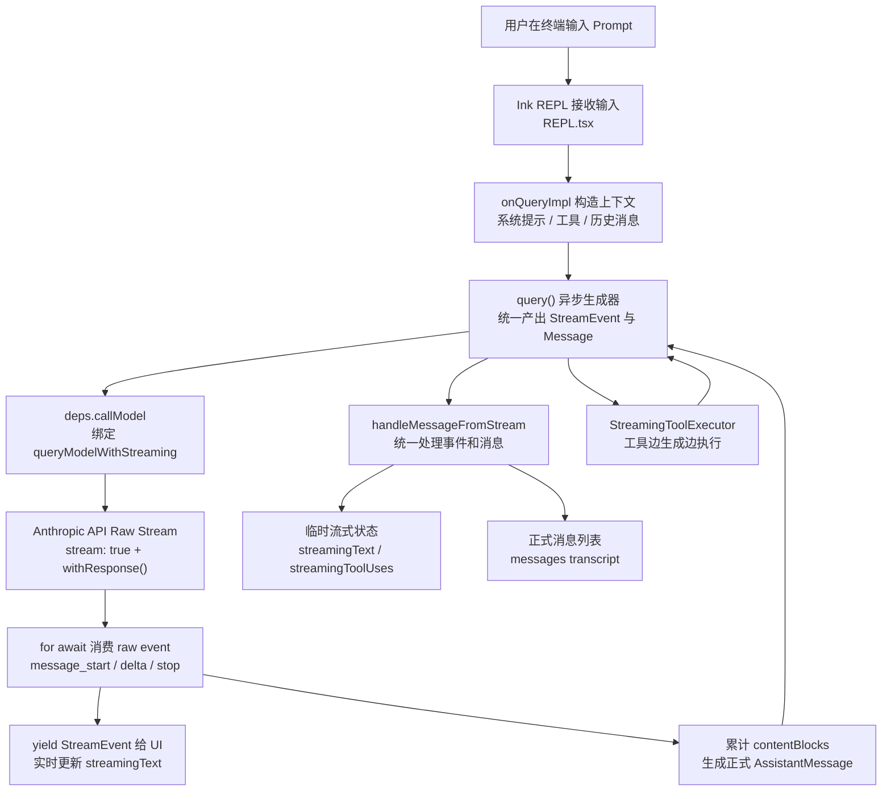
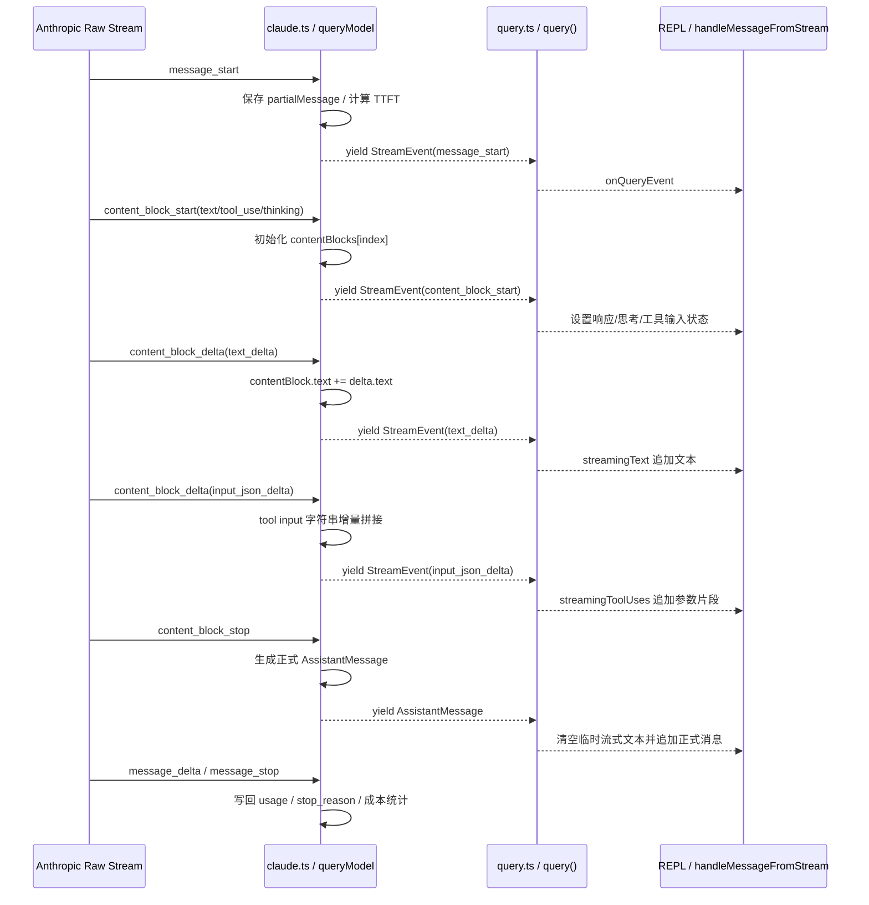
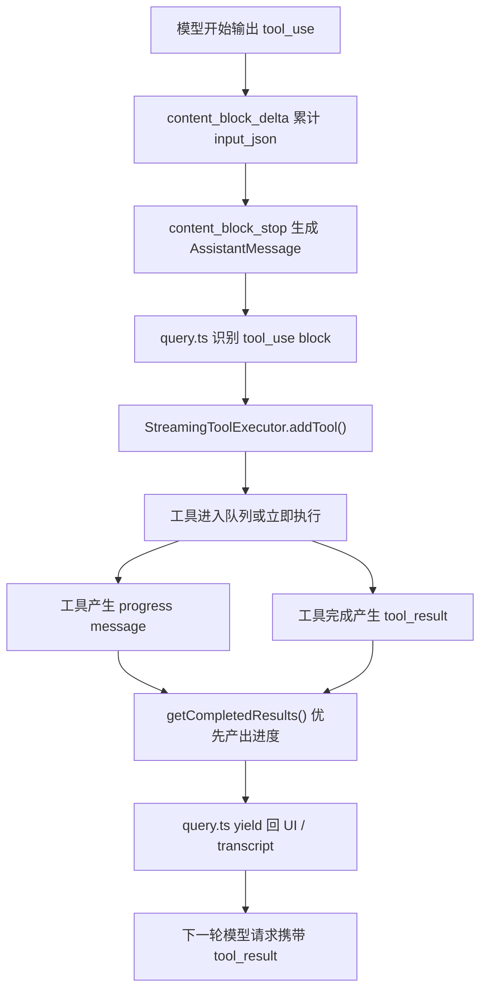

# 全程流式工作机制研究：`claude-code-haha-main`

> 本文档基于参考项目 `D:\chat-A\reference\claude-code-haha-main` 的源码阅读整理，重点解释它如何把模型输出、UI 展示、工具调用、错误恢复组织成一条“全程流式”工作链路。

## 1. 项目背景与核心结论

`claude-code-haha-main` 是一个基于 Bun、React/Ink、Anthropic SDK 的终端 Agent 项目。它的流式能力不是简单地把上游 HTTP/SSE 数据直接打印到终端，而是通过多层 `AsyncGenerator` 将请求、模型事件、UI 临时状态、工具执行、错误恢复串成统一事件流。

核心结论：

- **统一流式抽象**：核心管线以 `AsyncGenerator` 为主，逐层 `yield` `StreamEvent`、正式 `Message`、工具结果、系统提示和错误消息。
- **边收边聚合**：API 层一边把 raw stream event 继续向上游 `yield`，一边在本地累计 `contentBlocks`，最终生成可持久化的 assistant message。
- **UI 双状态渲染**：UI 使用 `streamingText`、`streamingToolUses` 等临时状态做实时展示，完成消息到达后再进入正式消息列表。
- **工具也参与流式**：模型刚产出完整 `tool_use` block 后，工具即可启动执行，工具 progress 和 `tool_result` 也通过同一条管线回灌。
- **恢复路径完整**：流式失败时支持非流式 `fallback`、watchdog、abort cleanup，避免 transcript 中留下半截 `tool_use`。

## 2. 全程流式总览图



中文标注说明：

- `StreamEvent` 是“上游 raw event 的包装”，主要用于 UI 实时反馈。
- `Message` 是“已经归一化、可进入 transcript 的正式消息”。
- `query()` 是主协调器，它不只负责模型请求，也负责上下文压缩、工具调度、错误恢复、后续轮次继续。

## 3. 主调用链：CLI / REPL / query / API / UI

### 3.1 CLI 入口

入口脚本位于：

- `D:\chat-A\reference\claude-code-haha-main\bin\claude-haha`

它默认执行：

```bash
bun --env-file=.env ./src/entrypoints/cli.tsx
```

也就是说，完整终端 UI 从 `src/entrypoints/cli.tsx` 启动，随后进入 React/Ink 渲染的 REPL。

### 3.2 REPL 消费 query 流

REPL 中的关键消费点：

- `D:\chat-A\reference\claude-code-haha-main\src\screens\REPL.tsx:2787`

核心形态是：

```ts
for await (const event of query({
  messages: messagesIncludingNewMessages,
  systemPrompt,
  userContext,
  systemContext,
  canUseTool,
  toolUseContext,
  querySource: getQuerySourceForREPL(),
})) {
  onQueryEvent(event)
}
```

这说明 REPL 并不等待一次完整响应结束，而是持续消费 `query()` 生成器产生的每一个事件。

### 3.3 query 是统一调度层

`query()` 定义位置：

- `D:\chat-A\reference\claude-code-haha-main\src\query.ts:219`

它的返回类型包含：

- `StreamEvent`
- `RequestStartEvent`
- `Message`
- `TombstoneMessage`
- `ToolUseSummaryMessage`
- 终止结果 `Terminal`

这意味着它承担了“模型流式事件 + 完成消息 + 工具消息 + 系统控制事件”的统一产出职责。

生产依赖绑定位置：

- `D:\chat-A\reference\claude-code-haha-main\src\query\deps.ts:1`

其中 `callModel` 被绑定到 `queryModelWithStreaming`。这样 `query.ts` 可以专注调度，API 请求细节被隔离到 `services/api/claude.ts`。

## 4. 上游模型流式事件处理

### 4.1 模型流入口

模型流式函数位置：

- `D:\chat-A\reference\claude-code-haha-main\src\services\api\claude.ts:752`

`queryModelWithStreaming()` 本身也是 `async function*`，内部通过 `yield* queryModel(...)` 把更底层的事件继续向上传递。

### 4.2 创建 raw stream

真正发起流式请求的位置：

- `D:\chat-A\reference\claude-code-haha-main\src\services\api\claude.ts:1822`

关键行为：

```ts
const result = await anthropic.beta.messages
  .create({ ...params, stream: true }, { signal })
  .withResponse()
```

这里显式使用 `stream: true`，并通过 `.withResponse()` 同时获取响应头、request id 和底层 stream。

### 4.3 消费 raw stream

raw stream 消费位置：

- `D:\chat-A\reference\claude-code-haha-main\src\services\api\claude.ts:1940`

核心形态：

```ts
for await (const part of stream) {
  resetStreamIdleTimer()
  switch (part.type) {
    case 'message_start':
    case 'content_block_start':
    case 'content_block_delta':
    case 'content_block_stop':
    case 'message_delta':
    case 'message_stop':
  }

  yield {
    type: 'stream_event',
    event: part,
  }
}
```

这个设计有两个并行动作：

1. **立即向 UI 产出事件**：让终端能实时显示文字、thinking 状态、工具参数。
2. **本地累计完整消息**：把分散的 delta 聚合成最终 transcript message。

### 4.4 事件到消息的聚合规则



关键源码位置：

- `message_start` 保存 `partialMessage`：`D:\chat-A\reference\claude-code-haha-main\src\services\api\claude.ts:1980`
- `content_block_start` 初始化 block：`D:\chat-A\reference\claude-code-haha-main\src\services\api\claude.ts:1995`
- `input_json_delta` 追加工具参数：`D:\chat-A\reference\claude-code-haha-main\src\services\api\claude.ts:2087`
- `text_delta` 追加文本：`D:\chat-A\reference\claude-code-haha-main\src\services\api\claude.ts:2113`
- `content_block_stop` 生成正式消息：`D:\chat-A\reference\claude-code-haha-main\src\services\api\claude.ts:2171`

## 5. UI 临时流式状态与正式消息切换

UI 事件处理器位置：

- `D:\chat-A\reference\claude-code-haha-main\src\utils\messages.ts:2929`

`handleMessageFromStream()` 的职责是把 `query()` 产出的事件转换成 UI 状态变化。

### 5.1 临时状态

主要临时状态：

- `streamingText`：正在生成但尚未成为正式消息的文本。
- `streamingToolUses`：正在生成的工具调用参数。
- `streamingThinking`：thinking block 的实时或完成态展示。
- `streamMode`：spinner 展示状态，例如 requesting、thinking、responding、tool-input、tool-use。

### 5.2 text_delta 的即时显示

`text_delta` 处理位置：

- `D:\chat-A\reference\claude-code-haha-main\src\utils\messages.ts:3047`

核心动作：

```ts
const deltaText = message.event.delta.text
onUpdateLength(deltaText)
onStreamingText?.(text => (text ?? '') + deltaText)
```

含义：每来一个文本 delta，就追加到 `streamingText`，终端立即重渲染。

### 5.3 input_json_delta 的工具参数展示

`input_json_delta` 处理位置：

- `D:\chat-A\reference\claude-code-haha-main\src\utils\messages.ts:3055`

它会把 `partial_json` 拼到对应工具调用的 `unparsedToolInput` 上，因此用户能看到工具参数逐步生成。

### 5.4 正式消息到达时的无缝切换

完成消息处理位置：

- `D:\chat-A\reference\claude-code-haha-main\src\utils\messages.ts:2975`

关键逻辑：

1. 如果收到的不是 `stream_event`，说明它是正式消息或控制消息。
2. 对正式 assistant message，先清空 `streamingText`。
3. 再调用 `onMessage(message)` 追加到正式消息列表。

这样可以避免 UI 同时显示“临时流式文本”和“正式消息”造成重复或闪烁。

## 6. 工具调用流式执行机制

模型流式输出不只包含文字，也可能包含 `tool_use` block。这个项目的关键优化是：**一旦某个 `tool_use` block 完成，就可以启动工具执行，而不是等待整轮 assistant response 全部结束。**



关键源码位置：

- `query.ts` 识别 assistant message 中的 `tool_use`：`D:\chat-A\reference\claude-code-haha-main\src\query.ts:828`
- 添加工具任务到流式执行器：`D:\chat-A\reference\claude-code-haha-main\src\query.ts:840`
- 非阻塞获取已完成工具结果：`D:\chat-A\reference\claude-code-haha-main\src\query.ts:850`
- `StreamingToolExecutor.getCompletedResults()`：`D:\chat-A\reference\claude-code-haha-main\src\services\tools\StreamingToolExecutor.ts:412`
- `StreamingToolExecutor.getRemainingResults()`：`D:\chat-A\reference\claude-code-haha-main\src\services\tools\StreamingToolExecutor.ts:453`

### 6.1 为什么工具也要流式

如果工具必须等模型完整回复结束后才执行，会出现两个问题：

- 用户看到工具调用参数生成了，但工具迟迟不运行，交互延迟变高。
- 多工具场景中，原本可以并发或提前执行的工具被串行阻塞。

该项目通过 `StreamingToolExecutor` 将工具执行纳入同一条 `AsyncGenerator` 流，提升响应连续性。

### 6.2 工具结果顺序与安全

`StreamingToolExecutor` 并不是无脑并发吐结果。它会考虑：

- pending progress 优先产出，保证用户看到活跃进度。
- 对非并发安全工具，必要时保持顺序。
- Bash 类错误可取消兄弟工具，避免依赖链继续执行无意义命令。
- abort 时仍补齐合成 `tool_result`，避免 transcript 中出现孤立 `tool_use`。

## 7. 错误、fallback、abort 与 watchdog

全程流式系统最难的不是“正常流”，而是失败后如何保持 transcript 和工具状态一致。

### 7.1 stream_request_start

`query.ts` 在开始请求前会产出：

```ts
yield { type: 'stream_request_start' }
```

位置：

- `D:\chat-A\reference\claude-code-haha-main\src\query.ts:337`

UI 收到后会把 spinner 设置为 requesting，表示已经进入请求阶段。

### 7.2 watchdog 与 streaming stall

API 层会在 raw stream 循环里记录事件间隔：

- `D:\chat-A\reference\claude-code-haha-main\src\services\api\claude.ts:1944`

当流长时间无事件时，watchdog 可以触发 abort 或 fallback，避免终端一直卡在“正在响应”。

### 7.3 非流式 fallback

流式失败后，项目可以退回非流式请求：

- fallback 入口附近：`D:\chat-A\reference\claude-code-haha-main\src\services\api\claude.ts:2534`

退回非流式后，会把完整响应构造成 `AssistantMessage` 再 `yield`，从而维持上层 UI 和 transcript 的统一消费方式。

### 7.4 abort 后补齐工具结果

如果用户中断请求，`query.ts` 会优先处理 abort：

- `D:\chat-A\reference\claude-code-haha-main\src\query.ts:1010`

关键目标：

- 如果已经产生 `tool_use`，就必须有对应 `tool_result`。
- 如果工具执行器存在，就消费 `getRemainingResults()`，让执行器生成必要的合成结果。
- 否则通过 `yieldMissingToolResultBlocks()` 补齐缺失结果。

这样可以避免下一轮请求因为 tool pairing 不完整而被 API 拒绝。

## 8. 可借鉴设计模式

### 8.1 用 AsyncGenerator 做主干协议

推荐抽象：

```ts
type AgentEvent =
  | { type: 'stream_event'; event: RawModelEvent }
  | { type: 'message'; message: NormalizedMessage }
  | { type: 'request_start' }
  | { type: 'tombstone'; messageId: string }
  | { type: 'tool_progress'; payload: ToolProgress }
```

优势：

- 调用方可以用 `for await` 自然消费。
- 中间层可以 `yield*` 组合子生成器。
- 错误、工具、模型 delta 都能走同一条协议。

### 8.2 分离临时流式状态与正式消息

UI 层建议分两类状态：

- **临时状态**：`streamingText`、`streamingToolInput`、`streamingThinking`。
- **正式状态**：`messages`、`transcript`、可持久化消息。

不要把每个 token 都追加进正式消息列表，否则会造成：

- transcript 写入频繁。
- 消息 ID 和 usage 统计难维护。
- 完成态消息与中间态消息边界不清晰。

### 8.3 raw event 继续上抛，本地同时聚合

API 层建议同时做两件事：

- `yield StreamEvent`：满足 UI 实时展示。
- 累计 `contentBlocks`：保证最终消息完整、可持久化、可作为下一轮上下文。

这比“只传 delta”或“只传最终消息”更适合 Agent 场景。

### 8.4 tool_use / tool_result 配对是硬约束

在支持工具调用的模型中，`tool_use` 与 `tool_result` 的配对必须被严格维护。中断、fallback、工具错误都不能破坏这个配对。

建议实现：

- 每个 `tool_use.id` 都进入 pending 表。
- 工具成功、失败、取消都生成对应 `tool_result`。
- 请求中断时统一补齐 synthetic error result。
- 下一轮发给模型前做 pairing repair。

### 8.5 fallback 不应改变上层消费协议

无论底层是流式成功、非流式 fallback、模型错误还是用户中断，上层最好仍然消费同一种事件协议。这样 REPL/UI 不需要理解底层请求细节，只负责渲染事件。

## 9. 关键源码路径索引

| 主题 | 路径 |
| --- | --- |
| CLI 启动脚本 | `D:\chat-A\reference\claude-code-haha-main\bin\claude-haha` |
| REPL 消费 query 流 | `D:\chat-A\reference\claude-code-haha-main\src\screens\REPL.tsx:2787` |
| query 生成器定义 | `D:\chat-A\reference\claude-code-haha-main\src\query.ts:219` |
| query 依赖绑定 | `D:\chat-A\reference\claude-code-haha-main\src\query\deps.ts:1` |
| 模型流式入口 | `D:\chat-A\reference\claude-code-haha-main\src\services\api\claude.ts:752` |
| 创建 raw stream | `D:\chat-A\reference\claude-code-haha-main\src\services\api\claude.ts:1822` |
| 消费 raw stream | `D:\chat-A\reference\claude-code-haha-main\src\services\api\claude.ts:1940` |
| UI 事件处理器 | `D:\chat-A\reference\claude-code-haha-main\src\utils\messages.ts:2929` |
| 工具流式结果产出 | `D:\chat-A\reference\claude-code-haha-main\src\services\tools\StreamingToolExecutor.ts:412` |

## 10. 一句话总结

这个项目的“全程流式”本质是：以 `AsyncGenerator` 为主干协议，把模型 raw stream、消息聚合、UI 临时态、工具执行、fallback 和 abort cleanup 都组织成可连续消费的事件流；UI 只需持续 `for await` 消费事件，就能同时获得实时反馈和最终一致的 transcript。
